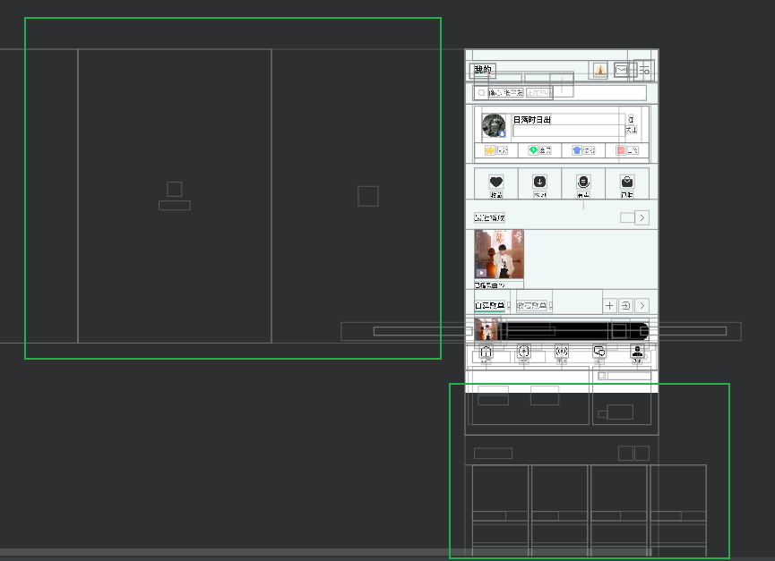

# 预加载和懒加载——ViewPager+Fragment优化

**目的：**

> TODO：

参考：

https://mengfou.blog.csdn.net/article/details/121220878?spm=1001.2101.3001.6650.2&utm_medium=distribute.pc_relevant.none-task-blog-2%7Edefault%7EBlogCommendFromBaidu%7ERate-2-121220878-blog-82923077.235%5Ev40%5Epc_relevant_rights_sort&depth_1-utm_source=distribute.pc_relevant.none-task-blog-2%7Edefault%7EBlogCommendFromBaidu%7ERate-2-121220878-blog-82923077.235%5Ev40%5Epc_relevant_rights_sort&utm_relevant_index=5           Android插件化开发指南——实践之ViewPager+Fragment优化（预加载和懒加载）

效果： 

> 1、----------> QQ音乐：
>
> 
>
> 2、动图见： https://mengfou.blog.csdn.net/article/details/121220878?spm=1001.2101.3001.6650.2&utm_medium=distribute.pc_relevant.none-task-blog-2%7Edefault%7EBlogCommendFromBaidu%7ERate-2-121220878-blog-82923077.235%5Ev40%5Epc_relevant_rights_sort&depth_1-utm_source=distribute.pc_relevant.none-task-blog-2%7Edefault%7EBlogCommendFromBaidu%7ERate-2-121220878-blog-82923077.235%5Ev40%5Epc_relevant_rights_sort&utm_relevant_index=5     

见：https://blog.csdn.net/rzleilei/article/details/123252533        Android性能优化之页面优化

https://blog.csdn.net/rzleilei/article/details/125258457         启动速度优化

