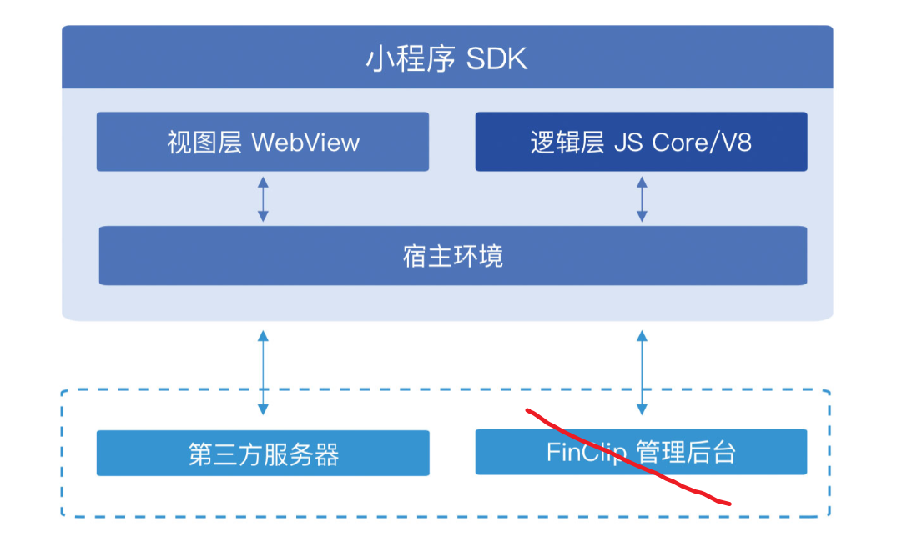

# 小程序

基础概念：

> 小程序与宿主，两个进程！！！！

基于浏览器

 图见 https://www.finclip.com/mop/document/develop/guide/start/host-environment.html#_1-逻辑层与视图层

两个小程序通信

> （1）通过宿主linux应用通信
>
> （2）网络通信websocket：通过远程的中间服务器

linux上，利用QT渲染

消耗----------一个页面：10M

jsBridge：

> 小程序的js ---> 调用 小程序的cpp

https://blog.csdn.net/qq_44376306/article/details/133963573

小程序，类似于webview？

类似于 flutter？

## finclip

https://www.finclip.com/mop/document/runtime-sdk/windows/windows-intro.html

## 获取界面上的节点信息

参考： https://www.finclip.com/mop/document/develop/guide/framework/view.html#_6-1-什么是组件

FXML节点信息:

> 获取界面节点信息
>
> 界面变化通知

## 无障碍

无障碍不支持，但是可以做

QT是有无障碍的？

## 小程序开发

https://www.finclip.com/downloads/

## JS系列(二) - V8引擎的运行原理

js跑在V8引擎上   ----->  必然hos也是这样做的

https://blog.csdn.net/qq_44376306/article/details/133963573