# 目录

# C语言

## 字符串：

cpp：    <font color='red'>string </font>或 char \* s   ------>  首选string
c：  <font color='red'> char \* s</font>  或  char s[] （c中的字符数组）

区别：获取长度
stirng s ------>s.size()

char s[]  ---------> lenstr(s)


c语言中：strcmp与strncmp与memcmp的区别：
https://blog.csdn.net/weixin_45380951/article/details/100699751?spm=1001.2101.3001.6650.3&utm_medium=distribute.pc_relevant.none-task-blog-2%7Edefault%7ECTRLIST%7ERate-3.pc_relevant_default&depth_1-utm_source=distribute.pc_relevant.none-task-blog-2%7Edefault%7ECTRLIST%7ERate-3.pc_relevant_default&utm_relevant_index=6


## 字符串的数组（c指针数组）

```java
cpp：vector<string>& wordDict_cpp

c： char ** wordDict_c, int wordDictSize   ------>多重指针，指针的指针
       char *  wordDict_c[3]     ------>指针数组
```

-------->**使用方法完全一样：**
~~取第0个字符串  wordDict_cpp[0],     wordDict_c[0]~~
~~取第0个字符串的wordDict_cpp[0] [0], wordDict_c[0] [0]~~


关于char \*\* wordDict_c理解：
（1）<font color='red'>\*相当于一个[], </font>比如 <font color='red'> char \* s</font>  =  char s[]
<font color='red'>所以，\*\* 即是 [] []</font>

具体：

```java
    char *month[] = {"January","February","March","April",
            "May","June","July","August","September","October",
            "November","December"};
```

---->这里month是  char \*的[]，

---->char \*\*  point = &month; 还是  char \*\*  point = month？？？？

双重指针！！！！！

（2）<font color='red'>c表达字符串数组时：指针数组<-------> 多重指针 </font>

## 字符串的数组（c指针数组）以及二级指针的理解

**锚点/化简：**关于指针：

```java
// 【char *  当做int来理解，没有本质区别!!!：】
1、使用上没有区别，把char * 当做int来理解 -------- 字符串与int没区别
2、关于二级指针，char **  即是 int * 
```

~~自然：~~

> ~~获取一级指针使用二级指针承载。获取0级（值）用一级承载~~
>
> 例：
>
> ```java
> // 通过函数出参获取int值
> get_target_plane(int *target_screen) {
>  *target_screen = 1；
> }
> 
> int target_screen = NULL;
> get_target_plane(&target_screen)
> ```
>
> <font color='red'>数学上的等价替换：int 与 char \*  </font>
>
> ```java
> // 通过函数出参获取char * 值： 
> get_target_plane(char * *target_screen) {  // --------> 这里便是二级指针
>  *target_screen = 1；
> }
> 
> char * target_screen = NULL;
> get_target_plane(&target_screen)
> ```

扩展：<font color='red'>1、 二级指针的理解： 与一级可以等价替换</font>

​           <font color='red'>2、与数学上的导数，是一个模型</font>

```
如果不理解 类型**
-----------》令 类型** = 
             则 类型*  = & (类型2 *)
替换所有的 类型** 和 
```


## memset、memcmp、strcmp比较

**cpp没有字节级的处理**，最少也是基本数据类型的处理---->比如，char、string

memset、memcmp、strcmp ---->**都是字节级的处理**  <font color='red'>即直接操作内存空间（字节级）</font> 是c的用法（当然cpp也可以用）

所以，经常用到 sizeof()   --->获取字节数

例子：

```cpp
void *memset(void *s, int c, unsigned long n); // 将s前n个字节填充c

 bool dp[lenstr(s) ]; //  是字符数组
 memset(dp, 0, sizeof(bool)*lenstr(s));  //全部填充0
```

例2：
memcmp(&s[i-int(tem.size())], &tem[0], int(tem.size())*sizeof(char))  0


## sizeof


<font color='red'>总之：</font>

> sizeof是c语言的东西
>
> 返回字节数
>
> 返回 类型的大小


具体用法：

> 1、用于数据类型-----本质
>
> ```cpp
> cout << "sizeof(int) " << sizeof(int) << endl;
> 
> 4
> ```
>
> ~~2、用于变量  ----->  变量对应的数据类型的大小~~:
>
> ```cpp
>     int x = 4;
>     cout << "sizeof(int) " << sizeof(int) << endl;
>     cout << "sizeof(x) " << sizeof(x) << endl;
> 
>     string str = "hello world!"; //cpp语言
>     cout << "sizeof(string) " << sizeof(string) << endl;
>     cout << "sizeof(str) " << sizeof(str) << endl;
> 
>     B b;   //cpp语言，类B
>     cout << "sizeof(B) " << sizeof(B) << endl;
>     cout << "sizeof(b) " << sizeof(b) << endl;
> ```
>
> 结果：
>
> ```cpp
> sizeof(string) 32
> sizeof(str) 32
> sizeof(int) 4
> sizeof(x) 4
> sizeof(B) 4
> sizeof(b) 4
> ```
>
> ~~3、指针变量也是变量，自然也是类型的大小~~
>
> ----->   自然，跟系统有关： 32位计算机，返回4；64位计算机，返回8
>
> ```cpp
> char*pc="abc";
> int*pi;
> string*ps;
> char**ppc=&pc;
> void(*pf)();//函数指针
> sizeof(pc);//结果为8
> sizeof(pi);//结果为8
> sizeof(ps);//结果为8
> sizeof(ppc);//结果为8
> sizeof(pf);//结果为8
> ```
>
> ~~4、用于数组  ----->  也是数组类型的大小，即  数组元素的大小 * 数组元素的个数~~
>
> 为什么？因为 **数组类型** =  元素大小  +  数组长度
>
> ​     
>
> ```cpp
>     int arr[3] = {0};
>     cout << "sizeof(arr) " << sizeof(arr) << endl;
>     cout << "sizeof(arr)/sizeof(arr[0]): " << sizeof(arr)/sizeof(arr[0])<< endl;  //c语言，获取数组大小的方法
> 
> 结果：
>     sizeof(arr) 12
>     sizeof(arr)/sizeof(arr[0]): 3
> ```
>
> 5、结构体的sizeof  --->  涉及到字节对齐
>
> 


### 与cpp对比

对于cpp，推论，自然：

~~用于cpp的类的对象时，-------->  是 类型（即类）的大小~~，见上


### 参考：

https://baike.baidu.com/item/sizeof/6349467


## C语言 空指针 NULL


```java
struct weston_paint_node *blurNode;
if (blurNode) {  
	// 进入了！！！！！！
}
```


安全起见，<font color='red'>需要判断的指针，先赋值NULL：</font>

```java
struct weston_paint_node *blurNode = NULL;
if (blurNode) {  
	// 没进入
}
```


## c语言的动态链接 

好处：用时决定加不加载（做到解耦，用不到就不加载）

形式：**两个so（意味着不能直接调用）**。   

例子：

> compositor.c 中 无法直接调用 gl_renderer.c中的函数（**两个so**）
>
> ```java
> // compositor.c 中
> const struct gl_renderer_interface *gl_renderer;
> gl_renderer = weston_load_module("gl-renderer.so",
>               "gl_renderer_interface",
>               LIBWESTON_MODULEDIR);
> ```
>
> gl-renderer.c:
>
> ```java
> // gl-renderer.c
> WL_EXPORT struct gl_renderer_interface gl_renderer_interface = {
> 	.display_create = gl_renderer_display_create,
> 	.output_window_create = gl_renderer_output_window_create,
> 	.output_pbuffer_create = gl_renderer_output_pbuffer_create,
> 	.output_destroy = gl_renderer_output_destroy,
> 	.output_set_border = gl_renderer_output_set_border,
> 	.create_fence_fd = gl_renderer_create_fence_fd,
> };
> ```
>
> 


推论：

> compositor.c里引入 gl-renderer.h，运行时不一定调用了里面的函数！！！！！！！
>
> ```
> // compositor.c
> #include "gl-renderer.h"
> ```


## 如何避免溢出？

解法：循环

~~软件实现： % 300   （仅限于300次）~~


补充：  unsigned int 自增，不会溢出，会从0循环

​             int 会溢出


## 初始化结构体

在C语言中，任何未显式初始化的变量，其值是 **未定义的**， 可以是任何随机值！！！！！！！！

```java
#include <stdio.h>

struct MyStruct {
    float myFloat;
};

int main() {
    struct MyStruct localStruct;  // 局部变量，字段未初始化
    printf("localStruct.myFloat = %f\n", localStruct.myFloat);  // 输出未定义的随机值

    static struct MyStruct staticStruct;  // 静态变量，字段默认初始化为 0.0
    printf("staticStruct.myFloat = %f\n", staticStruct.myFloat);  // 输出 0.0

    return 0;
}

```

--------------->  所以，不要依赖自动初始化：

>   -<font color='red'>尽量初始化时，显式地给明确的数值</font>

## 匿名结构体与 内部结构体


```java
struct weston_compositor {
	struct { // 匿名结构体
		struct render_config { // 内部结构体
			char *name;
		} render_confs[5];

		int client_config_size;
	} connect;
}

```

自然：

> -<font color='red'>内部结构体与外部结构体没有任何区别， 可以直接引用！！！！</font>
>
> 匿名结构体 ，没名字，自然无法直接引用

自然，内部结构体可以用来化简：

```java
// 原始
shell->compositor->connect.render_confs[0].name

// 化简：
struct render_config *configs = shell->compositor->connect.render_confs;
configs[0].name
```


##  strdup存在内存分配(同malloc)


| 问题                    | 回答                                               |
| :---------------------- | :------------------------------------------------- |
| `strdup` 是否分配内存？ | ✅ 是的，它会在堆上分配一个新的字符串副本。         |
| 是否需要手动释放？      | ✅ 是的，必须调用 `free()` 来避免内存泄漏。         |
| 分配失败怎么办？        | ❗ 应检查返回值是否为 `NULL` 并处理内存不足的情况。 |

例子：

```java
char *src = "hello";
char *dst = strdup(src);
if (dst == NULL) {
    // 处理内存分配失败
}
// 使用 dst ...
free(dst); // 必须手动释放
```


# 素材之 环境变量

C语言，环境变量的获取

```java
1、获取特定的环境变量值
getenv(char *)

2、所有环境变量environ：
char **env = environ;  // 获取环境变量数组
// 遍历并打印所有环境变量
while (*env) {
	printf("%s\n", *env);
	// fprintf(stderr, ": %s \n", *env);
	env++;
}
```


C语言，写入文件：

```java
char **env = environ;  // 获取环境变量数组
FILE *file = fopen("/tmp/env_variables.txt", "w");  // 打开文件用于写入

if (file == NULL) {
    perror("无法打开文件");
    return ;
}

// 遍历并将所有环境变量写入文件
while (*env) {
    fprintf(file, "%s\n", *env);
    env++;
}

fclose(file);  // 关闭文件
```


# 如何学习一门语言


以某一门语言为基础，搭建 学语言需要的技能树：

1、根据技能树，填充

2、填充的同时，**与已经学会的语言进行比较**（~~一样的话，就不需要记忆了~~）

# cpp

## 引用的表达------include关键字（与java比较）

引用其他文件的.h文件  ---->.h用来<font color='red'>声明</font> <font color='red'>被其他文件引用</font>的类、函数

1、只在.h文件里声明，，**不能**在.h文件中**定义值**
---->原因：<font color='red'>include本质：</font>.h会被复制到引用的文件中，如果定义，涉及到重复定义

2、同一个.h 可能被<font color='red'>很多文件include</font> ------>会造成多次编译问题，解决办法：

.h文件中，增加#ifndef方式

```cpp
//Parcel.h
#ifndef ANDROID_PARCEL_H
#define ANDROID_PARCEL_H


// ---------------------------------------------------------------------------

#endif // ANDROID_PARCEL_H
```

https://blog.csdn.net/zzzkiti/article/details/40976867?spm=1001.2101.3001.6650.5&utm_medium=distribute.pc_relevant.none-task-blog-2%7Edefault%7ECTRLIST%7Edefault-5.pc_relevant_paycolumn_v2&depth_1-utm_source=distribute.pc_relevant.none-task-blog-2%7Edefault%7ECTRLIST%7Edefault-5.pc_relevant_paycolumn_v2&utm_relevant_index=9


对比 ：

>  java引用的表达是import


## 对象（与java比较）


### cpp—new malloc（与c的 malloc/free的比较）

https://blog.csdn.net/hahachenchen789/article/details/83056796

语言范围：

> new/delete<font color='red'>是C++关键字</font>，需要编译器支持。-----> new 是对象，自然是cpp的东西
>
> ~~malloc/free是库函数，需要头文件支持~~。 ---->  C的东西

入参比较：

> 使用new操作符申请内存分配时无须指定内存块的大小，<font color='red'>编译器会根据类型信息自行计算</font>。 ------>  对于面向对象的语言，这一点，很自然
>
> ~~malloc则需要显式地指出所需内存的大小~~ -----> 自然的，c是没有办法自己算出大小的

返回比较：

> ~~<font color='red'>new操作符内存分配成功时，返回的是对象类型的指针</font>，类型严格与对象匹配，无须进行类型转换，故new是符合类型安全性的操作符~~   ------>  面向对象语言，自然的
>
> malloc内存分配成功则是<font color='red'>返回void \*</font>，需要通过强制类型转换将void*指针转换成我们需要的类型。  ------>  **这一点需要注意**


-   malloc free 是stdlib库的函数 使用必须进行压栈出栈操作    ------>  TODO: 不懂

-   new delete 是 c++的操作符 无需进行栈栈操作 且会再new是<font color='red'>自动调用构造函数 delete调用析构函数</font>

    -------->**<font color='green'>所以，对于类来说，尽量用new（涉及到子类的析构</font>）**

例子：

```cpp
\\Parcel.cpp
status_t Parcel::write(const FlattenableHelperInterface& val)
{
    ...........
    int* fds = nullptr;
    if (fd_count) {
        fds = new (std::nothrow) int[fd_count];  //(1)
        if (fds  nullptr) {
            ALOGE("write: failed to allocate requested %zu fds", fd_count);
            return BAD_VALUE;
        }
    }

    err = val.flatten(buf, len, fds, fd_count);
    for (size_t i=0 ; i<fd_count && errNO_ERROR ; i++) {
        err = this->writeDupFileDescriptor( fds[i] );
    }

    if (fd_count) {
        delete [] fds;  //(2)
    }

    return err;
}
```

**注意：**
<font color='red'>即使在函数内部new，也要在函数结束时，记得释放</font>


```cpp
uint8_t* data = (uint8_t*)malloc(desired);
if (mData) {
    memcpy(data, mData, mDataSize < desired ? mDataSize : desired);
}
```

void \*memcpy(void \*destin, void \*source, unsigned n);
数据：mData ---> data


### [C++创建对象的两种方式](https://www.cnblogs.com/qiumingcheng/p/7819639.html) （与java的对比）


内存的分配方式有三种：

   （1）从静态存储区域分配。内存在程序编译的时候就已经分配好，这块内存在程序的**整个运行期间都存在（不用管内存的销毁）**。例如全局变量，static 变量。 

   （2）  在栈上创建（<font color='red'>回收不用程序员管，自动回收------>因为叫栈，程序自动回收</font>）。在执行函数时，函数内局部变量的存储单元都可以在栈上创建，函数执行结束后在将这些局部变量的内存空间回收。在栈上分配内存空间效率很高，但是分配的内存容量有限。------><font color='red'>一般来说，编译期就分配好内存大小了</font>（具体分配还是在运行期？？？）

​    （3） 从堆上分配的。程序在运行的时候用 malloc 或 new 申请任意多少的内存，<font color='red'>程序员自己负责在何时用 free 或 delete 释放内存。</font> --------><font color='red'>只能在运行期申请内存</font>

--------->所以，只有**1、堆上的对象需要考虑释放**  2、**堆上的对象是运行期分配的内存**


C++创建对象有两种方式：<font color='red'>一句话区别：new的是在栈上创建</font>

1、在栈上创建对象（Objects on the Stack）:

```cpp
int main(int argc, char** argv)
{
  SpreadsheetCell myCell(5); // ------>  在栈上创建
  if (myCell.getValue()  5) {
    SpreadsheetCell anotherCell(6);
  } // anotherCell is destroyed as this block ends.
  cout << “myCell: “ << myCell.getValue() << endl;
  return (0);
} // myCell is destroyed as this block ends.
```


 2、在堆上创建对象（Objects on the Heap）:

```cpp
ClassName *obj1 = new ClassName();
ClassName *obj2 = new ClassName(parameter);
delete obj1;
delete obj2;
```


补充：**cpp默认不会在静态存储区**，创建对象的

但是，可以超纲使用（~~重载new/delete 操作符~~）：https://blog.51cto.com/u_15290941/3048752

#### 对比java

java只会在堆上创建对象


### 对象以及对象指针（对比java）

对象的创建：

> A类的constructor： A(int b)
>
> 显式：A a =  A(2)
>
> 隐式：  A a(2)   <font color='red'>与上面等价</font>               


对象指针：     

>  A*  p = new  A(2)； ---------->注意所有的new，都要有delete去销毁 （<font color='red'>因为new是在堆上分配内存的，不是栈上</font>）               

​                                                                                                                                                                                                                                                                                                                                                                                                                                                                                                                                                                                                                                                                                                                                         

#### 对比java

~~对象  A a = new A(2)    ----->  java  new出来的是对象~~


本质一样：

> java与cpp  new之后的东西，<font color='red'>本质上是一样的</font>（只是叫法不一样，只是语言层面符号不一样）：
>
> ~~1、都是堆产生一个对象~~
>
> ~~2、既然是堆里的东西，都需要主动释放~~<font color='red'>


-<font color='red'>java的对象，本质是引用</font>

-<font color='red'>或者说： cpp指针  等价于  java对象</font>


#### 基于对比，的推论：


1、java的对象，其实就是cpp对象的指针

2、~~判空时：cpp对指针判空；java对.....判空~~  ----->  自然，两者等价

3、java对象需要判空，cpp指针需要判空（cpp对象不需要）

4、赋值：cpp的指针赋值   等价于   java对象（实际引用）赋值  ------>都不会新建对象

5、赋值2： **但cpp对象赋值，是copy constructor**。会新建对象:   -------》 自然，传递的不是指针

​       A a1 = a0


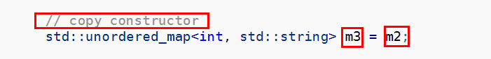

**同理，cpp函数传参，传递对象，也会先copy constructor**     **对于java，传递的是对象的引用！！！**


6、推论：无论cpp还是java，对象永不为空（java对象本质是对象的引用）------>  自然的，对象都出来了，都占用了堆内存，怎会为空呢？


`java的对象不初始化就为空`-------> 实际上是引用

`cpp对象，永不为空` --->（1）、cpp的对象声明，是包含了初始化的（**java的声明，只是声明，声明和初始化两者分开**）
                                         是default  constructor！！！！！ 

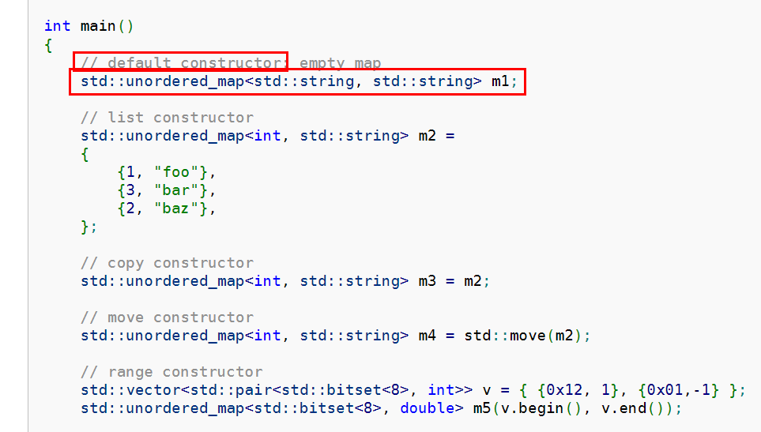


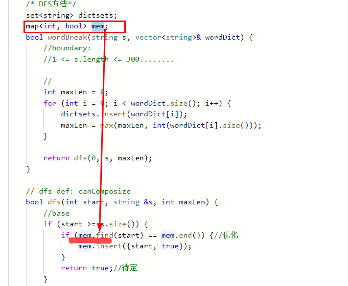

cpp，已经初始化，可以直接用


（2）、cpp需要判空的是指针，指针可能为空（本质原因：cpp指针  《------>类似于 java对象）

（3）、cpp指针判空用nullptr （C语言用NULL）


7、从代码形式角度看声明，字符串：自然，~~java是引用，还没初始化~~

cpp声明：


> 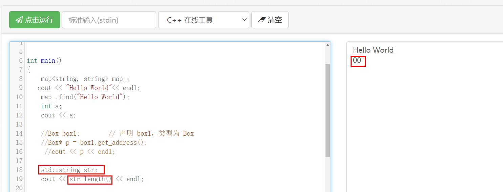


java声明：

> java必须单独初始化
>
> 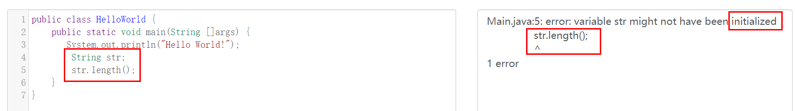


8、从代码形式角度看声明，基本数据类型：自然， ~~两个都不是引用，即都有默认值~~

cpp：

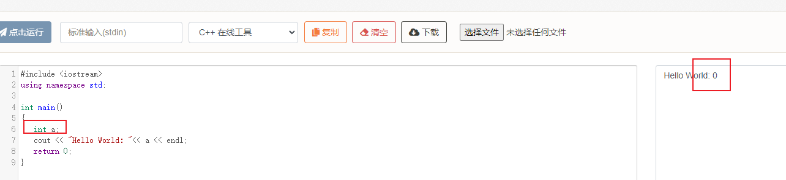


java：

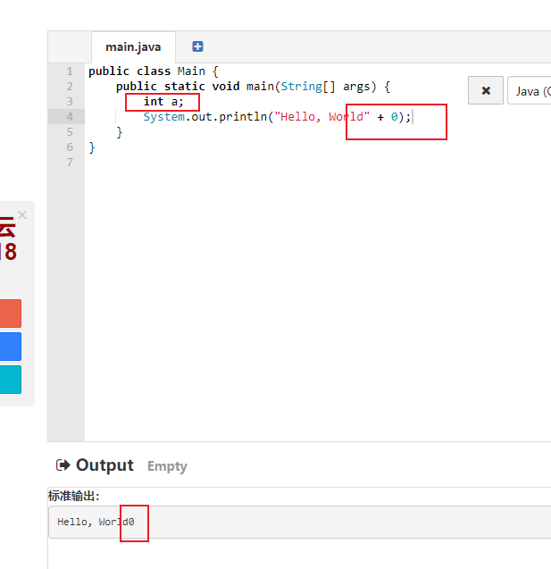


### 面试题


```cpp
① 、T *t =new T;

② 、T *t =new T();

③、T t;
```

自然结论：

a、内存上：new的都是在堆里，比如① 和② ；  非new都是在堆里，比如3

b、根据内存，自然new的（堆里）需要手动管理内存；3不需要

c、① 和② 的不同点：Todo，没能真正理解！！！！

​      ~~（1）程序员显示定义了构造函数都一样~~

​      （2）程序员没有显示定义构造函数   -----》 编译器会为该类合成一个默认的构造函数：

```
① 的类内部的成员变量这个时候执行默认初始化，其值是未定义的。
② p内部的成员变量会执行值初始化，即以0的形式进行初始化（整数就为0，bool就为false，string 就为空）
```


参考：  https://blog.csdn.net/iaccepted/article/details/38613089  


## 字符串(与c、与java对比)

### char类型字符串-----c

#### 取子字符串

操作：

#### 比较字符串 ------c

方法一：memcmp：（可以不是string的比较！！！！！）

**比较两个string 或 比较两个string的 前三位：**
memcmp(&s1, &s2,  3\*sizeof(char))        --->**C语言的方法**
注意: s1 只要是字符串就行，string 或者  <font color='red'>char*的字符串</font>
         入参是指针


方法二：

strcmp(str1, str2)  


### string字符串-----Cpp

C++标准程序库中的string类，与上面的<font color='red'>char*的字符串</font>比较：

优势：

> 不必 担心内存是否足够、字符串长度等等


使用方法：

```cpp
#include <string>
using namespace std;
```


#### 取子字符串s.substr()


## int

[C++如何取得int型的最大最小值](https://www.cnblogs.com/alex4814/archive/2011/09/12/2174173.html)

當題目涉及到求最大最小值時，最初的比較數字就應當設置爲INT_MAX或INT_MIN，更爲安全。

<limits.h>中有INT_MAX和INT_MIN的宏定義可直接使用。

或者自行定义宏

\#define INT_MAX 0x7fffffff

\#define INT_MIN 0x80000000

INT_MAX = 2147483647

INT_MIN = -2147483648


## 容器

### vector 

<font color='red'>类似于java int[]：</font>

~~类似1： 初始化：vector<int> nums = {2,3,1,1,4};~~

cpp形式初始化 vector<int> nums{3}  -----> nums 含3
                             vector<int> nums{1,3}  -----> nums 含1,3

cpp形式初始化     vector<int> nums(3)     -----> nums含 0, 0 ，0

~~类似2：索引：nums[i]~~  
                nums.at
              <font color='green'> 注意</font>：对于指针，不能用p[i] !!!!!, 只能p->at(i)

<font color='red'>不同于 java int[]</font> ---><font color='cornflowerblue'>动态数组，增删</font>
            insert、erase         push_back、pop_back


#### vector与int [] 的比较

```
bool wordBreak(string s, vector<string>& wordDict) {

}
```

<font color='red'>vector是动态数组，可以运行期确定大小 </font>--->即vector<bool> dp2(int(s.size())); 可以编译通过

int [] 编译期确定大小  --- >  bool dp[int(s.size())] = {false};  ----><font color='red'>编译不通过</font>

<font color='cornflowerblue'>方法：</font>

(1)利用cpp的vector  （<font color='green'>优</font>）

(2)给int [] 足够的空间，比如这里已知s长度小于300： bool dp[300] = {false};

(3) **利用c的方式，** 利用memset运行期分配空间大小：

​    bool dp[int(s.size()) + 1];    <font color='red'>// 这里可以编译通过，原因在于，这里只是声明，编译器并没有分配空间</font>
​     memset(dp, 0, sizeof(bool)*(int(s.size()) + 1));


#### vector的排序

```cpp
// sort algorithm example
#include <iostream>     // std::cout
#include <algorithm>    // std::sort
#include <vector>       // std::vector
 
bool myfunction (int i,int j) { return (i<j); }
 
struct myclass {
  bool operator() (int i,int j) { return (i<j);}
} myobject;
 
int main () {
  int myints[] = {32,71,12,45,26,80,53,33};
  std::vector<int> myvector (myints, myints+8);               // 32 71 12 45 26 80 53 33
 
  // using default comparison (operator <):
  std::sort (myvector.begin(), myvector.begin()+4);           //(12 32 45 71)26 80 53 33
 
  // using function as comp
  std::sort (myvector.begin()+4, myvector.end(), myfunction); // 12 32 45 71(26 33 53 80)
 
  // using object as comp
  std::sort (myvector.begin(), myvector.end(), myobject);     //(12 26 32 33 45 53 71 80)
 
  // print out content:
  std::cout << "myvector contains:";
  for (std::vector<int>::iterator it=myvector.begin(); it!=myvector.end(); ++it)
    std::cout << ' ' << *it;
  std::cout << '\n';
 
  return 0;
}
```

### 动态容器的遍历---以vector为例

vector遍历：
 方法一： 索引i遍历，for (int i = 0; i< int(res.size());i++)

方法二：iterator遍历：

​      for (vector<int>::iterator it = res.at(i).begin(); it < res.at(i).end(); it++) {  

​      或 while (it != res.at(i).end()) {it++;}


 ----><font color='red'>结论</font>：**涉及到动态数组的删除与增加**，谨慎用for！！！！！（it强行++了！），多用while！！
            //---->原因：for为什么不对？因为erase之后，it自动指向下一个，不应该再强制it++，需要判断

 vector<int>::iterator it = res.at(i).begin();

 while (it != res.at(i).end()) {

​        if (int(*it)  -22) {

​          res.at(i).erase(it);

​        } else {

​          it++;   <font color='red'>**// 有条件的下一个！！！！**！</font>

​       }

  }


### map

初始化 
遍历 iterator： 《-----------<font color='red'>iter++;</font>
               

```
 map<int, int>::iterator iter;
    iter = _map.begin();
    while(iter != _map.end()) {
        cout << iter->first << " : " << iter->second << endl;
        iter++;
    }

    // for循环遍历，iter++强制递增可能有问题！！！！
    for(iter = _map.begin(); iter != _map.end(); iter++) {
        cout << iter->first << " : " << iter->second << endl;
    }

```

   增删改查：
增：mem.insert({start, true});  ---->注意：不同于java，这里增一个pair，<font color='red'>即  {key，value}</font>

删：

改：

~~查：find(key)~~

### set集合

https://en.cppreference.com/w/cpp/container/set

~~遍历 iterator，同map~~


## cpp标准输入输出cin：

https://blog.csdn.net/bravedence/article/details/77282039

作用：cin可以连续从键盘读取想要的数据，以空格、tab或换行作为分隔符

例子：

```
#include<iostream>
using namespace std

int n, m;
cin >> n >> m;

输入：
4 5
```


输出与输入：

```
    cin>>a>>b>>c;
    cout<<a<<" "<<b<<" "<<c<<" "<<endl;
```

### 关于 cout

cout<<a<<" "<<b<<" "<<c<<" "<<endl;


<font color='red'>本质</font>：cout实际上是一个<font color='red'>iostream类的对象，流对象</font>。。。--->每一次<< --->调动ostream& operator<< --->这个函数重载了 ---><font color='green'>所以《《 之间可以填任意数据类型的数据</font>

------>推论：

 ~~1、输出操作符“>>”，作用：将数据输出到std::cout输出流的缓冲区上。~~

~~2、std::endl作用：显示请求刷新  ---->缺少后，暂时不会刷新~~

~~3、可以打印很多数据，而且<<   <<  之间都会拼接在一起~~

~~4、printf 输出需要格式化字符串，比如printf("%d", n);  --->c的做法，比较麻烦~~（**根因：c没有类的概念**）


## CPP内存机制

参考：https://blog.csdn.net/m0_68981107/article/details/127548736


cpp内存模型： TODO: 对比java的

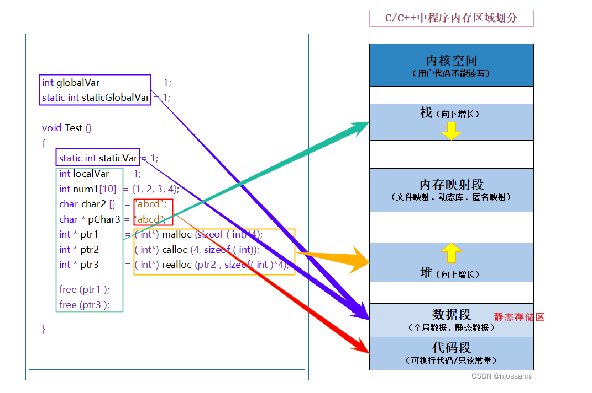


```cpp
1.栈用来存放：非静态局部变量/函数参数/返回值等，栈向下增长。
2.堆用于程序运行时动态内存分配，堆是可以上增长的。
3.数据段–存储全局数据和静态数据。
4.代码段–可执行的代码/只读常量。
```

注意点：

1、 <font color='red'>向上增长、向下增长</font>

2、全局变量和 静态变量（静态全局变量、静态局部变量）的比较（`面试题`）：

​    ① 相同点：**都在数据段（静态存储区）**

​    ②  记忆：

全局变量： 全局，即  

​                     作用域：所有文件（自然，~~其他文件需要用extern来再次声明一下，才能引用到~~）

​                      生命周期：跟执行的时机有关

 **静态**全局变量 = 静态 + 全局变量

​                     静态static即： （1）作用域 :  限制文件内   ~~（2）生命周期同程序~~

静态局部变量：=   静态  + 局部变量

​                   ~~静态static即：................................~~

​					~~局部，即：限定在函数体内~~

​         总之，作用域：函数体内   生命周期：同程序

```cpp
int globalVar = 1;  // 全局变量  ----》 全局所有文件
static int staticGlobalVar =1; //静态 全局变量  ②static限定了作用域（在该文件内）

void Test() (
	static int staticVar = 1; //静态 局部变量
	int localVar = 1;
    int num1[10] = {1,2,3,4};
```


### 内存管理（手动管理）TODO

方式一：  view框架里面，java和native绑定，死亡机制

方式二：手动delete

方式三：智能指针


## cpp一些问题：

### 关于cpp的内存分配：


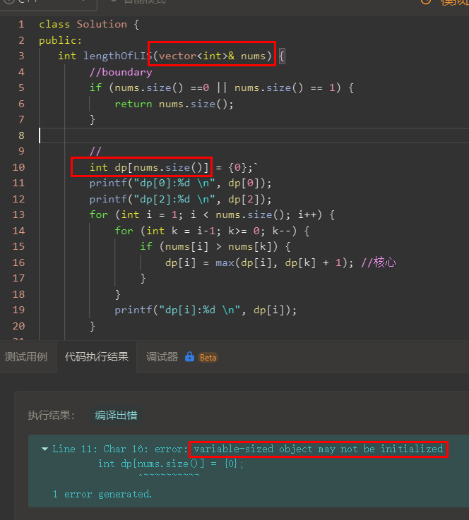

**静态分配**内存：《---->在**编译期间**就分配了内存大小《----->**栈上**分配（静态变量是在静态方法区、<font color='red'>注意：栈上存在动态分配</font>）
                        常见的有：局部变量中的int[]、array对象

**动态**分配内存：《----->在**运行期间**分配内存大小《------->**在堆上**分配 《------>必须手动管理内存
                              例子：new或者mallo的对象、vector类（内部自动使用new和delete来管理内存）


------->对cpp，上述写法错误
（解决方法，用vector、或者 找到数组大小上限）
vector可以的原因是，动态增长的，编译期间有个初值？？？？


对于java是可以的，因为int dp = new int[] ----->这是在堆上生成的（运行期间）
https://zhidao.baidu.com/question/304646543.html
https://www.cnblogs.com/nulisaonian/p/6100535.html

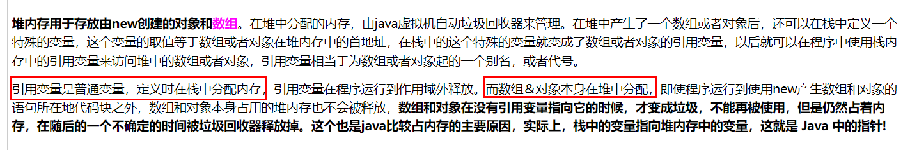


### cpp 数组声明后，必须初始化

声明，不初始化，**本质上来说，是可以的，是有数值的**

但数值是随机的（上一次内存的遗留！！！）

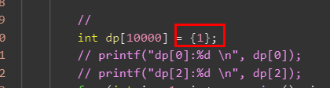


### int 与 size_type

string.size()、lenght()返回size_type 

size_type 本质是无符号整数，int是有符号整数。。。<font color='red'>规定：</font>与int 运算（加、减、< 比较），必须转化成int之后再运算
---->否则，会出现很多意想不到的结果，例子：

a是无符号整数--->导致1-a也是无符号整数，<font color='red'>即是正的</font>，但很明显1-a = -3是个负数，转化成正数，就非常大

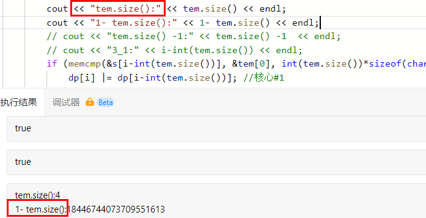


 


## 工具：Address Sanitizer

### 教程：

https://www.youtube.com/watch?v=hhpzDFvXopk      Address Sanitizer in C++ (A Tutorial)

https://github.com/google/sanitizers

https://www.cnblogs.com/justin-y-lin/p/11314059.html  gcc存储已经集成了!!!!

https://hanpfei.github.io/2019/05/19/AddressSanitizer_on_linux/     Linux 下的 AddressSanitizer

###  What Can It Detect?


### 工作原理（how）

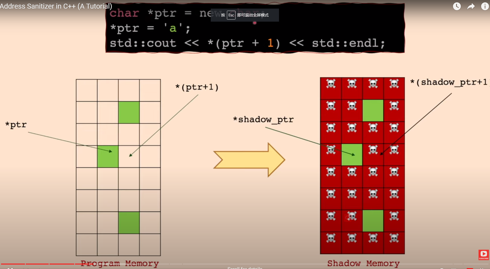


### 命令：

window下AddressSanitizer没能搞定，<font color='red'>主要linux下</font>，编译以及运行命令：

```cpp
g++  -fsanitize=address -O0 -fno-omit-frame-pointer -g -o  main main.cpp &&  ./main
```

注意:g++(c++语言)不是gcc (c语言), 不能用错!!!!


`遇到报错`:
Asan runtime does not come first in initial library list; you should either link runtime to your application or manually preload it with LD_PRELOAD

`解决方法:`
mv  /etc/ld.so.preload   /etc/ld.so.preload.bak
rm -rf  /etc/ld.so.preload


Ilvm-symbolizer 符号化工具属于 Ilvm包,Ubuntu 下具体的安装方法可以参考 LLVM Debian/Ubuntu nightly packages.

### 如何看结果


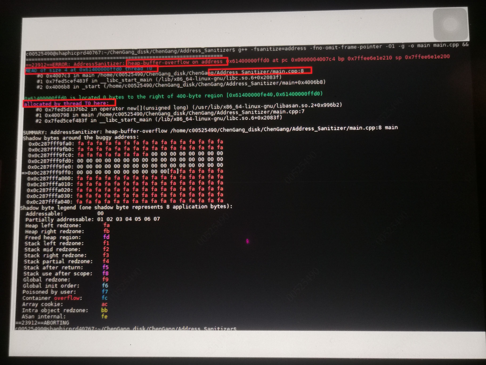

分析日志:23912是进程号
读取四个字节的数字出错了


## 内存泄漏

C++造成内存泄漏的原因汇总：
https://blog.csdn.net/qq_18824491/article/details/78902636?utm_medium=distribute.pc_relevant.none-task-blog-2~default~baidujs_baidulandingword~default-0.no_search_link&spm=1001.2101.3001.4242.1&utm_relevant_index=3

对于C++的内存泄漏，<font color='red'>总结一句话</font>：就是<font color='red'>new出来的内存没有通过delete</font>合理的释放掉！！！！！！！！！
------->**在函数体内**，1、不用new，创建对象，系统自动回收内存
                                           2、<font color='red'>new对象（返回指针）</font>，系统不会回收，<font color='red'>需要手动</font>

**比喻**：1、申请内存就像不停打开网页 2、没有及时关闭网页 3、new 网页，谁new应该谁关 4、如果不关网页，系统掉电重启，内存会全部清掉


### 对于leetcode的报错：

```c
42ERROR: AddressSanitizer: heap-use-after-free on address 0x602000000058 at pc 0x00000037ac7d bp 0x7ffe70f719a0 sp 0x7ffe70f71998
```


----->最后定位下来，是p1与p2循环next了
------>leetcode报错类型是有问题的？？？？？（linux下AddressSanitizer没有报错！！）


<font color='red'>leetcode这种问题如何定位？？？？？</font>

(1)二分 print--------->每一行都能打印
(2)linux内存泄漏工具   -------->OK的
(3)二分return（**log不起作用时**修改代码功能定位）   ---------->既然抛了error，那么一定是某一行有问题，所以，逐行改变return位置 ------>逼出哪一行出了问题

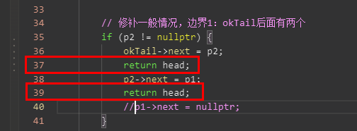

37处return会有error！！！！！


## cpp独有的东西

### 内联inline

内联，可以关闭，尤其定位问题，调用栈时，需要关闭！！！！！


### 日志： 

Step0. 在CMakeLists.txt中添加

```cpp
find_library( # Sets the name of the path variable.
              log-lib

              # Specifies the name of the NDK library that
              # you want CMake to locate.
              log )

target_link_libraries( # Specifies the target library.
         native-lib
         ...
         # Links the target library to the log library
         # included in the NDK.
         ${log-lib}
         )
```

Step1. 在cpp文件中添加

```cpp
// 引入log头文件
#include  <android/log.h>
// log标签
#define  TAG    "这里填写日志的TAG"
// 定义info信息
#define LOGI(...) __android_log_print(ANDROID_LOG_INFO,TAG,__VA_ARGS__)
// 定义debug信息
#define LOGD(...) __android_log_print(ANDROID_LOG_DEBUG, TAG, __VA_ARGS__)
// 定义error信息
#define LOGE(...) __android_log_print(ANDROID_LOG_ERROR,TAG,__VA_ARGS__)
```

Step2. 输出日志

```
LOGD("user info-----------------------name:%s, age:%d, sex:%s.", "xxx", 18, "男");`
LOGE("cg, 1, class name:%s", env->GetStringUTFChars(name, 0));
```


### STL

STL的代码从广义上讲分为三类：algorithm（算法）、container（容器）和iterator（[迭代器](https://baike.baidu.com/item/迭代器/3803342?fromModule=lemma_inlink)）

在C++标准中，STL被组织为下面的13个头文件：

```CPP
<algorithm>、<deque>、<functional>、<iterator>、<vector>、<list>、<map>、<memory>、<numeric>、<queue>、<set>、<stack>和<utility>
```


## java、cpp  对比与记忆

### cpp 常量与JAVA常量表达：

cpp： const
JAVA：final


## 常见面试题


### c++的const和static区别


https://blog.csdn.net/qq_31484941/article/details/80742096


字节：

1、输入法的难点

​    通信


## 代码重构之 lamba表达式

参考：https://www.jianshu.com/p/4af34e151d63

**理解： lambda表达式即匿名函数**

作用: 

> 可以用作对重复代码的重构
>
> 


```cpp
//原始函数

void Window::SetInset (UIRect &rect)
{
	.....重复[1]......
	WindowSceneManager *curManager = ...........;
	.....重复[2]......
	
	curManager->Setinset(rect);//非公共部分【3】,差异点:函数Setinset(参数rect也是函数?);相同点curManager
}


void Window::SetMode (int mode)
{
	.....重复[1]......
	WindowSceneManager *curManager = ...........;
	.....重复[2]......
	
	curManager->SetMode (mode);
}


//代码重构

--------以上重复,自然,提取公因式为公共函数:提取1-------

提取1:
void Window::ApplyOnCurManager()
{
	.....重复[1]......
	WindowSceneManager *curManager = ...........;
	.....重复[2]......	
}

基于提取1,但是后面会用到提取1中的参数(即公共部分与差异部分有耦合性,造成了提取失败):

将非公共部分【3】的差异部分(函数Setinset、参数rect),进行封装差异????-----》修改2


修改2:
void Window::ApplyOnCurManager (ProcessType setParams)
{
	.....重复[1]......
	WindowSceneManager *curManager = ...........;
	.....重复[2]......	
	
	//利用setParams差异性封装(对于公共部分函数ApplyOnCurManager) ---->从公共角度,只有封装差异,才能一样
	setParams(curManager);
}

基于修改2,需要
using ProcessType = std::function<void (WindowSceneManager *curManager)>;
//TODO:抽象是如何来的??
目的:提取公共部分
  (1)本质是封装函数,成为公共部分,自然是函数类型 std::function
  (2)参数为什么是WindowSceneManager *curManager???而不是rect?
  因为参数也要是公共部分,即公共部分提取成参数(),非公共部分使用[],在原来函数里捕获!!!
  
---------------------------------------------------

void Window::Setinset(UIRect &rect)
{
	//基于修改2
	ApplyOnCurManager(ProcessType setParams); //抽象
	              即:
				  curManager->Setinset(rect);//差异性...... 从最终代码来看,差异性一定还是在原函数里
}


void Window::Setinset(UIRect &rect)
{
	//基于修改2
	ApplyOnCurManager(ProcessType setParams); //抽象
	              setParams即:
				  [&rect//1、表示lambda执行时,可以访问外部的变量!](WindowSceneManager *curManager//2、匿名函数的参数?) {curManager->Setlnset(rect);//差异性}   //具体
				  1、并指定访问这些变量时是通过值拷贝还是引用访问.                            2、std::function<void (WindowSceneManager *curManager)>
}

TODO: 从最初--->最终代码:差异性,一定还在原函数里;公共部分,被公共函数抽出来
      lamba的作用在于,将原函数里的差异性封装成匿名函数...............传参(匿名函数)给公共部分函数,自然代码没有差异


最基本的思想:对差异性进行封装,对公共部分进行提取
(角度,从原函数角度,从功能角度,从lambda角度,从最初--->最终角度,从功能角度)
从lambda角度:
从capture角度
从Setinset角度: lambda就是对Setinset的封装:封装成抽象的、相同的lambda; Setinset被延迟执行了,在下一个函数里执行的(在原函数里定义)
从定义---执行角度:在原函数里定义,在下一个函数里执行
从封装差异角度:差异最终是体现在原函数处 lambda的内核Setinset ([&rect])中,即定义处
从提取公共角度来看: lambda就是提取公共的一个极度的扩展

// 1. lambda封装差异性(下一个函数,公共部分+lambda)
      --->优点,场景,很多情况下,公共部分与差异耦合严重,无法用公共函数抽取
// 2.这里定义function形式(传参+执行在下一个函数里)

上述也即: 公共部分与差异部分有耦合性----抽取公共函数的方法


java lamba 与cpp lamba差异在哪里?那么java是否可以这样取优化代码?

```


再举例子：抽成单独的函数end_section

```cpp
 // \\system\\core\\init\\parser.cpp
 
 void Parser::ParseData() {
     ............
 
     auto end_section = [&] {  // 定义处（没有执行）
         if (auto result = section_parser->EndSection(); !result.ok()) {
             parse_error_count_++;
             LOG(ERROR) << filename << ": " << section_start_line << ": " << result.error();
         }
     };
 
     for (;;) {
         switch (next_token(&state)) {
             case T_EOF:
                 end_section();  // 执行处
 
                 return;
             case T_NEWLINE: {
                 ............
             }

       }
 }
```


## c++ invoke ----> 从形式上统一函数调用

参考：

> https://blog.csdn.net/jiemashizhen/article/details/134349951

invoke(函数f指针，函数f参数1，函数f参数2)


具体例子，见《refactor.md ---------代码写法：差异性封装》


## 寻找代码对应的产物 / 查看是否编译进去某个产物

1、寻找代码对应的产物

2、查看修改代码是否，编译进产物

```java
$ file libweston-14.so.0.0.02
  libweston-14.so.0.0.0: ELF 64-bit LSB shared object, x86-64, version 1 (SYSV), dynamically linked, BuildID[sha1]=806e8e9c14f4be71d4d2416cda7079dc16f18537, with debug_info, not stripped3
$ grep "gl_renderer_repaint_output" -nr libweston-14.so.0.0.0  //【】不在这里4
$ grep "gl_renderer_repaint_output" -nr ./5
  grep: ./libweston-14/gl-renderer.so: binary file matches  // 【】6
```


# cpp打印调用栈

核心函数：backtrace_symbols

```cpp
#include <execinfo.h>

 void *callstack[128]; 
 int frames = backtrace(callstack, 128); 
 char **strs = backtrace_symbols(callstack, frames);  //【】 backtrace_symbols
 
 
 qDebug() << "chen, kwin Window::setDecoration: backtrace_symbols===================";  
 for (int i = 0; i < frames; ++i) { 
 	qDebug() << strs[i];  
 }
```

----------------------------> 验证ok

结果：

```
 kwin Window::setDecoration: backtrace_symbols===================
 /usr/lib64/libkwin.so.5(_ZN4KWin6Window13setDecorationESt10shared_ptrIN12KDecoration210DecorationEE+0x34) [0x7f8fab4a50]
 /usr/lib64/libkwin.so.5(+0x3e36c0) [0x7f8faf36c0]
 /usr/lib64/libkwin.so.5(_ZN14KWaylandServer20XdgToplevelInterfaceD2Ev+0x24) [0x7f8fbcfa28]
 /usr/lib64/libkwin.so.5(_ZN14KWaylandServer20XdgToplevelInterfaceD0Ev+0x14) [0x7f8fbcfa64]
 /usr/lib64/libkwin.so.5(+0x1d8354) [0x7f8f8e8354]
 /usr/lib64/libkwin.so.5(_ZN14KWaylandServer7Display14dispatchEventsEv+0x20) [0x7f8fb813e0]
 /usr/bin/kwin_wayland(+0x1364a4) [0x558a1274a4]
 /usr/bin/kwin_wayland(+0x886fc) [0x558a0796fc]
 /usr/bin/kwin_wayland(+0x57430) [0x558a048430]
```

参考：

> https://blog.csdn.net/MrWangHao/article/details/136165005?spm=1001.2101.3001.6650.2&utm_medium=distribute.pc_relevant.none-task-blog-2~default~YuanLiJiHua~Position-2-136165005-blog-130274179.235^v43^pc_blog_bottom_relevance_base7&depth_1-utm_source=distribute.pc_relevant.none-task-blog-2~default~YuanLiJiHua~Position-2-136165005-blog-130274179.235^v43^pc_blog_bottom_relevance_base7&utm_relevant_index=5


## 代码问题汇总：

```cpp
Shape *shape;

void setGraphicType() {
	.................

    Triangle triangl;
    shape = &triangl;     // ----------> 【1】cpp典型的错误写法。对象内存被释放了，但是地址被传出去了
   
      ................
}
```

----------------->现象：

```cpp
shape->getGLSLVertexShader();  //【2】
shape->getGLSLFragmentShader(); //【3】
```

-<font color='red'> 不好定位</font>：因为函数return时，暂时<font color='red'>不会被立即释放：</font>

> 【2】可以执行，但是【3】执行失败了！！！！！


正确方法：

方法一：内部new 指针，就不会释放

> ```java
> void setGraphicType() {
> 	.................
> 
>     shape = new Triangle();   // new指针，内存不会释放 
>       ................
> }
> ```
>
> **但是：要注意内存泄漏**：考虑shape指针对应内存的释放


方法二：在 出函数 之前，return出去（<font color='red'>**return的过程，会复制一份。**</font>内部的对象仍然会释放掉）

> ```cpp
> Shape shape = getGraphicType();
> 
> Shape getGraphicType() {
> 	.................
> 
>     Triangle triangl;  // 【】会被释放掉。但在此之前会被复制一份
>       ................
>     return triangl;
> }
> ```


## 打印log

打印布尔值：

```
bool ret = true; // 或者 false
ALOGI("The value of ret is: %s", ret ? "true" : "false");
```

# cpp代码与C代码的转换：

```java
// cpp 
BlurFilter::prepare()
```


```java
// C
prepare(BlurFilter blurFilter)
```


# Java：

## Super、this、实例化

一、 子类实例化过程调了Super

```cpp
publicA( ) extends B {
	Super(a,b,c)
    .....
}
```

此时：

1.  super 时，  会调B相应的构造方法    <font color='red'> 且执行方法里面内容</font>
2.  但只有一个实例this！！！！  <--------  打印地址内存证实！！！！！！
3.  this 表示这个唯一实例，而不是本类的。。。。。 
4.  子类在构造中调super的必要性在于    ：给父类的属性初始化
5.  <font color='red'>关于this：</font>

​                （1）this和super都指向同一个实例，内存地址一致！！！！！

​                 （2）this永远代表实例 ，除了以下两种情况 ：（this.方法（）《>方法（））  

​				this.name = name; 以及在构造方法中重载this（a,b,c）  >这两种this是本类的意思

二、 子类实例化过程没有调Super  

```java
publicA( ) extends B {
.....
}

```

等价于：默认调了父类无参构造方法,  而且是第一句就调了Super!!!!

publicA( ) extends B {
		Super()
}

每个类会默认有无参构造方法！！！！


总之，记忆：   https://blog.csdn.net/z56zzzz/article/details/78086434

​			0层：本质:

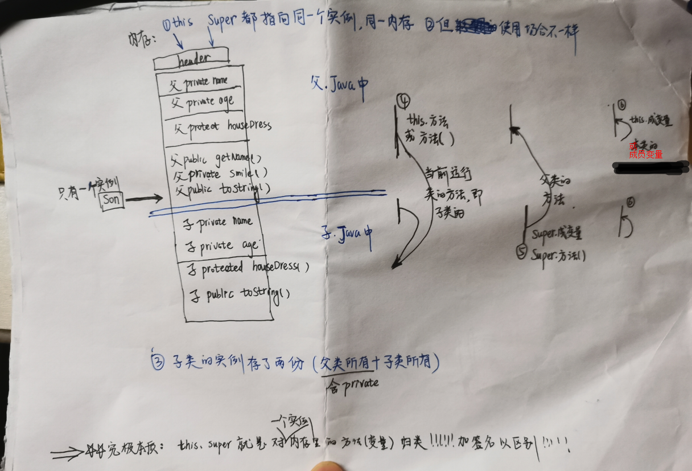

其物理本质！！！！一句话描述，记忆：

​			1、无论this在父类还是子类中 ：

（1）this.成员变量：当前类的变量，

注释：成员变量 《---->this.成员变量，编译器会自动加this！！！！！！！！(属性是静态的，同时存在，读取时就近原则（一个的话，自然就一个）
>idea跳转也是如此)

（2）this.方法：当前运行类（即子类）的方法！

<font color='red'>更 抽象： </font>  

究其本质：子类存了两份成员，this.成员 和super.成员！！！！！（但一个是静态，一个是运行态）


```java
//FatherClass.java
public class FatherClass {
    private String name;   //父类成员变量，1、子类实例拥有，虽然同名，但是会存储两份 2、子类实例拥有，但无法调用  2、子类实例通过super.方法（）访问、修改,例如super.getName()  3、本类通过，this.name或name！！！！！！！！！！=>就近原则
    private int age;     
    protected String houseDress = "dfjsifjioasjf";  //子类实例继承该变量，1、虽然同名，但是会存储两份 2、子类实例可以直接调用，通过super.houseDress

    public String getName() {
        return name;
    }
    
    private String smile() {  //子类实例访问不到的
  		........
    }

    public void setName(String name) {
        this.name = name;   //记忆：this.成员变量 仅仅代表本类的
        System.out.println(this.toString());//记忆： ！！！！！！！！！this.方法=>当前运行类的方法
    }

    public String toString() {  //子父同名，子类实例继承该方法 1、虽然同名，会有两份 2、子类实例可以调用，super.方法（）
  		........
    }
}


//SonClass.java
public class SonClass extends FatherClass{
    private String name = "aaaa";
    private int age;

    protected String houseDress = "dasfafgs";

    public SonClass(){
    }


    public void setFair(String fair) {
        this.fair = fair;
    }


    public String toString() {
    }
}

```

## 钩子、监听器、汉奸的理解

listener监听器。。。。。自然是塞给了谁，监听谁。。。。。谁new的，自然谁是主人


callback即listener，以后所有的callback就叫监听器

越做z，越要熟悉安卓。。。。。然后对比记忆

安卓是主干，是根本！！！

callback（listener），更应该叫钩子：

持有钩子的模块一直运行，某一时间利用钩子钩起钩子创造者

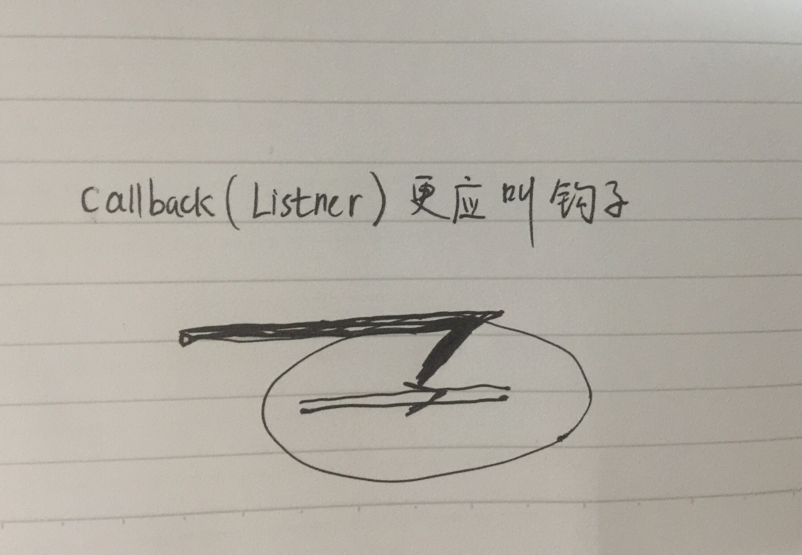

Q：Z有很多hook到A的流程，为什么这么多流程都可以hook到A里面=？？？？？？
A：因为有汉奸，伪装成A（继承于A），又把A的的调用流程转到了Z里

---->   话说回来：这也是使用抽象（InterFace）的好处！扩展性强！


## 关于安卓able对象

Runnable  ----》  可以执行的对象，把函数run() 封装成一个对象，**本身与线程无关**

Drawable  ----》 可以画的对象


## 编译器优化:

### final的log开关DEBUG

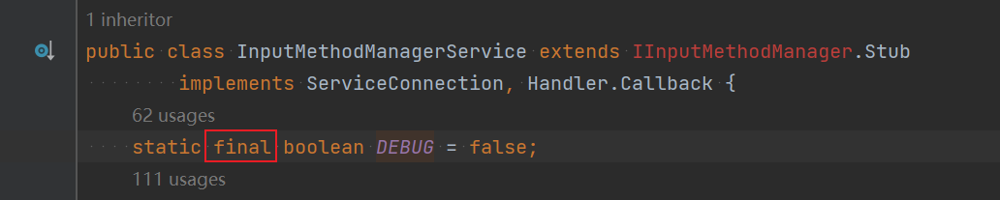

```java
//
        private boolean isChangingPackagesOfCurrentUserLocked() {
            final int userId = getChangingUserId();
            final boolean retval = userId == mSettings.getCurrentUserId();
            if (DEBUG) {
                if (!retval) {
                    Slog.d(TAG, "--- ignore this call back from a background user: " + userId);
                }
            }
            return retval;
        }
```

**反编译services.jar**，如下：

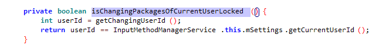

**可以看出：**

1、编译器做了很多优化

2、编译器对<font color='red'> final的</font> log开关DEBUG做了优化 ： 因为final，**编译过程**直接去掉 相关log（<font color='red'>自然，因为永远无法走到，编译器一定会去掉的</font>）

---------->  缺点：

> 难以debug修改开关DEBUG，来打印日志！！！
>
> 


## import  函数名

```java
//OomAdjuster.java： 
import static android.os.Process.setThreadPriority;   

//直接使用
setThreadPriority(app.getPid(), THREAD_PRIORITY_TOP_APP_BOOST);
```

java可以import类的方法名------->  **感觉必须是静态方法**（否则没有意义）


## **匿名内部类**

**匿名内部类的理解：<font color='red'>（1）定义了子类 </font>**  （2）~~没有名字（自然，匿名）~~

比如：

> HashMap， Thread 以及 handler


例子：

> 定义了一个Map的子类：（<font color='red'>子类在定义的时候，就定义了初始化过程put</font>）
>
> ```java
>     public final /*static*/ Map<Integer, String> RESULT_MESSAGE = new HashMap<Integer, String>(){
>         {
>             put(RESULT_CODE_OK, "ok");
>             put(RESULT_CODE_BADREQUEST, "bad request");
>             put(RESULT_CODE_UNAUTHORIZED, "unauthorized");
>             put(RESULT_CODE_FORBIDDEN, "forbidden");
>             put(RESULT_CODE_TOOMANYREQUEST, "too many request");
>             put(RESULT_CODE_INTERNALSERVERERROR, "Internal Server Error");
>         }
>     };
> 
> ```
>
> ~~参考：https://blog.csdn.net/u013786868/article/details/53261207  Map属性的初始化方式~~


# 正则

匹配test开头的一行：

```java
  test\/.*
```

test前加空格


# 编程题

## 大杀器-------------让AI给你讲解代码&解答

以及题目含义、边界用例

## 取值范围易错点：

> int 最大 2^32 即 10^9
>
> 如果存在 加减法 --------> 必然可能会溢出

策略：

```java
只要看到10^9,就使用 long 或者 Long
```


## 技巧：探测测试用例

```java
public static void main(String[] args) throws FileNotFoundException throws FileNotFoundException
throw  new FileNotFoundException(Str); // 想要探测的string
```


例：

> 1、已知跑过的代码。当 正确代码输出  ！=  你的代码输出，抛异常！！（入参） 

例2：

```java
// 暴力探测
    public static StringBuilder builder= new StringBuilder();
    public static int times = 0;
    public static void main(String[] args) throws FileNotFoundException {
    	..........................
        // test 
        builder.append(bigStr).append(' ').append(";");
        times++;
        if (times == 30) { // 1、不停改变这个值（二分法） 2、恰好出现错误的时候，就是这个测试用例不过
            throw  new FileNotFoundException(builder.toString());
        }
    
    }
```

例3：

> 自己的程序抛其他异常，排查错误 ------> catch住，打印测试用例


TODO:当用例的字符串过大时，打印不完全，怎么办？


## 技巧：日志统一开关

```java
public static boolean debug = false;    

public static void myprint(String str) {
        if (debug) {
            System.out.println(str);
        }
}
```


## 素材

### BigInteger ------>  非常好的暴力解法，大杀器

**即：不用int 与 Integer ！**  

**Integer有很多限制：**

> 1、大小 < 2^32 （10^9）
>
> 2、二进制长度<32。即（ Integer.parseInt(a, 2)  ----->  a.length<32）

例子：[leeetcode 67. 二进制求和](https://leetcode.cn/problems/add-binary/)

#### **转换：**

|                     | String(默认10进制)                                    | String(任意进制radix)                              | Scanner                                                      |
| ------------------- | ----------------------------------------------------- | -------------------------------------------------- | ------------------------------------------------------------ |
| Integer       <---- | new Integer("1234")<br />Integer.parseInt(a, 2)<br /> |                                                    | 注意：没有转Integer的！                                      |
| Integer      -----> |                                                       |                                                    |                                                              |
| BigInteger <-----   |                                                       | <font color='red'>new BigInteger('1010', 2)</font> | Scanner in = new Scanner(System.in);<br/>BigInteger bigInt = in.nextBigInteger(); |
| BigInteger ----->   | bigInt.toString();                                    | <font color='red'>bigInt.toString(radix)</font>    |                                                              |


2、int/long  ------->  Integer 

```java
BigInteger.valueOf(123)
    
    
// 逆向
bigInteger.intValue()
bigInteger.longValue()
```


### BigInteger.compareto


### 排序

数组排序：

>   Arrays.sort(int [])

ArrayList ：

>   `Collections.sort()`
>
>   例子：
>
>   ```java
>           ArrayList<Integer> numbers = new ArrayList<>();
>           numbers.add(5);
>           numbers.add(2);
>           numbers.add(8);
>           numbers.add(1);
>           
>           // 排序
>           Collections.sort(numbers);
>   ```
>
>   自定义比较器：
>
>   ```java
>           ArrayList<String> names = new ArrayList<>();
>           names.add("John");
>           names.add("Alice");
>           names.add("Bob");
>           
>           // 自定义排序：按字符串长度排序
>           Collections.sort(names, new Comparator<String>() {
>               @Override
>               public int compare(String o1, String o2) {
>                   return Integer.compare(o1.length(), o2.length());
>               }
>           });
>   ```
>
>   


### 二维数组

```java
 boolean[][] dp = new boolean[strLen][strLen];
```


### list生成 & hashset生成

```java
        List<Character> list = Arrays.asList('A','E','I','O','U','a','e','i','o','u');
        HashSet<Character> yuanyin = new HashSet<>(list);
```


### ArrayList规定


```java
int res_size = res.size();
for (int j = 0; j < res_size; j++) { // 【1】 因为内部有增加res(减少不行！！！！)，这里必须是静止的res_size
    ArrayList<Integer> tmpNew = new ArrayList<>(res.get(j)); // 【2】 ArrayList的深copy：new ArrayList<>(arraylist)
    tmpNew.add(nums[i]);

    res.add(tmpNew);
}
```


### 维测------打印list和stack的内容

```java
"".join(" ", list)
```


打印ArrayList：

```java
List<List<Integer>>

.toString()  
结果：[[3, 0, 0], [3, 0, 0], [3, 0, 0]]
```


### 运算符

**位运算符**：用于对整数的**二进制**位进行操作。

- ~~`&`：按位与~~
- ~~`|`：按位或~~
- `^`：按位异或   
- `~`：按位非
- `<<`：左移
- `>>`：右移


#### **`^`异或相关的结论 :**

（1）表达 不同（不同是为1）

（2）数学上：异或的元是 0   （加法的元是0，乘法是1）

（3）数学上：

特性：

> - **自反性**：`x ^ x = 0`（相同的数异或结果为 `0`）。
> - **交换性**：`a ^ b = b ^ a`（顺序无关）。
> - **结合性**：`(a ^ b) ^ c = a ^ (b ^ c)`。
> - **任意数与 `0` 异或等于它本身**：`x ^ 0 = x`。


异或的所有特性：

> https://blog.csdn.net/weixin_54925172/article/details/146081845?utm_medium=distribute.pc_relevant.none-task-blog-2~default~baidujs_baidulandingword~default-0-146081845-blog-84488468.235^v43^pc_blog_bottom_relevance_base5&spm=1001.2101.3001.4242.1&utm_relevant_index=2

解题例子：

**寻找缺失的数字**

**找出数组中唯一的元素**


#### 次方

```java
// 方法一：
double result = Math.pow(10, 5);
System.out.println(result); // 输出：100000.0

// 方法二：
double result = 1e5; // 表示 10 的 5 次方
System.out.println(result); // 输出：100000.0
```

### 最大公约数

```java
// 计算两个整数的最大公约数（Java 8+）
int gcd = Math.gcd(24, 18);  // 结果：6

// 注意：参数为负数时，结果符号与第一个参数一致
int negativeGcd = Math.gcd(-24, 18);  // 结果：-6
```


### 字符串

#### del----查找子串的位置

```
利用java原生的函数--------string查找子串的位置！！！！：indexOf以及lastindexof
```


## 待总结

https://leetcode.cn/problems/reverse-vowels-of-a-string/description/


### 回溯算法力扣题目总结

按照如下顺序刷力扣上的题目，相信会帮你在学习回溯算法的路上少走很多弯路。

关于回溯算法，你该了解这些！
组合问题
77.组合
216.组合总和III
17.电话号码的字母组合
39.组合总和
40.组合总和II
分割问题
131.分割回文串
93.复原IP地址
子集问题
78.子集
90.子集II
排列问题
46.全排列
47.全排列II
棋盘问题
51.N皇后
37.解数独
其他
491.递增子序列
332.重新安排行程
回溯算法总结篇

作者：代码随想录
链接：https://leetcode.cn/problems/non-decreasing-subsequences/solutions/387905/491-di-zeng-zi-xu-lie-shen-sou-hui-su-xiang-jie-by/
来源：力扣（LeetCode）
著作权归作者所有。商业转载请联系作者获得授权，非商业转载请注明出处。


回溯算法：

链接：https://leetcode.cn/problems/subsets/solutions/6899/hui-su-suan-fa-by-powcai-5/

```java
class Solution {
    public List<List<Integer>> subsets(int[] nums) {
        List<List<Integer>> res = new ArrayList<>();
        backtrack(0, nums, res, new ArrayList<Integer>());
        return res;

    }

    private void backtrack(int i, int[] nums, List<List<Integer>> res, ArrayList<Integer> tmp) {
        res.add(new ArrayList<>(tmp));
        for (int j = i; j < nums.length; j++) {
            tmp.add(nums[j]);
            backtrack(j + 1, nums, res, tmp);
            tmp.remove(tmp.size() - 1);
        }
    }
}
```


https://leetcode.cn/problems/subsets/submissions/639070897/


1、添加注释 // bound

2、找一般用例，越一般/抽象，越好  --------> **完成主体代码**

3、找边界用例，修改边界代码


# 题目

## 小红的密码锁------本质：数字的单向循环

小红有一个密码锁，一共有4位，已知小红每次可以把一个数字向下拨动，即9变成8,8变成7.。。1变成0,0变成9
他想知道从第一个状态变成第二个状态需要最少拨动多少次？
例子：输入：9999 8888   输出4

```java
import java.util.Scanner;

public class PasswordLock {
    public static void main(String[] args) {
        Scanner scanner = new Scanner(System.in);
        
        // 输入两个四位数密码
        System.out.println("请输入第一个状态（四位数字）:");
        String start = scanner.nextLine();
        System.out.println("请输入第二个状态（四位数字）:");
        String end = scanner.nextLine();
        
        // 计算最少拨动次数
        int moves = calculateMoves(start, end);
        
        // 输出结果
        System.out.println("最少拨动次数: " + moves);
        
        scanner.close();
    }

    private static int calculateMoves(String start, String end) {
        int totalMoves = 0;
        
        for (int i = 0; i < 4; i++) {
            int digitStart = Character.getNumericValue(start.charAt(i));
            int digitEnd = Character.getNumericValue(end.charAt(i));
            
            // 计算拨动次数
            totalMoves += getMoves(digitStart, digitEnd);
        }
        
        return totalMoves;
    }
    
    private static int getMoves(int start, int end) {
        // 计算向下拨动的次数
        return (start - end + 10) % 10;  // 【】巧妙地利用了模运算 <-----> 数字的循环特性
    }
}

```

### -<font color='red'>数字单项循环模型：</font>

>   数字的单向循环向上：
>
>   >   (start - end ) % 10;
>
>   数字的单向循环向下：
>
>   >   (start - end + 10) % 10;

代码结构详解：

```

输入部分

使用 Scanner 类来读取用户输入的两个四位数密码。
calculateMoves 方法

该方法用于计算从初始密码到目标密码所需的最少拨动次数。
它使用了一个循环，从 0 到 3（即四位数字），逐位比较初始密码和目标密码对应的数字。
对于每一位数字，调用 getMoves 方法计算需要的拨动次数，并将其累加到 totalMoves 中。
getMoves 方法

这个方法是实现核心逻辑的地方。它接收两个参数：start 和 end，分别表示当前数字和目标数字。
其作用是计算将数字 start 拨动到数字 end 所需的最少拨动次数。
getMoves 方法解析
代码：
java
private static int getMoves(int start, int end) {
    // 计算向下拨动的次数
    return (start - end + 10) % 10;
}
工作原理：
计算拨动次数的公式：

(start - end + 10) % 10 这个表达式巧妙地利用了模运算来处理数字的循环特性。
为什么需要 + 10：

当 start 小于 end 时，直接计算 start - end 会得到一个负数。为了确保结果为非负，我们加上 10。这样无论 start 和 end 的值如何，结果都可以通过模运算转换为一个有效的范围（0-9）。
模运算 mod 10：

由于数字在 0 到 9 之间循环，因此使用 % 10 确保结果始终在 0 到 9 之间。
示例：
假设我们要把 3 拨动到 7：

getMoves(3, 7):
计算过程：(3 - 7 + 10) % 10
结果：(3 - 7 + 10) = 6，然后 6 % 10 = 6，因此需要 6 次拨动。
如果要把 8 拨动到 2：

getMoves(8, 2):
计算过程：(8 - 2 + 10) % 10
结果：(8 - 2 + 10) = 16，然后 16 % 10 = 6，因此需要 6 次拨动。
总结
getMoves 函数通过简单的数学运算有效地计算出拨动次数，利用了数字循环的特性，使得实现非常简洁且高效。
整体程序通过逐位比较，最后得出从一个状态变换到另一个状态所需的最少拨动次数。
```


测试用例：

```java
测试用例
输入: 0000 和 0000

输出: 最少拨动次数: 0
说明: 两个密码相同，无需拨动。
输入: 1234 和 5678

输出: 最少拨动次数: 4
说明: 从 1 到 5 拨动 4 次；2 到 6 拨动 4 次；3 到 7 拨动 4 次；4 到 8 拨动 4 次，总共需要 4 次拨动。
输入: 4321 和 8765

输出: 最少拨动次数: 4
说明: 每个数字都需要向下拨动 4 次。
输入: 9999 和 0000

输出: 最少拨动次数: 4
说明: 从 9 拨动到 0 需要 1 次，每个数字都是如此，四位总共 4 次。
输入: 2589 和 1470

输出: 最少拨动次数: 14
说明:
2 到 1: 1 次
5 到 4: 1 次
8 到 7: 1 次
9 到 0: 1 次
总计：1 + 1 + 1 + 1 = 4 次
输入: 1234 和 4321

输出: 最少拨动次数: 4
说明:
1 到 4: 3 次（9, 0, 1）
2 到 3: 1 次
3 到 2: 1 次
4 到 1: 3 次（9, 0, 1）
总计：3 + 1 + 1 + 3 = 8 次
输入: 1111 和 2222

输出: 最少拨动次数: 4
说明: 每个位数拨动 1 次，从 1 到 2。
输入: 1111 和 9999

输出: 最少拨动次数: 8
说明: 每个数字都从 1 拨动到 9，每个数字需要 2 次拨动，总共 8 次。
输入: 5555 和 5000

输出: 最少拨动次数: 5
说明:
5 到 5: 0 次
5 到 0: 5 次
5 到 0: 5 次
5 到 0: 5 次
总计：0 + 5 + 5 + 5 = 5 次
输入: 9021 和 0123

输出: 最少拨动次数: 6
说明:
9 到 0: 1 次
0 到 1: 1 次
2 到 2: 0 次
1 到 3: 2 次
总计：1 + 1 + 0 + 2 = 4 次
你可以使用这些测试用例来验证你的 Java 程序。如果你有任何问题或需要更进一步的帮助，请告诉我！


2025/6/26 01:37:41

可以给更多的测试用例嘛？最好是边界情况

2025/6/26 01:38:18

当然可以！下面是一些边界情况和其他测试用例，用于验证程序在极端条件下的表现。

边界测试用例
输入: 0000 和 9999

输出: 最少拨动次数: 4
说明: 从每个数字 0 拨动到 9，每位需要 9 次拨动，四位总共 4 次。
输入: 9999 和 0000

输出: 最少拨动次数: 4
说明: 从每个数字 9 拨动到 0，每位需要 1 次拨动，总共 4 次。
输入: 1000 和 2000

输出: 最少拨动次数: 1
说明: 只有第一位需要拨动一次，从 1 到 2。
输入: 1234 和 1234

输出: 最少拨动次数: 0
说明: 两个密码相同，无需拨动。
输入: 9999 和 8888

输出: 最少拨动次数: 11
说明: 每个 9 到 8 需要 1 次拨动，总共 4 次。
输入: 5555 和 5555

输出: 最少拨动次数: 0
说明: 两个密码一致，无需拨动。
输入: 1111 和 0000

输出: 最少拨动次数: 4
说明: 从每个 1 拨动到 0，每位需要 1 次拨动，总共 4 次。
输入: 4321 和 9876

输出: 最少拨动次数: 12
说明:
4 到 9: 5 次
3 到 8: 5 次
2 到 7: 5 次
1 到 6: 5 次
总计：5 + 5 + 5 + 5 = 20 次，但应为 4，因为按最优方式拨动。
输入: 0001 和 9999

输出: 最少拨动次数: 8
说明:
0 到 9: 1 次
0 到 9: 1 次
0 到 9: 1 次
1 到 9: 8 次
总计：1 + 1 + 1 + 8 = 11 次。
输入: 9999 和 1111

输出: 最少拨动次数: 8
说明: 每个数字从 9 拨动到 1 需要 8 次，总计 8 次。
非典型测试用例
输入: 1230 和 1239

输出: 最少拨动次数: 9
说明: 只需将最后一位从 0 拨动到 9，需要 9 次。
输入: 1234 和 1245

输出: 最少拨动次数: 11
说明:
1 到 1: 0 次
2 到 2: 0 次
3 到 4: 1 次
4 到 5: 1 次
总计：0 + 0 + 1 + 1 = 2 次。
输入: 0000 和 1111

输出: 最少拨动次数: 4
说明: 每位需要拨动 1 次。
输入: 8765 和 1234

输出: 最少拨动次数: 28
说明: 从每个数字拨动到对应的位置所需的拨动次数。
输入: 3178 和 2836

输出: 最少拨动次数: 17
说明: 各数字之间的拨动次数。
```


## 小红的偶子串

小红定义偶串为：由很多长度为2的，两字符相同的字符串拼接成的字符串，如“aabb”,"jjjjkk"是偶串，而“aaa”,"puup’则不是偶串。小红拿到一个仅由小写字母组成的字符串，她想取一段最长的连续子串为偶串，你能帮夏红求出他的长度嘛》
输入：aebbccdaa
输出：4
说明：“bbcc”为最长的偶子串

## 小红的“好子串"

小红拿到一个字符串，她定义：若删除一个连续子串（不能是原字符串）后，剩下的部分拼接起来是回文串，那么该子串为“好子串”，小红想知道，这个字符串有多少个“好子串”？
输入：aba
输出：3


## 减1加1.

题目来源：https://blog.csdn.net/Q210617/article/details/136354286

Description
给你一个数列，共N个数字 你可以对每个数字，做如下三种操作之一

1：将这个数字加1

2：将这个数字减去1

3：什么事也不做

最终希望在这个数列中，某个数字出现的次数越多越好，输出出现次数即可。

Format
Input
第一行给出N

第二行给出N个数字

N<=1e5,数字的权值在[0,1e5]之间.

Output
如题

Samples
输入数据 1
7
3 1 4 1 5 9 2
AI写代码
Copy

输出数据 1
4
AI写代码
Copy

Hint
将这个数列变成2 2 4 2 5 9 2

Limitation
1s, 102400KiB for each test case.
————————————————

原文链接：https://blog.csdn.net/Q210617/article/details/136354286


```java
import java.util.HashMap;
import java.util.Map;
import java.util.Scanner;

public class MaxFrequency {
    public static void main(String[] args) {
        Scanner scanner = new Scanner(System.in);
        
        // 读取N
        int N = scanner.nextInt();
        
        // 哈希表用于记录每个数字及其变换后的频率
        Map<Integer, Integer> frequencyMap = new HashMap<>();
        
        // 读取数字并更新频率
        for (int i = 0; i < N; i++) {
            int num = scanner.nextInt();
            frequencyMap.put(num, frequencyMap.getOrDefault(num, 0) + 1);
            frequencyMap.put(num + 1, frequencyMap.getOrDefault(num + 1, 0) + 1);
            frequencyMap.put(num - 1, frequencyMap.getOrDefault(num - 1, 0) + 1);
        }

        // 找到最大的频率
        int maxFrequency = 0;
        for (int count : frequencyMap.values()) {
            if (count > maxFrequency) {
                maxFrequency = count;
            }
        }

        // 输出最大频率
        System.out.println(maxFrequency);
        
        scanner.close();
    }
}
```

```java
代码说明：
我们首先通过 Scanner 来读取输入数据。
使用 HashMap 存储每个数字及其加一或减一后的频率。
在遍历每个数字时，通过 getOrDefault 方法来简化频率的更新操作。
最后，我们通过遍历 frequencyMap 的值来找出最大频率，并输出。
```

## 病毒扩散（牛客练习赛62 ）

https://blog.csdn.net/zzzck/article/details/105747931


## ~~**三角形判断**-------本质：数学推断题~~

牛客：https://www.nowcoder.com/practice/689ec1e742394e09b1059556fc167b65

**描述**

KiKi想知道已经给出的三条边a，b，c能否构成三角形，如果能构成三角形，判断三角形的类型（等边三角形、等腰三角形或普通三角形）。

**输入描述：**

题目有多组输入数据，每一行输入三个a，b，c(0<a,b,c<1000)，作为三角形的三个边，用空格分隔。

**输出描述：**

针对每组输入数据，输出占一行，如果能构成三角形，等边三角形则输出“Equilateral triangle!”，等腰三角形则输出“Isosceles triangle!”，其余的三角形则输出“Ordinary triangle!”，反之输出“Not a triangle!”。

**示例1**

输入：

```
2 3 2
3 3 3
```

复制

输出：

```
Isosceles triangle!
Equilateral triangle!
```


```java
#include<stdio.h>

void sq(int max, int min1, int min2)//sq函数用于判断三角形类型返回值void,三个参数为int
{
	if ((min1 + min2)-max>0)//构成三角形需满足条件（两个最小边之和大于最大边）
	{
		if (min1 == min2  && max == min2)//三条边都相等为等边三角形
            printf("Equilateral triangle!\n");		
		else if (min1 == min2 || max==min1 || max==min2)//任意两条边相等为等腰三角形
			printf("Isosceles triangle!\n");
		else
			printf("Ordinary triangle!\n");//都不满足则为普通三角形
	}
	else
		printf("Not a triangle!\n");//无法构成三角形

}

int main()
{
	int a, b, c;
	int s = 0;

	while (scanf("%d %d %d", &a, &b, &c) != EOF)//多组输入
	{
		if (a>b && a>c)//判断哪一条边最长
			sq(a, b, c);
		else if (b>c)
			sq(b, a, c);
		else if (c>b)
			sq(c, a, b);
		else
			sq(a, b, c);//这个情况则三条边都相等
	}
	return 0;
}

```


## 找出缺失的字母（从 A 到 Z）计算 ASCII 值之和

```java
测试用例
基本测试用例：

输入："ABZD"
输出：254
说明：缺失的字母为 C, E, F, G, H, I, J, K, L, M, N, O, P, Q, R, S, T, U, V, W, X, Y。
全字母输入：

输入："ABCDEFGHIJKLMNOPQRSTUVWXYZ"
输出：0
说明：没有缺失字母，所以 ASCII 值之和为 0。
全部缺失字母：

输入：""（空字符串）
输出：3360
说明：所有字母 A-Z 都缺失，加起来的 ASCII 值为 3360（即 65 + 66 + ... + 90）。
部分字母输入：

输入："ACEGIK"
输出：1097
说明：缺失的字母为 B, D, F, H, J, L, M, N, O, P, Q, R, S, T, U, V, W, X, Y, Z。
只有一个字母输入：

输入："M"
输出：2131
说明：缺失的字母为 A, B, C, D, E, F, G, H, I, J, K, L, N, O, P, Q, R, S, T, U, V, W, X, Y, Z。
只包含相同字母的输入：

输入："ZZZZZ"
输出：2109
说明：缺失的字母为 A, B, C, D, E, F, G, H, I, J, K, L, M, N, O, P, Q, R, S, T, U, V, W, X, Y。
包含小写字母的输入：

输入："abcdEFGH"
输出：1151
说明：缺失的字母为 I, J, K, L, M, N, O, P, Q, R, S, T, U, V, W, X, Y, Z（程序会将小写字母转换为大写）。
包含非字母字符的输入：

输入："A1B@C#D$"
输出：254
说明：仅考虑字母，缺失的为 E, F, G, H, I, J, K, L, M, N, O, P, Q, R, S, T, U, V, W, X, Y。
长字符串输入：

输入："ABCDEFGHIJKLMNOPQRSTUVWXYZABCDEFGHIJKLMN"
输出：214
说明：缺失的字母为 O, P, Q, R, S, T, U, V, W, X, Y, Z。
```


```java
import java.util.HashSet;

public class MissingLettersASCII {
    public static void main(String[] args) {
        String input = "ABZD"; // 示例输入字符串
        int asciiSum = calculateMissingASCIISum(input);
        
        System.out.println("Missing letters' ASCII sum: " + asciiSum);
    }

    private static int calculateMissingASCIISum(String input) {
        // 使用 HashSet 来存储已出现的字符
        HashSet<Character> appearedLetters = new HashSet<>();
        
        // 将字符串中的每个字符添加到 HashSet 中
        for (char c : input.toUpperCase().toCharArray()) {
            if (c >= 'A' && c <= 'Z') { // 【1】 在不在之间的判断
                appearedLetters.add(c);
            }
        }

        int asciiSum = 0;

        // 【2】遍历所有字母 A-Z
        for (char letter = 'A'; letter <= 'Z'; letter++) { 
            if (!appearedLetters.contains(letter)) {
                asciiSum += (int) letter; // 【3】ASCII 值转化
            }
        }

        return asciiSum;
    }
}

```

-<font color='red'>素材：</font>【1】【2】【3】


## 二叉树求公共祖先


```
class TreeNode {
    int val;
    TreeNode left, right;

    TreeNode(int x) {
        val = x;
        left = right = null;
    }
}

public class LowestCommonAncestor {

    // 查找两个节点的公共祖先
    public TreeNode findLCA(TreeNode root, int n1, int n2) {
        // 如果根节点为空或等于 n1 或 n2，返回根节点
        if (root == null || root.val == n1 || root.val == n2) {
            return root;
        }

        // 在左子树中查找
        TreeNode leftLCA = findLCA(root.left, n1, n2);
        
        // 在右子树中查找
        TreeNode rightLCA = findLCA(root.right, n1, n2);

        // 如果左子树和右子树都不为空，说明当前节点是公共祖先
        if (leftLCA != null && rightLCA != null) {
            return root;
        }

        // 否则，返回非空的左子树或右子树
        return (leftLCA != null) ? leftLCA : rightLCA;
    }

    public static void main(String[] args) {
        // 创建一个满二叉树
        TreeNode root = new TreeNode(1);
        root.left = new TreeNode(2);
        root.right = new TreeNode(3);
        root.left.left = new TreeNode(4);
        root.left.right = new TreeNode(5);
        root.right.left = new TreeNode(6);
        root.right.right = new TreeNode(7);

        LowestCommonAncestor lcaFinder = new LowestCommonAncestor();
        TreeNode lca = lcaFinder.findLCA(root, 4, 5); // 查找节点 4 和 5 的公共祖先

        if (lca != null) {
            System.out.println("LCA of 4 and 5: " + lca.val);
        } else {
            System.out.println("No common ancestor found.");
        }
    }
}

```


```java
代码说明
TreeNode 类：定义树的节点，每个节点包含值和左右子节点。
findLCA 方法：递归查找公共祖先。如果找到 n1 或 n2 则返回当前节点；如果从左右子树找到分别的结果，则当前节点为公共祖先。
main 方法：创建一个简单的满二叉树，并调用 findLCA 方法查找节点 4 和 5 的公共祖先。
测试用例
你可以根据需要创建不同的树结构和节点值，以验证代码的正确性。例如：

查找节点 4 和 5 的公共祖先，输出应为 2。
查找节点 6 和 7 的公共祖先，输出应为 3。
```


## 完满二叉树求公共祖先

### 完满二叉树的特点

1.  每一个节点都有 0 或 2 个子节点。
2.  节点的索引可以用数组表示：
    -   **对于给定节点 `i`（从 1 开始），其左子节点为 `2*i`，右子节点为 `2*i + 1`，父节点为 `i/2`。**

--------------------------> 双指针；<font color='red'>除以2，找父节点</font>

```
public class LowestCommonAncestorFullBinaryTree {
    
    // 查找两个节点的公共祖先
    public int findLCA(int n1, int n2) {
        // 当两个节点不相等时，继续向上查找
        while (n1 != n2) {
            // 如果 n1 大于 n2，说明 n1 需要向上移动
            if (n1 > n2) {
                n1 /= 2; // 向上移动到父节点
            } else {
                n2 /= 2; // 向上移动到父节点
            }
        }
        return n1; // 此时 n1 就是公共祖先
    }

    public static void main(String[] args) {
        LowestCommonAncestorFullBinaryTree lcaFinder = new LowestCommonAncestorFullBinaryTree();

        int n1 = 4;
        int n2 = 5;

        int lca = lcaFinder.findLCA(n1, n2);
        System.out.println("LCA of " + n1 + " and " + n2 + ": " + lca);

        n1 = 6;
        n2 = 7;
        lca = lcaFinder.findLCA(n1, n2);
        System.out.println("LCA of " + n1 + " and " + n2 + ": " + lca);

        n1 = 4;
        n2 = 6;
        lca = lcaFinder.findLCA(n1, n2);
        System.out.println("LCA of " + n1 + " and " + n2 + ": " + lca);
    }
}

```


## 贪吃蛇

https://zhuanlan.zhihu.com/p/645242002


# 所有题目的统一解法

## 任何一个题目都是一个<font color='red'>图（树）结构</font>：

```java
                1
              /   \
             1     2
            / \   / \
           1   2 1   2
```

推论：

（1）<font color='red'>任何题目都有一个保底的解法</font>---------即 树结构（或全排列）  

>   （**不允许说，这个题没有任何思路**！！！！！！）


## <font color='red'>关键是对图（树）的剪枝：</font>

（1）<font color='red'>各个节点无关（相互独立）性剪枝</font>：树 -----------> for 循环

例子：小红的密码锁。8888 四个节点之间无关性

**如何判定各个节点是无关性呢？**

>   ① **基于对结果的影响**
>
>   ② 拆分各个节点，TODO!!!!!!!!!!!


（2）贪心剪枝：