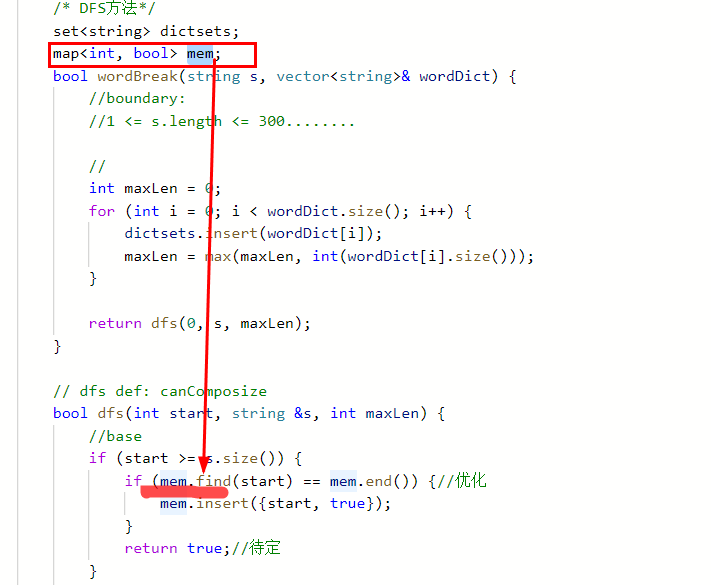
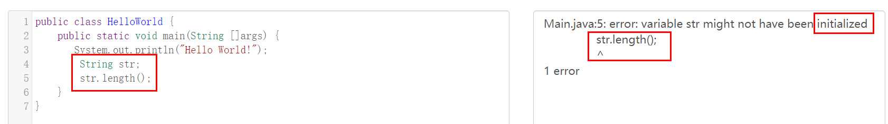
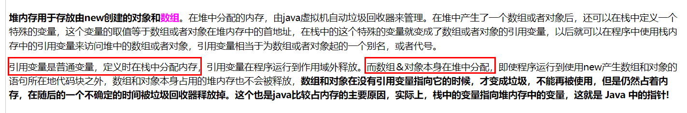
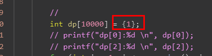
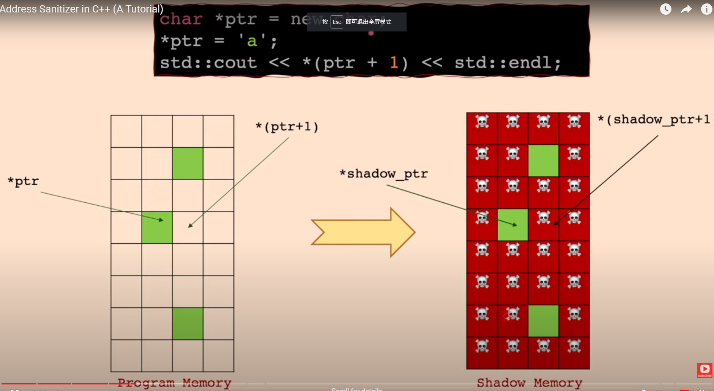
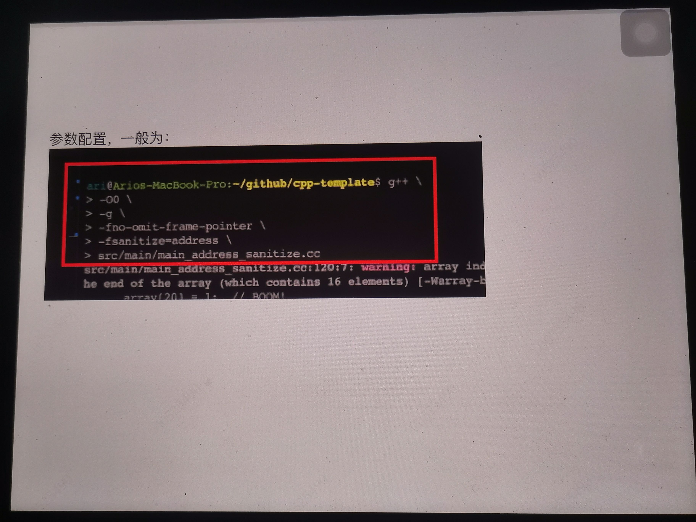
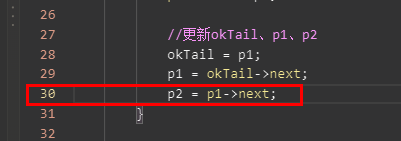
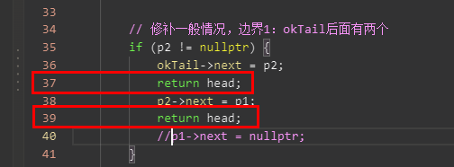
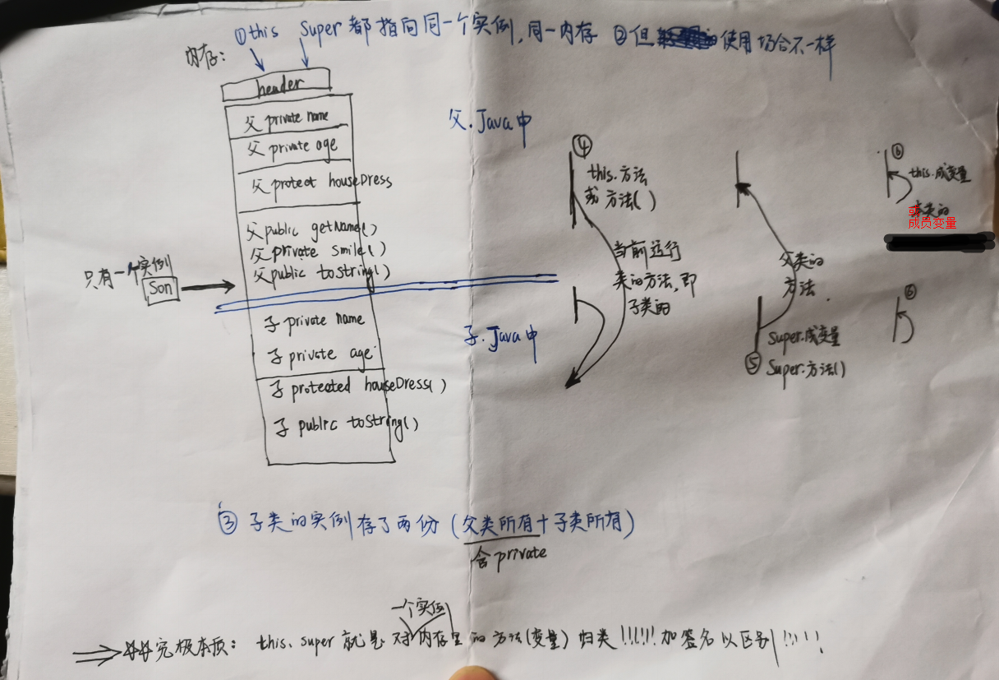

# 目录

# C语言

## 字符串：

cpp：    <font color='red'>string </font>或 char \* s   ------>  首选string
c：  <font color='red'> char \* s</font>  或  char s[] （c中的字符数组）

区别：获取长度
stirng s ------>s.size()

char s[]  ---------> lenstr(s)


c语言中：strcmp与strncmp与memcmp的区别：
https://blog.csdn.net/weixin_45380951/article/details/100699751?spm=1001.2101.3001.6650.3&utm_medium=distribute.pc_relevant.none-task-blog-2%7Edefault%7ECTRLIST%7ERate-3.pc_relevant_default&depth_1-utm_source=distribute.pc_relevant.none-task-blog-2%7Edefault%7ECTRLIST%7ERate-3.pc_relevant_default&utm_relevant_index=6


## 字符串的数组（c指针数组）

cpp：vector<string>& wordDict_cpp

c： char ** wordDict_c, int wordDictSize   ------>多重指针，指针的指针
       char \*  wordDict_c[3]     ------>指针数组

-------->**使用方法完全一样：**
~~取第0个字符串  wordDict_cpp[0],     wordDict_c[0]~~
~~取第0个字符串的wordDict_cpp[0] [0], wordDict_c[0] [0]~~


关于char \*\* wordDict_c理解：
（1）<font color='red'>\*相当于一个[], </font>比如 <font color='red'> char \* s</font>  =  char s[]
<font color='red'>所以，\*\* 即是 [] []</font>

具体：
    char \*month[] = {"January","February","March","April",
            "May","June","July","August","September","October",
            "November","December"};
---->这里month是  char \*的[]，

---->char \*\*  point = &month; 还是  char \*\*  point = month？？？？

双重指针！！！！！

（2）<font color='red'>c表达字符串数组时：指针数组<-------> 多重指针 </font>


## memset、memcmp、strcmp比较

**cpp没有字节级的处理**，最少也是基本数据类型的处理---->比如，char、string

memset、memcmp、strcmp ---->**都是字节级的处理**  <font color='red'>即直接操作内存空间（字节级）</font> 是c的用法（当然cpp也可以用）

所以，经常用到 sizeof()   --->获取字节数

例子：

```cpp
void *memset(void *s, int c, unsigned long n); // 将s前n个字节填充c

 bool dp[lenstr(s) ]; //  是字符数组
 memset(dp, 0, sizeof(bool)*lenstr(s));  //全部填充0
```

例2：
memcmp(&s[i-int(tem.size())], &tem[0], int(tem.size())*sizeof(char))  0


## sizeof


<font color='red'>总之：</font>

> sizeof是c语言的东西
>
> 返回字节数
>
> 返回 类型的大小


具体用法：

> 1、用于数据类型-----本质
>
> ```cpp
> cout << "sizeof(int) " << sizeof(int) << endl;
> 
> 4
> ```
>
> ~~2、用于变量  ----->  变量对应的数据类型的大小~~:
>
> ```cpp
>     int x = 4;
>     cout << "sizeof(int) " << sizeof(int) << endl;
>     cout << "sizeof(x) " << sizeof(x) << endl;
> 
>     string str = "hello world!"; //cpp语言
>     cout << "sizeof(string) " << sizeof(string) << endl;
>     cout << "sizeof(str) " << sizeof(str) << endl;
> 
>     B b;   //cpp语言，类B
>     cout << "sizeof(B) " << sizeof(B) << endl;
>     cout << "sizeof(b) " << sizeof(b) << endl;
> ```
>
> 结果：
>
> ```cpp
> sizeof(string) 32
> sizeof(str) 32
> sizeof(int) 4
> sizeof(x) 4
> sizeof(B) 4
> sizeof(b) 4
> ```
>
> ~~3、指针变量也是变量，自然也是类型的大小~~
>
> ----->   自然，跟系统有关： 32位计算机，返回4；64位计算机，返回8
>
> ```cpp
> char*pc="abc";
> int*pi;
> string*ps;
> char**ppc=&pc;
> void(*pf)();//函数指针
> sizeof(pc);//结果为8
> sizeof(pi);//结果为8
> sizeof(ps);//结果为8
> sizeof(ppc);//结果为8
> sizeof(pf);//结果为8
> ```
>
> ~~4、用于数组  ----->  也是数组类型的大小，即  数组元素的大小 * 数组元素的个数~~
>
> 为什么？因为 **数组类型** =  元素大小  +  数组长度
>
> ​     
>
> ```cpp
>     int arr[3] = {0};
>     cout << "sizeof(arr) " << sizeof(arr) << endl;
>     cout << "sizeof(arr)/sizeof(arr[0]): " << sizeof(arr)/sizeof(arr[0])<< endl;  //c语言，获取数组大小的方法
> 
> 结果：
>     sizeof(arr) 12
>     sizeof(arr)/sizeof(arr[0]): 3
> ```
>
> 5、结构体的sizeof  --->  涉及到字节对齐
>
> 


### 与cpp对比

对于cpp，推论，自然：

~~用于cpp的类的对象时，-------->  是 类型（即类）的大小~~，见上


### 参考：

https://baike.baidu.com/item/sizeof/6349467


# 如何学习一门语言


以某一门语言为基础，搭建 学语言需要的技能树：

1、根据技能树，填充

2、填充的同时，**与已经学会的语言进行比较**（~~一样的话，就不需要记忆了~~）

# cpp

## 引用的表达------include关键字（与java比较）

引用其他文件的.h文件  ---->.h用来<font color='red'>声明</font> <font color='red'>被其他文件引用</font>的类、函数

1、只在.h文件里声明，，**不能**在.h文件中**定义值**
---->原因：<font color='red'>include本质：</font>.h会被复制到引用的文件中，如果定义，涉及到重复定义

2、同一个.h 可能被<font color='red'>很多文件include</font> ------>会造成多次编译问题，解决办法：

.h文件中，增加#ifndef方式

```cpp
//Parcel.h
#ifndef ANDROID_PARCEL_H
#define ANDROID_PARCEL_H


// ---------------------------------------------------------------------------

#endif // ANDROID_PARCEL_H
```

https://blog.csdn.net/zzzkiti/article/details/40976867?spm=1001.2101.3001.6650.5&utm_medium=distribute.pc_relevant.none-task-blog-2%7Edefault%7ECTRLIST%7Edefault-5.pc_relevant_paycolumn_v2&depth_1-utm_source=distribute.pc_relevant.none-task-blog-2%7Edefault%7ECTRLIST%7Edefault-5.pc_relevant_paycolumn_v2&utm_relevant_index=9


对比 ：

>  java引用的表达是import


## 对象（与java比较）


### cpp—new malloc（与c的 malloc/free的比较）

https://blog.csdn.net/hahachenchen789/article/details/83056796

语言范围：

> new/delete<font color='red'>是C++关键字</font>，需要编译器支持。-----> new 是对象，自然是cpp的东西
>
> ~~malloc/free是库函数，需要头文件支持~~。 ---->  C的东西

入参比较：

> 使用new操作符申请内存分配时无须指定内存块的大小，<font color='red'>编译器会根据类型信息自行计算</font>。 ------>  对于面向对象的语言，这一点，很自然
>
> ~~malloc则需要显式地指出所需内存的大小~~ -----> 自然的，c是没有办法自己算出大小的

返回比较：

> ~~<font color='red'>new操作符内存分配成功时，返回的是对象类型的指针</font>，类型严格与对象匹配，无须进行类型转换，故new是符合类型安全性的操作符~~   ------>  面向对象语言，自然的
>
> malloc内存分配成功则是<font color='red'>返回void \*</font>，需要通过强制类型转换将void*指针转换成我们需要的类型。  ------>  **这一点需要注意**


-   malloc free 是stdlib库的函数 使用必须进行压栈出栈操作    ------>  TODO: 不懂

-   new delete 是 c++的操作符 无需进行栈栈操作 且会再new是<font color='red'>自动调用构造函数 delete调用析构函数</font>

    -------->**<font color='green'>所以，对于类来说，尽量用new（涉及到子类的析构</font>）**

例子：

```cpp
\\Parcel.cpp
status_t Parcel::write(const FlattenableHelperInterface& val)
{
    ...........
    int* fds = nullptr;
    if (fd_count) {
        fds = new (std::nothrow) int[fd_count];  //(1)
        if (fds  nullptr) {
            ALOGE("write: failed to allocate requested %zu fds", fd_count);
            return BAD_VALUE;
        }
    }

    err = val.flatten(buf, len, fds, fd_count);
    for (size_t i=0 ; i<fd_count && errNO_ERROR ; i++) {
        err = this->writeDupFileDescriptor( fds[i] );
    }

    if (fd_count) {
        delete [] fds;  //(2)
    }

    return err;
}
```

**注意：**
<font color='red'>即使在函数内部new，也要在函数结束时，记得释放</font>


```cpp
uint8_t* data = (uint8_t*)malloc(desired);
if (mData) {
    memcpy(data, mData, mDataSize < desired ? mDataSize : desired);
}
```

void \*memcpy(void \*destin, void \*source, unsigned n);
数据：mData ---> data


### [C++创建对象的两种方式](https://www.cnblogs.com/qiumingcheng/p/7819639.html) （与java的对比）


内存的分配方式有三种：

   （1）从静态存储区域分配。内存在程序编译的时候就已经分配好，这块内存在程序的**整个运行期间都存在（不用管内存的销毁）**。例如全局变量，static 变量。 

   （2）  在栈上创建（<font color='red'>回收不用程序员管，自动回收------>因为叫栈，程序自动回收</font>）。在执行函数时，函数内局部变量的存储单元都可以在栈上创建，函数执行结束后在将这些局部变量的内存空间回收。在栈上分配内存空间效率很高，但是分配的内存容量有限。------><font color='red'>一般来说，编译期就分配好内存大小了</font>（具体分配还是在运行期？？？）

​    （3） 从堆上分配的。程序在运行的时候用 malloc 或 new 申请任意多少的内存，<font color='red'>程序员自己负责在何时用 free 或 delete 释放内存。</font> --------><font color='red'>只能在运行期申请内存</font>

--------->所以，只有**1、堆上的对象需要考虑释放**  2、**堆上的对象是运行期分配的内存**


C++创建对象有两种方式：<font color='red'>一句话区别：new的是在栈上创建</font>

1、在栈上创建对象（Objects on the Stack）:

```cpp
int main(int argc, char** argv)
{
  SpreadsheetCell myCell(5); // ------>  在栈上创建
  if (myCell.getValue()  5) {
    SpreadsheetCell anotherCell(6);
  } // anotherCell is destroyed as this block ends.
  cout << “myCell: “ << myCell.getValue() << endl;
  return (0);
} // myCell is destroyed as this block ends.
```


 2、在堆上创建对象（Objects on the Heap）:

```cpp
ClassName *obj1 = new ClassName();
ClassName *obj2 = new ClassName(parameter);
delete obj1;
delete obj2;
```


补充：**cpp默认不会在静态存储区**，创建对象的

但是，可以超纲使用（~~重载new/delete 操作符~~）：https://blog.51cto.com/u_15290941/3048752

#### 对比java

java只会在堆上创建对象


### 对象以及对象指针（对比java）

对象的创建：

> A类的constructor： A(int b)
>
> 显式：A a =  A(2)
>
> 隐式：  A a(2)   <font color='red'>与上面等价</font>               


对象指针：     

>  A*  p = new  A(2)； ---------->注意所有的new，都要有delete去销毁 （<font color='red'>因为new是在堆上分配内存的，不是栈上</font>）               

​                                                                                                                                                                                                                                                                                                                                                                                                                                                                                                                                                                                                                                                                                                                                         

#### 对比java

~~对象  A a = new A(2)    ----->  java  new出来的是对象~~


本质一样：

> java与cpp  new之后的东西，<font color='red'>本质上是一样的</font>（只是叫法不一样，只是语言层面符号不一样）：
>
> ~~1、都是堆产生一个对象~~
>
> ~~2、既然是堆里的东西，都需要主动释放~~<font color='red'>


<font color='red'>java的对象，本质是引用</font>

<font color='red'>或者说： cpp指针  等价于  java对象</font>


#### 基于对比，的推论：


1、java的对象，其实就是cpp对象的指针

2、~~判空时：cpp对指针判空；java对.....判空~~  ----->  自然，两者等价

3、java对象需要判空，cpp指针需要判空（cpp对象不需要）

4、赋值：cpp的指针赋值   等价于   java对象（实际引用）赋值  ------>都不会新建对象

5、赋值2： **但cpp对象赋值，是copy constructor**。会新建对象:   -------》 自然，传递的不是指针

​       A a1 = a0


**同理，cpp函数传参，传递对象，也会先copy constructor**     **对于java，传递的是对象的引用！！！**


6、推论：无论cpp还是java，对象永不为空（java对象本质是对象的引用）------>  自然的，对象都出来了，都占用了堆内存，怎会为空呢？


`java的对象不初始化就为空`-------> 实际上是引用

`cpp对象，永不为空` --->（1）、cpp的对象声明，是包含了初始化的（**java的声明，只是声明，声明和初始化两者分开**）
                                         是default  constructor！！！！！ 




cpp，已经初始化，可以直接用


（2）、cpp需要判空的是指针，指针可能为空（本质原因：cpp指针  《------>类似于 java对象）

（3）、cpp指针判空用nullptr （C语言用NULL）


7、从代码形式角度看声明，字符串：自然，~~java是引用，还没初始化~~

cpp声明：


> 


java声明：

> java必须单独初始化
>
> 


8、从代码形式角度看声明，基本数据类型：自然， ~~两个都不是引用，即都有默认值~~

cpp：


java：


### 面试题


```cpp
① 、T *t =new T;

② 、T *t =new T();

③、T t;
```

自然结论：

a、内存上：new的都是在堆里，比如① 和② ；  非new都是在堆里，比如3

b、根据内存，自然new的（堆里）需要手动管理内存；3不需要

c、① 和② 的不同点：Todo，没能真正理解！！！！

​      ~~（1）程序员显示定义了构造函数都一样~~

​      （2）程序员没有显示定义构造函数   -----》 编译器会为该类合成一个默认的构造函数：

```
① 的类内部的成员变量这个时候执行默认初始化，其值是未定义的。
② p内部的成员变量会执行值初始化，即以0的形式进行初始化（整数就为0，bool就为false，string 就为空）
```


参考：  https://blog.csdn.net/iaccepted/article/details/38613089  


## 字符串(与c、与java对比)

### char类型字符串-----c

#### 取子字符串

操作：

#### 比较字符串 ------c

方法一：memcmp：（可以不是string的比较！！！！！）

**比较两个string 或 比较两个string的 前三位：**
memcmp(&s1, &s2,  3\*sizeof(char))        --->**C语言的方法**
注意: s1 只要是字符串就行，string 或者  <font color='red'>char*的字符串</font>
         入参是指针


方法二：

strcmp(str1, str2)  


### string字符串-----Cpp

C++标准程序库中的string类，与上面的<font color='red'>char*的字符串</font>比较：

优势：

> 不必 担心内存是否足够、字符串长度等等


使用方法：

```cpp
#include <string>
using namespace std;
```


#### 取子字符串s.substr()


## int

[C++如何取得int型的最大最小值](https://www.cnblogs.com/alex4814/archive/2011/09/12/2174173.html)

當題目涉及到求最大最小值時，最初的比較數字就應當設置爲INT_MAX或INT_MIN，更爲安全。

<limits.h>中有INT_MAX和INT_MIN的宏定義可直接使用。

或者自行定义宏

\#define INT_MAX 0x7fffffff

\#define INT_MIN 0x80000000

INT_MAX = 2147483647

INT_MIN = -2147483648


## 容器

### vector 

<font color='red'>类似于java int[]：</font>

~~类似1： 初始化：vector<int> nums = {2,3,1,1,4};~~

cpp形式初始化 vector<int> nums{3}  -----> nums 含3
                             vector<int> nums{1,3}  -----> nums 含1,3

cpp形式初始化     vector<int> nums(3)     -----> nums含 0, 0 ，0

~~类似2：索引：nums[i]~~  
                nums.at
              <font color='green'> 注意</font>：对于指针，不能用p[i] !!!!!, 只能p->at(i)

<font color='red'>不同于 java int[]</font> ---><font color='cornflowerblue'>动态数组，增删</font>
            insert、erase         push_back、pop_back


#### vector与int [] 的比较

```
bool wordBreak(string s, vector<string>& wordDict) {

}
```

<font color='red'>vector是动态数组，可以运行期确定大小 </font>--->即vector<bool> dp2(int(s.size())); 可以编译通过

int [] 编译期确定大小  --- >  bool dp[int(s.size())] = {false};  ----><font color='red'>编译不通过</font>

<font color='cornflowerblue'>方法：</font>

(1)利用cpp的vector  （<font color='green'>优</font>）

(2)给int [] 足够的空间，比如这里已知s长度小于300： bool dp[300] = {false};

(3) **利用c的方式，** 利用memset运行期分配空间大小：

​    bool dp[int(s.size()) + 1];    <font color='red'>// 这里可以编译通过，原因在于，这里只是声明，编译器并没有分配空间</font>
​     memset(dp, 0, sizeof(bool)*(int(s.size()) + 1));


#### vector的排序

```cpp
// sort algorithm example
#include <iostream>     // std::cout
#include <algorithm>    // std::sort
#include <vector>       // std::vector
 
bool myfunction (int i,int j) { return (i<j); }
 
struct myclass {
  bool operator() (int i,int j) { return (i<j);}
} myobject;
 
int main () {
  int myints[] = {32,71,12,45,26,80,53,33};
  std::vector<int> myvector (myints, myints+8);               // 32 71 12 45 26 80 53 33
 
  // using default comparison (operator <):
  std::sort (myvector.begin(), myvector.begin()+4);           //(12 32 45 71)26 80 53 33
 
  // using function as comp
  std::sort (myvector.begin()+4, myvector.end(), myfunction); // 12 32 45 71(26 33 53 80)
 
  // using object as comp
  std::sort (myvector.begin(), myvector.end(), myobject);     //(12 26 32 33 45 53 71 80)
 
  // print out content:
  std::cout << "myvector contains:";
  for (std::vector<int>::iterator it=myvector.begin(); it!=myvector.end(); ++it)
    std::cout << ' ' << *it;
  std::cout << '\n';
 
  return 0;
}
```

### 动态容器的遍历---以vector为例

vector遍历：
 方法一： 索引i遍历，for (int i = 0; i< int(res.size());i++)

方法二：iterator遍历：

​      for (vector<int>::iterator it = res.at(i).begin(); it < res.at(i).end(); it++) {  

​      或 while (it != res.at(i).end()) {it++;}


 ----><font color='red'>结论</font>：**涉及到动态数组的删除与增加**，谨慎用for！！！！！（it强行++了！），多用while！！
            //---->原因：for为什么不对？因为erase之后，it自动指向下一个，不应该再强制it++，需要判断

 vector<int>::iterator it = res.at(i).begin();

 while (it != res.at(i).end()) {

​        if (int(*it)  -22) {

​          res.at(i).erase(it);

​        } else {

​          it++;   <font color='red'>**// 有条件的下一个！！！！**！</font>

​       }

  }


### map

初始化 
遍历 iterator： 《-----------<font color='red'>iter++;</font>
               

```
 map<int, int>::iterator iter;
    iter = _map.begin();
    while(iter != _map.end()) {
        cout << iter->first << " : " << iter->second << endl;
        iter++;
    }

    // for循环遍历，iter++强制递增可能有问题！！！！
    for(iter = _map.begin(); iter != _map.end(); iter++) {
        cout << iter->first << " : " << iter->second << endl;
    }

```

   增删改查：
增：mem.insert({start, true});  ---->注意：不同于java，这里增一个pair，<font color='red'>即  {key，value}</font>

删：

改：

~~查：find(key)~~

### set集合

https://en.cppreference.com/w/cpp/container/set

~~遍历 iterator，同map~~


## cpp标准输入输出cin：

https://blog.csdn.net/bravedence/article/details/77282039

作用：cin可以连续从键盘读取想要的数据，以空格、tab或换行作为分隔符

例子：

```
#include<iostream>
using namespace std

int n, m;
cin >> n >> m;

输入：
4 5
```


输出与输入：

```
    cin>>a>>b>>c;
    cout<<a<<" "<<b<<" "<<c<<" "<<endl;
```

### 关于 cout

cout<<a<<" "<<b<<" "<<c<<" "<<endl;


<font color='red'>本质</font>：cout实际上是一个<font color='red'>iostream类的对象，流对象</font>。。。--->每一次<< --->调动ostream& operator<< --->这个函数重载了 ---><font color='green'>所以《《 之间可以填任意数据类型的数据</font>

------>推论：

 ~~1、输出操作符“>>”，作用：将数据输出到std::cout输出流的缓冲区上。~~

~~2、std::endl作用：显示请求刷新  ---->缺少后，暂时不会刷新~~

~~3、可以打印很多数据，而且<<   <<  之间都会拼接在一起~~

~~4、printf 输出需要格式化字符串，比如printf("%d", n);  --->c的做法，比较麻烦~~（**根因：c没有类的概念**）


## CPP内存机制

参考：https://blog.csdn.net/m0_68981107/article/details/127548736


cpp内存模型： TODO: 对比java的


```cpp
1.栈用来存放：非静态局部变量/函数参数/返回值等，栈向下增长。
2.堆用于程序运行时动态内存分配，堆是可以上增长的。
3.数据段–存储全局数据和静态数据。
4.代码段–可执行的代码/只读常量。
```

注意点：

1、 <font color='red'>向上增长、向下增长</font>

2、全局变量和 静态变量（静态全局变量、静态局部变量）的比较（`面试题`）：

​    ① 相同点：**都在数据段（静态存储区）**

​    ②  记忆：

全局变量： 全局，即  

​                     作用域：所有文件（自然，~~其他文件需要用extern来再次声明一下，才能引用到~~）

​                      生命周期：跟执行的时机有关

 **静态**全局变量 = 静态 + 全局变量

​                     静态static即： （1）作用域 :  限制文件内   ~~（2）生命周期同程序~~

静态局部变量：=   静态  + 局部变量

​                   ~~静态static即：................................~~

​					~~局部，即：限定在函数体内~~

​         总之，作用域：函数体内   生命周期：同程序

```cpp
int globalVar = 1;  // 全局变量  ----》 全局所有文件
static int staticGlobalVar =1; //静态 全局变量  ②static限定了作用域（在该文件内）

void Test() (
	static int staticVar = 1; //静态 局部变量
	int localVar = 1;
    int num1[10] = {1,2,3,4};
```


### 内存管理（手动管理）TODO

方式一：  view框架里面，java和native绑定，死亡机制

方式二：手动delete

方式三：智能指针


## cpp一些问题：

### 关于cpp的内存分配：


**静态分配**内存：《---->在**编译期间**就分配了内存大小《----->**栈上**分配（静态变量是在静态方法区、<font color='red'>注意：栈上存在动态分配</font>）
                        常见的有：局部变量中的int[]、array对象

**动态**分配内存：《----->在**运行期间**分配内存大小《------->**在堆上**分配 《------>必须手动管理内存
                              例子：new或者mallo的对象、vector类（内部自动使用new和delete来管理内存）


------->对cpp，上述写法错误
（解决方法，用vector、或者 找到数组大小上限）
vector可以的原因是，动态增长的，编译期间有个初值？？？？


对于java是可以的，因为int dp = new int[] ----->这是在堆上生成的（运行期间）
https://zhidao.baidu.com/question/304646543.html
https://www.cnblogs.com/nulisaonian/p/6100535.html




### cpp 数组声明后，必须初始化

声明，不初始化，**本质上来说，是可以的，是有数值的**

但数值是随机的（上一次内存的遗留！！！）




### int 与 size_type

string.size()、lenght()返回size_type 

size_type 本质是无符号整数，int是有符号整数。。。<font color='red'>规定：</font>与int 运算（加、减、< 比较），必须转化成int之后再运算
---->否则，会出现很多意想不到的结果，例子：

a是无符号整数--->导致1-a也是无符号整数，<font color='red'>即是正的</font>，但很明显1-a = -3是个负数，转化成正数，就非常大


 


## 工具：Address Sanitizer

### 教程：

https://www.youtube.com/watch?v=hhpzDFvXopk      Address Sanitizer in C++ (A Tutorial)

https://github.com/google/sanitizers

https://www.cnblogs.com/justin-y-lin/p/11314059.html  gcc存储已经集成了!!!!

https://hanpfei.github.io/2019/05/19/AddressSanitizer_on_linux/     Linux 下的 AddressSanitizer

###  What Can It Detect?


### 工作原理（how）




### 命令：

window下AddressSanitizer没能搞定，<font color='red'>主要linux下</font>，编译以及运行命令：

```cpp
g++  -fsanitize=address -O0 -fno-omit-frame-pointer -g -o  main main.cpp &&  ./main
```

注意:g++(c++语言)不是gcc (c语言), 不能用错!!!!


`遇到报错`:
Asan runtime does not come first in initial library list; you should either link runtime to your application or manually preload it with LD_PRELOAD

`解决方法:`
mv  /etc/ld.so.preload   /etc/ld.so.preload.bak
rm -rf  /etc/ld.so.preload


Ilvm-symbolizer 符号化工具属于 Ilvm包,Ubuntu 下具体的安装方法可以参考 LLVM Debian/Ubuntu nightly packages.

### 如何看结果


分析日志:23912是进程号
读取四个字节的数字出错了




## 内存泄漏

C++造成内存泄漏的原因汇总：
https://blog.csdn.net/qq_18824491/article/details/78902636?utm_medium=distribute.pc_relevant.none-task-blog-2~default~baidujs_baidulandingword~default-0.no_search_link&spm=1001.2101.3001.4242.1&utm_relevant_index=3

对于C++的内存泄漏，<font color='red'>总结一句话</font>：就是<font color='red'>new出来的内存没有通过delete</font>合理的释放掉！！！！！！！！！
------->**在函数体内**，1、不用new，创建对象，系统自动回收内存
                                           2、<font color='red'>new对象（返回指针）</font>，系统不会回收，<font color='red'>需要手动</font>

**比喻**：1、申请内存就像不停打开网页 2、没有及时关闭网页 3、new 网页，谁new应该谁关 4、如果不关网页，系统掉电重启，内存会全部清掉


### 对于leetcode的报错：

```c
42ERROR: AddressSanitizer: heap-use-after-free on address 0x602000000058 at pc 0x00000037ac7d bp 0x7ffe70f719a0 sp 0x7ffe70f71998
```




----->最后定位下来，是p1与p2循环next了
------>leetcode报错类型是有问题的？？？？？（linux下AddressSanitizer没有报错！！）


<font color='red'>leetcode这种问题如何定位？？？？？</font>

(1)二分 print--------->每一行都能打印
(2)linux内存泄漏工具   -------->OK的
(3)二分return（**log不起作用时**修改代码功能定位）   ---------->既然抛了error，那么一定是某一行有问题，所以，逐行改变return位置 ------>逼出哪一行出了问题



37处return会有error！！！！！


## cpp独有的东西

### 内联inline

内联，可以关闭，尤其定位问题，调用栈时，需要关闭！！！！！


### 日志： 

Step0. 在CMakeLists.txt中添加

```cpp
find_library( # Sets the name of the path variable.
              log-lib

              # Specifies the name of the NDK library that
              # you want CMake to locate.
              log )

target_link_libraries( # Specifies the target library.
         native-lib
         ...
         # Links the target library to the log library
         # included in the NDK.
         ${log-lib}
         )
```

Step1. 在cpp文件中添加

```cpp
// 引入log头文件
#include  <android/log.h>
// log标签
#define  TAG    "这里填写日志的TAG"
// 定义info信息
#define LOGI(...) __android_log_print(ANDROID_LOG_INFO,TAG,__VA_ARGS__)
// 定义debug信息
#define LOGD(...) __android_log_print(ANDROID_LOG_DEBUG, TAG, __VA_ARGS__)
// 定义error信息
#define LOGE(...) __android_log_print(ANDROID_LOG_ERROR,TAG,__VA_ARGS__)
```

Step2. 输出日志

```
LOGD("user info-----------------------name:%s, age:%d, sex:%s.", "xxx", 18, "男");`
LOGE("cg, 1, class name:%s", env->GetStringUTFChars(name, 0));
```


### STL

STL的代码从广义上讲分为三类：algorithm（算法）、container（容器）和iterator（[迭代器](https://baike.baidu.com/item/迭代器/3803342?fromModule=lemma_inlink)）

在C++标准中，STL被组织为下面的13个头文件：

```CPP
<algorithm>、<deque>、<functional>、<iterator>、<vector>、<list>、<map>、<memory>、<numeric>、<queue>、<set>、<stack>和<utility>
```


## java、cpp  对比与记忆

### cpp 常量与JAVA常量表达：

cpp： const
JAVA：final


## 常见面试题


### c++的const和static区别


https://blog.csdn.net/qq_31484941/article/details/80742096


字节：

1、输入法的难点

​    通信


## 代码重构之 lamba表达式

参考：https://www.jianshu.com/p/4af34e151d63

**理解： lambda表达式即匿名函数**

作用: 

> 可以用作对重复代码的重构
>
> 


```cpp
//原始函数

void Window::SetInset (UIRect &rect)
{
	.....重复[1]......
	WindowSceneManager *curManager = ...........;
	.....重复[2]......
	
	curManager->Setinset(rect);//非公共部分【3】,差异点:函数Setinset(参数rect也是函数?);相同点curManager
}


void Window::SetMode (int mode)
{
	.....重复[1]......
	WindowSceneManager *curManager = ...........;
	.....重复[2]......
	
	curManager->SetMode (mode);
}


//代码重构

--------以上重复,自然,提取公因式为公共函数:提取1-------

提取1:
void Window::ApplyOnCurManager()
{
	.....重复[1]......
	WindowSceneManager *curManager = ...........;
	.....重复[2]......	
}

基于提取1,但是后面会用到提取1中的参数(即公共部分与差异部分有耦合性,造成了提取失败):

将非公共部分【3】的差异部分(函数Setinset、参数rect),进行封装差异????-----》修改2


修改2:
void Window::ApplyOnCurManager (ProcessType setParams)
{
	.....重复[1]......
	WindowSceneManager *curManager = ...........;
	.....重复[2]......	
	
	//利用setParams差异性封装(对于公共部分函数ApplyOnCurManager) ---->从公共角度,只有封装差异,才能一样
	setParams(curManager);
}

基于修改2,需要
using ProcessType = std::function<void (WindowSceneManager *curManager)>;
//TODO:抽象是如何来的??
目的:提取公共部分
  (1)本质是封装函数,成为公共部分,自然是函数类型 std::function
  (2)参数为什么是WindowSceneManager *curManager???而不是rect?
  因为参数也要是公共部分,即公共部分提取成参数(),非公共部分使用[],在原来函数里捕获!!!
  
---------------------------------------------------

void Window::Setinset(UIRect &rect)
{
	//基于修改2
	ApplyOnCurManager(ProcessType setParams); //抽象
	              即:
				  curManager->Setinset(rect);//差异性...... 从最终代码来看,差异性一定还是在原函数里
}


void Window::Setinset(UIRect &rect)
{
	//基于修改2
	ApplyOnCurManager(ProcessType setParams); //抽象
	              setParams即:
				  [&rect//1、表示lambda执行时,可以访问外部的变量!](WindowSceneManager *curManager//2、匿名函数的参数?) {curManager->Setlnset(rect);//差异性}   //具体
				  1、并指定访问这些变量时是通过值拷贝还是引用访问.                            2、std::function<void (WindowSceneManager *curManager)>
}

TODO: 从最初--->最终代码:差异性,一定还在原函数里;公共部分,被公共函数抽出来
      lamba的作用在于,将原函数里的差异性封装成匿名函数...............传参(匿名函数)给公共部分函数,自然代码没有差异


最基本的思想:对差异性进行封装,对公共部分进行提取
(角度,从原函数角度,从功能角度,从lambda角度,从最初--->最终角度,从功能角度)
从lambda角度:
从capture角度
从Setinset角度: lambda就是对Setinset的封装:封装成抽象的、相同的lambda; Setinset被延迟执行了,在下一个函数里执行的(在原函数里定义)
从定义---执行角度:在原函数里定义,在下一个函数里执行
从封装差异角度:差异最终是体现在原函数处 lambda的内核Setinset ([&rect])中,即定义处
从提取公共角度来看: lambda就是提取公共的一个极度的扩展

// 1. lambda封装差异性(下一个函数,公共部分+lambda)
      --->优点,场景,很多情况下,公共部分与差异耦合严重,无法用公共函数抽取
// 2.这里定义function形式(传参+执行在下一个函数里)

上述也即: 公共部分与差异部分有耦合性----抽取公共函数的方法


java lamba 与cpp lamba差异在哪里?那么java是否可以这样取优化代码?

```


再举例子：抽成单独的函数end_section

```cpp
 // \\system\\core\\init\\parser.cpp
 
 void Parser::ParseData() {
     ............
 
     auto end_section = [&] {  // 定义处（没有执行）
         if (auto result = section_parser->EndSection(); !result.ok()) {
             parse_error_count_++;
             LOG(ERROR) << filename << ": " << section_start_line << ": " << result.error();
         }
     };
 
     for (;;) {
         switch (next_token(&state)) {
             case T_EOF:
                 end_section();  // 执行处
 
                 return;
             case T_NEWLINE: {
                 ............
             }

       }
 }
```


## c++ invoke ----> 从形式上统一函数调用

参考：

> https://blog.csdn.net/jiemashizhen/article/details/134349951

invoke(函数f指针，函数f参数1，函数f参数2)


具体例子，见《refactor.md ---------代码写法：差异性封装》


## 寻找代码对应的产物 / 查看是否编译进去某个产物

1、寻找代码对应的产物

2、查看修改代码是否，编译进产物

```java
$ file libweston-14.so.0.0.02
  libweston-14.so.0.0.0: ELF 64-bit LSB shared object, x86-64, version 1 (SYSV), dynamically linked, BuildID[sha1]=806e8e9c14f4be71d4d2416cda7079dc16f18537, with debug_info, not stripped3
$ grep "gl_renderer_repaint_output" -nr libweston-14.so.0.0.0  //【】不在这里4
$ grep "gl_renderer_repaint_output" -nr ./5
  grep: ./libweston-14/gl-renderer.so: binary file matches  // 【】6
```


# cpp打印调用栈

核心函数：backtrace_symbols

```cpp
#include <execinfo.h>

 void *callstack[128]; 
 int frames = backtrace(callstack, 128); 
 char **strs = backtrace_symbols(callstack, frames);  //【】 backtrace_symbols
 
 
 qDebug() << "chen, kwin Window::setDecoration: backtrace_symbols===================";  
 for (int i = 0; i < frames; ++i) { 
 	qDebug() << strs[i];  
 }
```

----------------------------> 验证ok

结果：

```
 kwin Window::setDecoration: backtrace_symbols===================
 /usr/lib64/libkwin.so.5(_ZN4KWin6Window13setDecorationESt10shared_ptrIN12KDecoration210DecorationEE+0x34) [0x7f8fab4a50]
 /usr/lib64/libkwin.so.5(+0x3e36c0) [0x7f8faf36c0]
 /usr/lib64/libkwin.so.5(_ZN14KWaylandServer20XdgToplevelInterfaceD2Ev+0x24) [0x7f8fbcfa28]
 /usr/lib64/libkwin.so.5(_ZN14KWaylandServer20XdgToplevelInterfaceD0Ev+0x14) [0x7f8fbcfa64]
 /usr/lib64/libkwin.so.5(+0x1d8354) [0x7f8f8e8354]
 /usr/lib64/libkwin.so.5(_ZN14KWaylandServer7Display14dispatchEventsEv+0x20) [0x7f8fb813e0]
 /usr/bin/kwin_wayland(+0x1364a4) [0x558a1274a4]
 /usr/bin/kwin_wayland(+0x886fc) [0x558a0796fc]
 /usr/bin/kwin_wayland(+0x57430) [0x558a048430]
```

参考：

> https://blog.csdn.net/MrWangHao/article/details/136165005?spm=1001.2101.3001.6650.2&utm_medium=distribute.pc_relevant.none-task-blog-2~default~YuanLiJiHua~Position-2-136165005-blog-130274179.235^v43^pc_blog_bottom_relevance_base7&depth_1-utm_source=distribute.pc_relevant.none-task-blog-2~default~YuanLiJiHua~Position-2-136165005-blog-130274179.235^v43^pc_blog_bottom_relevance_base7&utm_relevant_index=5


## 代码问题汇总：

```cpp
Shape *shape;

void setGraphicType() {
	.................

    Triangle triangl;
    shape = &triangl;     // ----------> 【1】cpp典型的错误写法。对象内存被释放了，但是地址被传出去了
   
      ................
}
```

----------------->现象：

```cpp
shape->getGLSLVertexShader();  //【2】
shape->getGLSLFragmentShader(); //【3】
```

-<font color='red'> 不好定位</font>：因为函数return时，暂时<font color='red'>不会被立即释放：</font>

> 【2】可以执行，但是【3】执行失败了！！！！！


正确方法：

方法一：内部new 指针，就不会释放

> ```java
> void setGraphicType() {
> 	.................
> 
>     shape = new Triangle();   // new指针，内存不会释放 
>       ................
> }
> ```
>
> **但是：要注意内存泄漏**：考虑shape指针对应内存的释放


方法二：在 出函数 之前，return出去（<font color='red'>**return的过程，会复制一份。**</font>内部的对象仍然会释放掉）

> ```cpp
> Shape shape = getGraphicType();
> 
> Shape getGraphicType() {
> 	.................
> 
>     Triangle triangl;  // 【】会被释放掉。但在此之前会被复制一份
>       ................
>     return triangl;
> }
> ```


## 打印log

打印布尔值：

```
bool ret = true; // 或者 false
ALOGI("The value of ret is: %s", ret ? "true" : "false");
```


# Java：

## Super、this、实例化

一、 子类实例化过程调了Super

```cpp
publicA( ) extends B {
	Super(a,b,c)
    .....
}
```

此时：

1.  super 时，  会调B相应的构造方法    <font color='red'> 且执行方法里面内容</font>
2.  但只有一个实例this！！！！  <--------  打印地址内存证实！！！！！！
3.  this 表示这个唯一实例，而不是本类的。。。。。 
4.  子类在构造中调super的必要性在于    ：给父类的属性初始化
5.  <font color='red'>关于this：</font>

​                （1）this和super都指向同一个实例，内存地址一致！！！！！

​                 （2）this永远代表实例 ，除了以下两种情况 ：（this.方法（）《>方法（））  

​				this.name = name; 以及在构造方法中重载this（a,b,c）  >这两种this是本类的意思

二、 子类实例化过程没有调Super  

```java
publicA( ) extends B {
.....
}

```

等价于：默认调了父类无参构造方法,  而且是第一句就调了Super!!!!

publicA( ) extends B {
		Super()
}

每个类会默认有无参构造方法！！！！


总之，记忆：   https://blog.csdn.net/z56zzzz/article/details/78086434

​			0层：本质:



其物理本质！！！！一句话描述，记忆：

​			1、无论this在父类还是子类中 ：

（1）this.成员变量：当前类的变量，

注释：成员变量 《---->this.成员变量，编译器会自动加this！！！！！！！！(属性是静态的，同时存在，读取时就近原则（一个的话，自然就一个）
>idea跳转也是如此)

（2）this.方法：当前运行类（即子类）的方法！

<font color='red'>更 抽象： </font>  

究其本质：子类存了两份成员，this.成员 和super.成员！！！！！（但一个是静态，一个是运行态）


```java
//FatherClass.java
public class FatherClass {
    private String name;   //父类成员变量，1、子类实例拥有，虽然同名，但是会存储两份 2、子类实例拥有，但无法调用  2、子类实例通过super.方法（）访问、修改,例如super.getName()  3、本类通过，this.name或name！！！！！！！！！！=>就近原则
    private int age;     
    protected String houseDress = "dfjsifjioasjf";  //子类实例继承该变量，1、虽然同名，但是会存储两份 2、子类实例可以直接调用，通过super.houseDress

    public String getName() {
        return name;
    }
    
    private String smile() {  //子类实例访问不到的
  		........
    }

    public void setName(String name) {
        this.name = name;   //记忆：this.成员变量 仅仅代表本类的
        System.out.println(this.toString());//记忆： ！！！！！！！！！this.方法=>当前运行类的方法
    }

    public String toString() {  //子父同名，子类实例继承该方法 1、虽然同名，会有两份 2、子类实例可以调用，super.方法（）
  		........
    }
}


//SonClass.java
public class SonClass extends FatherClass{
    private String name = "aaaa";
    private int age;

    protected String houseDress = "dasfafgs";

    public SonClass(){
    }


    public void setFair(String fair) {
        this.fair = fair;
    }


    public String toString() {
    }
}

```

## 钩子、监听器、汉奸的理解

listener监听器。。。。。自然是塞给了谁，监听谁。。。。。谁new的，自然谁是主人


callback即listener，以后所有的callback就叫监听器

越做z，越要熟悉安卓。。。。。然后对比记忆

安卓是主干，是根本！！！

callback（listener），更应该叫钩子：

持有钩子的模块一直运行，某一时间利用钩子钩起钩子创造者


Q：Z有很多hook到A的流程，为什么这么多流程都可以hook到A里面=？？？？？？
A：因为有汉奸，伪装成A（继承于A），又把A的的调用流程转到了Z里

---->   话说回来：这也是使用抽象（InterFace）的好处！扩展性强！


## 关于安卓able对象

Runnable  ----》  可以执行的对象，把函数run() 封装成一个对象，**本身与线程无关**

Drawable  ----》 可以画的对象


## 编译器优化:

### final的log开关DEBUG


```java
//
        private boolean isChangingPackagesOfCurrentUserLocked() {
            final int userId = getChangingUserId();
            final boolean retval = userId == mSettings.getCurrentUserId();
            if (DEBUG) {
                if (!retval) {
                    Slog.d(TAG, "--- ignore this call back from a background user: " + userId);
                }
            }
            return retval;
        }
```

**反编译services.jar**，如下：


**可以看出：**

1、编译器做了很多优化

2、编译器对<font color='red'> final的</font> log开关DEBUG做了优化 ： 因为final，**编译过程**直接去掉 相关log（<font color='red'>自然，因为永远无法走到，编译器一定会去掉的</font>）

---------->  缺点：

> 难以debug修改开关DEBUG，来打印日志！！！
>
> 


## import  函数名

```java
//OomAdjuster.java： 
import static android.os.Process.setThreadPriority;   

//直接使用
setThreadPriority(app.getPid(), THREAD_PRIORITY_TOP_APP_BOOST);
```

java可以import类的方法名------->  **感觉必须是静态方法**（否则没有意义）


## **匿名内部类**

**匿名内部类的理解：<font color='red'>（1）定义了子类 </font>**  （2）~~没有名字（自然，匿名）~~

比如：

> HashMap， Thread 以及 handler


例子：

> 定义了一个Map的子类：（<font color='red'>子类在定义的时候，就定义了初始化过程put</font>）
>
> ```java
>     public final /*static*/ Map<Integer, String> RESULT_MESSAGE = new HashMap<Integer, String>(){
>         {
>             put(RESULT_CODE_OK, "ok");
>             put(RESULT_CODE_BADREQUEST, "bad request");
>             put(RESULT_CODE_UNAUTHORIZED, "unauthorized");
>             put(RESULT_CODE_FORBIDDEN, "forbidden");
>             put(RESULT_CODE_TOOMANYREQUEST, "too many request");
>             put(RESULT_CODE_INTERNALSERVERERROR, "Internal Server Error");
>         }
>     };
> 
> ```
>
> ~~参考：https://blog.csdn.net/u013786868/article/details/53261207  Map属性的初始化方式~~


# 正则

匹配test开头的一行：

```java
  test\/.*
```

test前加空格