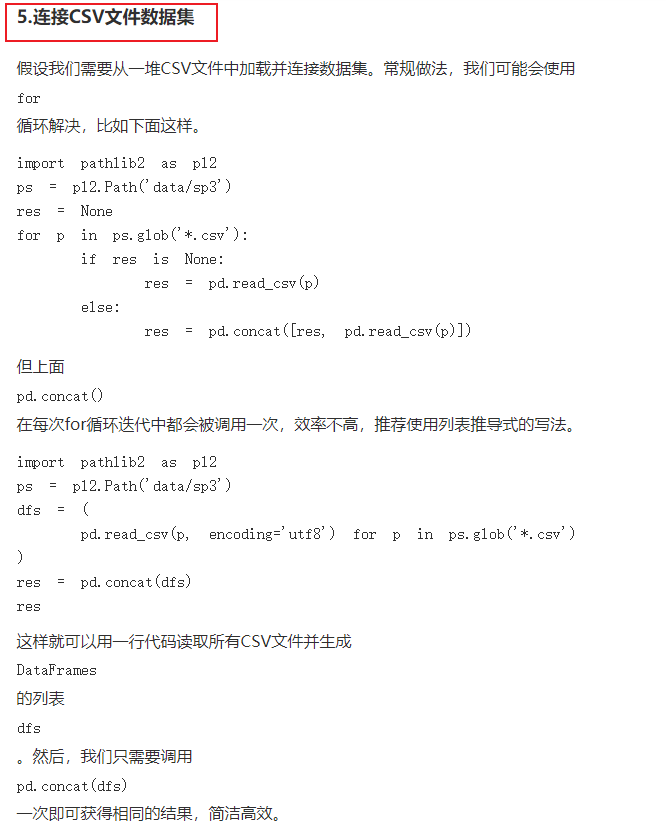
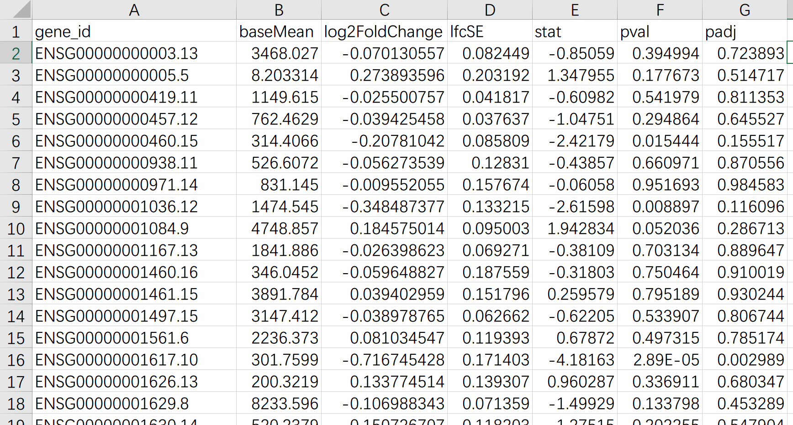

# 读取文件-----读取部分

```python
import pandas as pd
df = pd.read_table('example.csv',nrows=5)  // 前五row
print(df)
```


# xml文件解析

```python
import xml.etree.cElementTree as ET


path = ''
def praseXML(filePaths):
    global dict_clin

    fileCounts = 0
    global path
    for path in filePaths:
        fileCounts += 1
        tree = ET.ElementTree(file=path)
        root = tree.getroot()

        revse(root, dict_clin, fileCounts)
        
        
 # // 定义为，收集以root为根的所有，不包含root级的
deepth = 0
def revse(root, dict_clin, fileCounts):
    global deepth
    deepth += 1

    # 递归基
    if(not root):
        return
    if(deepth == 3) :
        return

    #
    for node in root:
        collectingInformation(node, dict_clin, fileCounts) #收集n同级别的
        revse(node, dict_clin, fileCounts)

    deepth = deepth -1
```


# 合并pd---------> 如何高效？

```python
# 方法一：时间：3h   内存： 3h内存就溢出了
merged_df = pd.DataFrame()
for sample_dic in metadata:
    barcode = sample_dic["associated_entities"][0]["entity_submitter_id"]
    file_name = sample_dic["file_name"][:]
    print("file_name:" )
    print(file_name)
    print("barcode:" )
    print(barcode)
    sample_df = pd.read_table(sample_path + '\\' + file_name, names = [barcode], skiprows=[0,2,3,4,5]) #【1】频繁创建对象
    merged_df = pd.concat([merged_df, sample_df], axis = 1)  #【2】 频繁合并  【3】merged_df增长速度非常快，不知道为啥？几十个G
    print("sample_df:" + str(sys.getsizeof(sample_df)/1024/1024) + " merged_df:" + str(sys.getsizeof(merged_df)/1024/1024))

merged_df.to_csv(root_path + '\\Results.csv')
print("Results are saved to: " + root_path + '\\Results.csv')
```


```python
# 方法二：时间：4min   内存： 4G
dfs = (pd.read_table(sample_path + '\\' + sample_dic["file_name"][:], skiprows=[0,2,3,4,5]) for sample_dic in metadata)   #【5】 连续读取，不存在 频繁合并 【6】内存上：dfs最大值，就是多个文件字节之和
res = pd.concat(dfs)
res.to_csv(root_path + '\\Results.csv')
```

------------------------------>  总之，两种方法，**在时间和空间上都是天差地别的**：

时间上：方法一多了（1）频繁创建对象  （2）频繁合并操作

空间上：：方法一多了（1）频繁创建对象  （2）merged_df大小急速增加（TODO：不知道为啥）


参考：

> https://www.360doc.com/content/23/0716/10/1088733714_1088733714.shtml
>
> 


# 列名----->升序排序

```python
    # 对列名进行升序排序
    unstranded_Results_df = unstranded_Results_df.sort_index(axis=1)
```


# 截取pd


## 自定义规则筛选列 ------>  <font color='red'>非常优，可扩展性非常强</font>

筛选unstranded_Results_df中 **列索引 columns**  包含   表groupe_df['bcr_patient_barcode'] 列中文字（包含任意一个都行）

```python
filtered_columns_df = unstranded_Results_df.filter(items=[col for col in unstranded_Results_df.columns if hasWantGroupOrNot(groupe_df['bcr_patient_barcode'], col)])

#自定义规则
def hasWantGroupOrNot(groupe_df_serise, column_name):
    for  barcode in  groupe_df_serise:
        if barcode in column_name:
            return myRem(barcode)
    return False
```


## 选取列

截取 ['gene_id', 'gene_name']  两列

```python
baoliu_df = unstranded_Results_df[['gene_id', 'gene_name']]
```

## 删除某一列

```python
    # 删除 gene_name 列
    clin_test_grouped_df.drop('gene_name', axis=1, inplace=True)
```

## 筛选行

**精髓：**构造group_condition = [True, False, ............]

```
#  测试组: 根据条件进行分组
group_condition = ((df['breast_carcinoma_progesterone_receptor_status'] == 'Negative')  & (df['breast_carcinoma_estrogen_receptor_status'] == 'Negative')
                &  ( ( (df['lab_proc_her2_neu_immunohistochemistry_receptor_status'].isnull()))|
                 (df['lab_proc_her2_neu_immunohistochemistry_receptor_status'] == 'Equivocal') |
                 (df['lab_proc_her2_neu_immunohistochemistry_receptor_status'] == 'Indeterminate') |
                 (df['lab_proc_her2_neu_immunohistochemistry_receptor_status'] == 'Negative'))
                & (  ( (df['lab_procedure_her2_neu_in_situ_hybrid_outcome_type'].isnull())) |
                   (df['lab_procedure_her2_neu_in_situ_hybrid_outcome_type'] == 'Negative')))
test_grouped_df = df[group_condition]
```


# 转置T	


# 生物信息分析---Python版的DESeq2


## R语言版DESeq2：

> https://naiv.fun/Misc/TCGA.html
>
> 图：最终结果
>
> 

----------------> 用python版，可以做出同样结果

## Python版的DESeq2

参考：https://cloud.tencent.com/developer/article/2228284  Python版的DESeq2尝鲜


## 画图

https://www.jianshu.com/p/a19e099de544        Python版RNA-seq分析教程：DEseq2差异表达基因分析


# python爬虫

参考：

https://blog.csdn.net/lemonbit/article/details/114957452?utm_medium=distribute.pc_relevant.none-task-blog-2~default~baidujs_baidulandingword~default-9-114957452-blog-128834558.235^v40^pc_relevant_anti_vip&spm=1001.2101.3001.4242.6&utm_relevant_index=12      40行Python代码一键把html网页保存为pdf，太方便了！

https://blog.csdn.net/Galoa/article/details/79873163  Python爬虫: 单网页 所有静态网页 动态网页爬取


https://pythonjishu.com/yophpzdhyczaznu/  Python实现爬取需要登录的网站完整示例

https://ylmx5201314.blog.csdn.net/article/details/130794156?spm=1001.2101.3001.6661.1&utm_medium=distribute.pc_relevant_t0.none-task-blog-2%7Edefault%7EBlogCommendFromBaidu%7EPaidSort-1-130794156-blog-124296992.235%5Ev40%5Epc_relevant_rights_sort&depth_1-utm_source=distribute.pc_relevant_t0.none-task-blog-2%7Edefault%7EBlogCommendFromBaidu%7EPaidSort-1-130794156-blog-124296992.235%5Ev40%5Epc_relevant_rights_sort&utm_relevant_index=1  


