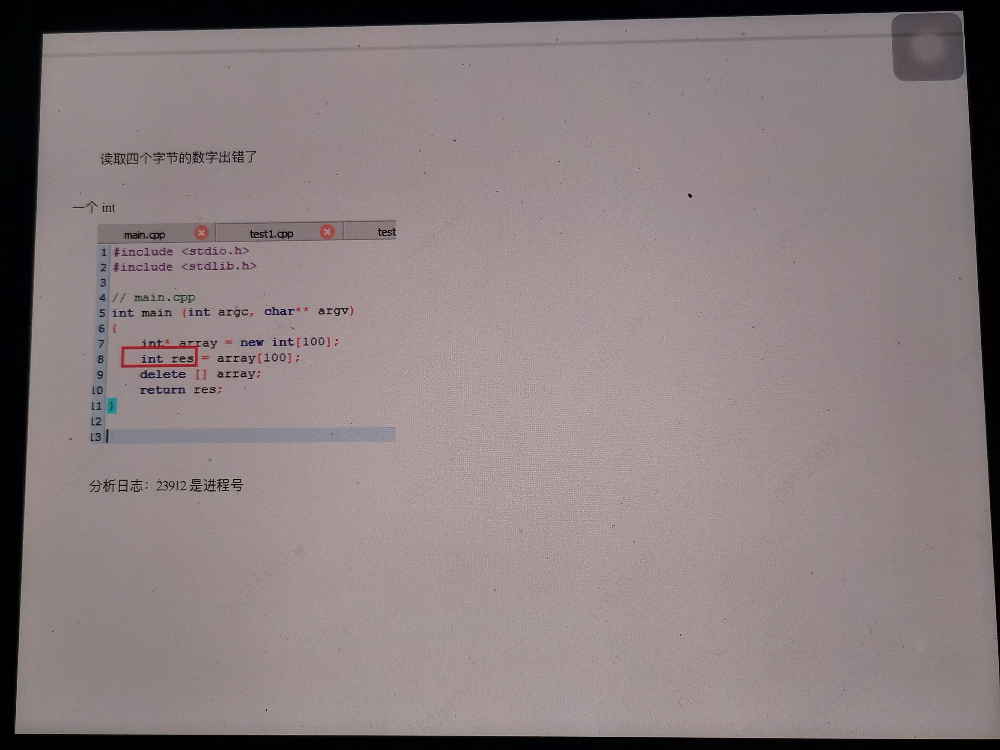
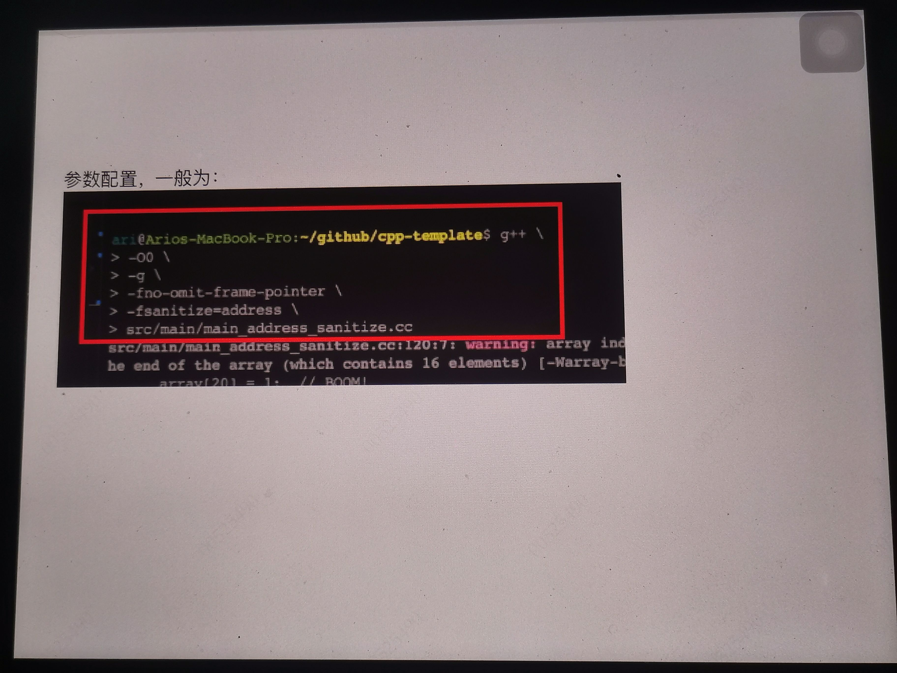
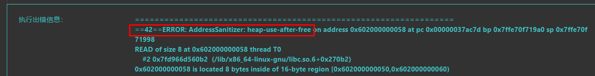
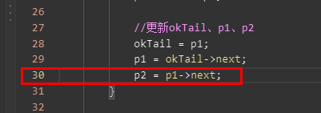

# Address Sanitizer

## 教程：

https://www.youtube.com/watch?v=hhpzDFvXopk      Address Sanitizer in C++ (A Tutorial)

https://github.com/google/sanitizers

https://www.cnblogs.com/justin-y-lin/p/11314059.html  gcc存储已经集成了!!!!

https://hanpfei.github.io/2019/05/19/AddressSanitizer_on_linux/     Linux 下的 AddressSanitizer

###  What Can It Detect?


### 工作原理（how）


### 命令：

window下AddressSanitizer没能搞定，<font color='red'>主要linux下</font>，编译以及运行命令：

```cpp
g++  -fsanitize=address -O0 -fno-omit-frame-pointer -g -o  main main.cpp &&  ./main
```

注意:g++(c++语言)不是gcc (c语言), 不能用错!!!!


`遇到报错`:
Asan runtime does not come first in initial library list; you should either link runtime to your application or manually preload it with LD_PRELOAD

`解决方法:`
mv  /etc/ld.so.preload   /etc/ld.so.preload.bak
rm -rf  /etc/ld.so.preload


Ilvm-symbolizer 符号化工具属于 Ilvm包,Ubuntu 下具体的安装方法可以参考 LLVM Debian/Ubuntu nightly packages.


### 如何看结果


分析日志:23912是进程号
读取四个字节的数字出错了





## 内存泄漏

C++造成内存泄漏的原因汇总：
https://blog.csdn.net/qq_18824491/article/details/78902636?utm_medium=distribute.pc_relevant.none-task-blog-2~default~baidujs_baidulandingword~default-0.no_search_link&spm=1001.2101.3001.4242.1&utm_relevant_index=3

对于C++的内存泄漏，<font color='red'>总结一句话</font>：就是<font color='red'>new出来的内存没有通过delete</font>合理的释放掉！！！！！！！！！
------->**在函数体内**，1、不用new，创建对象，系统自动回收内存
                                           2、<font color='red'>new对象（返回指针）</font>，系统不会回收，<font color='red'>需要手动</font>

**比喻**：1、申请内存就像不停打开网页 2、没有及时关闭网页 3、new 网页，谁new应该谁关 4、如果不关网页，系统掉电重启，内存会全部清掉


### 对于leetcode的报错：

```c
42ERROR: AddressSanitizer: heap-use-after-free on address 0x602000000058 at pc 0x00000037ac7d bp 0x7ffe70f719a0 sp 0x7ffe70f71998
```





----->最后定位下来，是p1与p2循环next了
------>leetcode报错类型是有问题的？？？？？（linux下AddressSanitizer没有报错！！）


-<font color='red'>leetcode这种问题如何定位？？？？？</font>

(1)二分 print--------->每一行都能打印

(2)linux内存泄漏工具   -------->OK的

(3)二分return（**log不起作用时**修改代码功能定位）   ---------->既然抛了error，那么一定是某一行有问题，所以，逐行改变

return位置 ------>逼出哪一行出了问题


37处return会有error！！！！！

