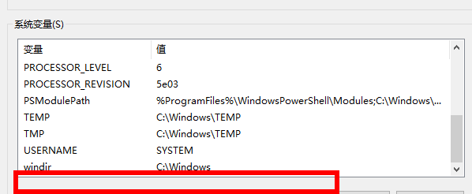
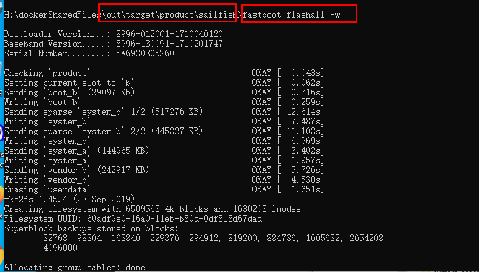
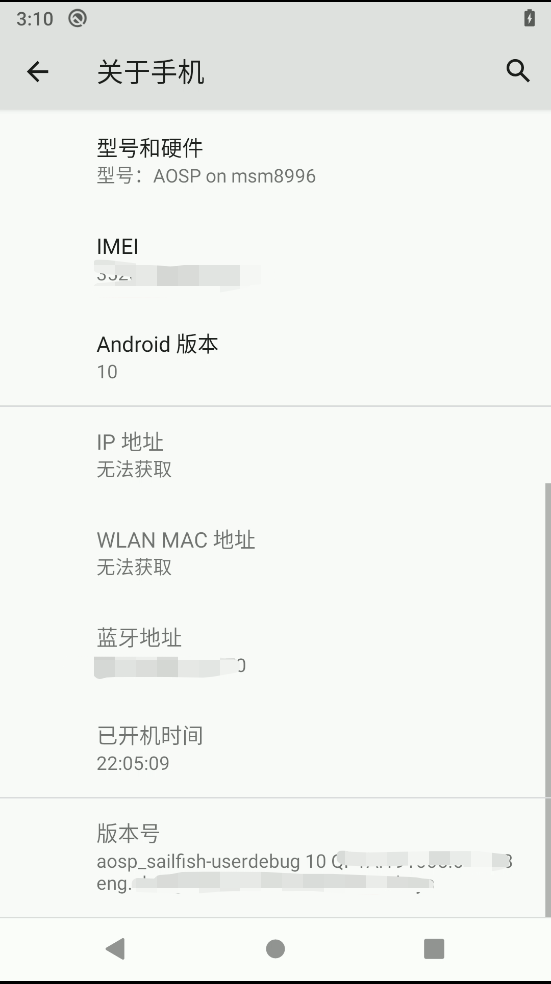
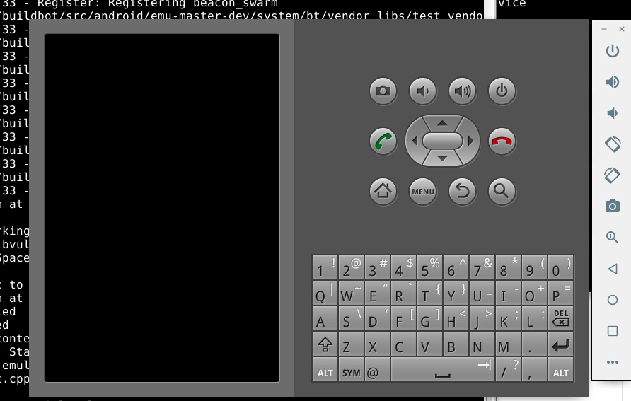
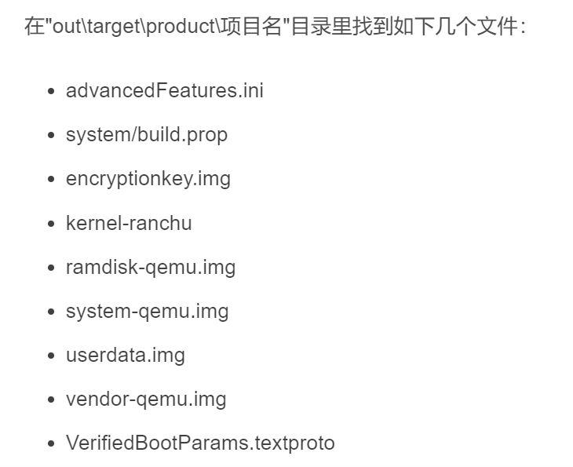
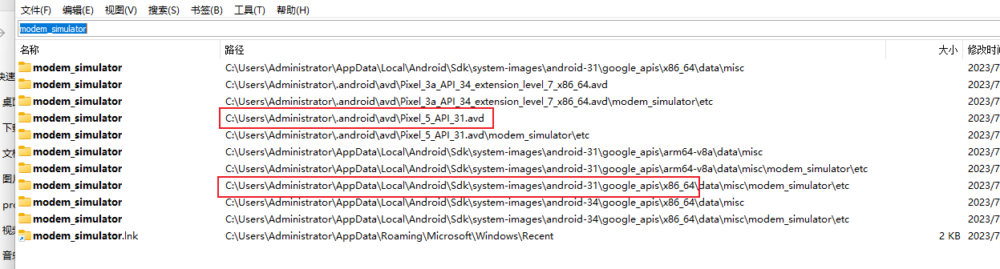

# 目录


# AOSP编译


## ~~Ubuntu16.04需要的依赖设置:~~


```c
apt-get install openjdk-8-jdk

apt-get install git ccache automake lzop bison gperf build-essential zip curl zlib1g-dev g++-multilib python-networkx libxml2-utils bzip2 libbz2-dev libbz2-1.0 libghc-bzlib-dev squashfs-tools pngcrush schedtool dpkg-dev liblz4-tool make optipng maven libc6-dev linux-libc-dev gcc-multilib g++-5-multilib libssl-dev

$ sudo apt-get update $ sudo apt-get install git-core gnupg flex bison gperf build-essential $ sudo apt-get install zip curl zlib1g-dev gcc-multilib g++-multilib libc6-dev-i386 $ sudo apt-get install lib32ncurses5-dev x11proto-core-dev libx11-dev lib32z-dev ccache $ sudo apt-get install libgl1-mesa-dev libxml2-utils xsltproc unzip m4

 sudo apt-get install libx11-dev:i386 libreadline6-dev:i386 libgl1-mesa-dev g++-multilib 
 sudo apt-get install -y git flex bison gperf build-essential libncurses5-dev:i386 
 sudo apt-get install tofrodos python-markdown libxml2-utils xsltproc zlib1g-dev:i386 
 sudo apt-get install dpkg-dev libsdl1.2-dev libesd0-dev
 sudo apt-get install git-core gnupg flex bison gperf build-essential  
 sudo apt-get install zip curl zlib1g-dev gcc-multilib g++-multilib 
 sudo apt-get install libc6-dev-i386 
 sudo apt-get install lib32ncurses5-dev x11proto-core-dev libx11-dev 
 sudo apt-get install libgl1-mesa-dev libxml2-utils xsltproc unzip m4
 sudo apt-get install lib32z-dev ccach


安装make
aptitude   install gcc automake autoconf libtool make
aptitude   install gcc gcc-c++

```


## 下载aosp

### 下载aosp source

**优选清华镜像** + linux开启代理 （为啥不开代理会失败呢？）

```java
repo init -u https://mirrors.tuna.tsinghua.edu.cn/git/AOSP/platform/manifest -b android-12.0.0_r28

repo init -u https://mirrors.tuna.tsinghua.edu.cn/git/AOSP/platform/manifest -b android-14.0.0_r28
------------->验证OK

repo sync -c -j32
```


```cpp
//中科大
repo init -u git://mirrors.ustc.edu.cn/aosp/platform/manifest -b  android-8.0.0_r13
repo init -u git://mirrors.ustc.edu.cn/aosp/platform/manifest -b  android-10.0.0_r17
repo init -u git://mirrors.ustc.edu.cn/aosp/platform/manifest -b  android-12.0.0_r28

//google原生
repo init -u https://android.googlesource.com/platform/manifest -b  android-12.0.0_r28

repo sync -c -j8
repo sync -c --no-tag  -j4 
```


<font color='green'>也可以这样切换其他分支-----> 待验证？？？</font> 

```
repo init -b android-6.0.1_r63
```


可能遇到的问题：

问题1： error：如果提示无法连接到 gerrit.googlesource.com？

> ```
> vim  /bin/repo   修改!
>  REPO_URL='https://mirrors.tuna.tsinghua.edu.cn/git/git-repo'
> ```
>


问题2：fatal: unable to connect to mirrors.ustc.edu.cn:

> 打开linux侧代理


### 如果需要某个特定的 Android 版本:

https://source.android.com/docs/setup/reference/build-numbers#source-code-tags-and-builds  ------> 有最新版本的要点：

> （1）不能是中文网站
>
> > ~~https://source.android.com/setup/start/build-numbers#source-code-tags-and-builds~~
>
> （2）不能翻译成中文


目前，安卓10使用版本：


安卓12使用版本：


安卓14使用版本：


## **AOSP编译刷入Pixel**

-------> 完美！！！，按照该教程，可行！

**注意一点**:  驱动vender（刷真机，涉及到vender，不同机子，不同vender）

https://blog.csdn.net/cl769796350/article/details/102676674?utm_medium=distribute.pc_relevant.none-task-blog-BlogCommendFromMachineLearnPai2-3.channel_param&depth_1-utm_source=distribute.pc_relevant.none-task-blog-BlogCommendFromMachineLearnPai2-3.channel_param       --------> 验证OK，但是文章加锁了

https://blog.csdn.net/learnframework/article/details/125269456   ------》 下载对应的vendor和驱动包

本人使用的是pixel一代-------> 代号为sailfish

​                     pixel5  ----------> redfish


###  <font color='green'>编译aosp</font>: 


1. source build/envsetup.sh

2. lunch     ------>     看一下有哪些选项，很多64版本的

   aosp_sailfish-userdebug   //这里选userdebug版本，拥有root权限

   lunch  aosp_sailfish-userdebug

3. make -j8 


###  <font color='green'>刷入镜像 </font>: 

切换到目录 /aosp/out/target/product/自己手机的代号

1.  设置临时变量
2.  set  ANDROID_PRODUCT_OUT = H:\dockerSharedFiles\aosp_android1000_r17\out_\product\sailfish
3.  
4.  *#进入fastboot模式*
5.  adb reboot bootloader    （验证有没有进入：fastboot  devices）
6.  
7.  *#*  <font color='red'>**自动刷入 -w双清 **</font>: 
8.  fastboot flashall -w
9.  
10.  *重启手机*
11.  fastboot reboot
12.  

拷贝到本地，

 cp /home/chen/workingSpace/aosp/out/  /home/chen/workingSpace/local/  -R

设置变量：ANDROID_PRODUCT_OUT

添加一个



进入window的目录：



注意：adb要用1.0.41的，安卓studio自带即可：

C:\Users\Administrator\AppData\Local\Android\Sdk\platform-tools


**进入fastboot模式方式：**

> 方式一：软件方式  adb reboot bootloader    -------> <font color='red'>不一定能成功</font>
>
> 方式二： 硬件方式：
>
> ​     https://blog.csdn.net/sinat_29315697/article/details/80607534     Google设备启动进入fastboot模式
>
> 

### 进入开发者模式

点击版本号



### 编译模拟器

见后

## 编译jar

### 编译framework.jar等jar

编译某一个模块：
https://blog.csdn.net/weixin_39914868/article/details/112402060

```java
source build/envsetup.sh 

lunch aosp_sailfish-userdebug //这里选userdebug版本，拥有root权限

make framework -j8
```


归结：

```java
 source build/envsetup.sh;lunch aosp_sailfish-userdebug; make framework -j8;python /home/chen/workingSpace/local/aosp_android1000_r17/python_install/replaceFiles/cpSo.py
```


### Android系统目录下 各jar包作用

1. am.jar：终端下执行am命令时所需的java库。源码目录：framework/base/cmds/am

2. android.policy.jar：锁屏界面需要用到的jar包，该包引用了android.test.runner.jar，源码目录：framework/base/policy    

   <font color='red'> ---------》没找到？？</font>

3. android.test.runner.jar：测试应用所需的jar包，该包引用了core.jar,core-junit.ajr以及framework.jar，源码目录：framework/base/test-runner

4. bmgr.jar：adb shell命令下对Android Device所有package备份和恢复的操作时所需的java库。官方文档：http://developer.android.com/guide/developing/tools/bmgr.html。不过这个android服务默认是Disabled，而且要backup的应用必须实现BackupAgent，在AndroidManifest.xml的application标签中加入android：backupAgent属性。源码目录：framework/base/cmds/bmgr

5. bouncycastle.jar： java三方的密匙库，网上资料说用来apk签名、https链接之类，官网 ：http://www.bouncycastle.org/java.html

6. com.android.future.usb.accessory.jar：用于管理USB的上层java库，在系统编译时hardware层会调用到。源码目录：frameworks/base/libs/usb

7. com.android.location.provider.jar：

8. com.android.nfc_extras.jar：NFC外部库。android/nfc/NfcAdapter.java会调用到包中的NfcAdapterExtras.java。源码目录：frameworks/base/nfc-extras

9. core-junit.jar ：junit核心库，在运行*Test.apk时被调用。

10. core-tests*.jar：framework下的一系列测试jar包，不做测试时可删除。

11. core.jar：核心库，启动桌面时首先加载这个。源码目录： 

12. ext.jar：android外部三方扩展包，源码主要是external/nist-sip（java下的sip三方库）、external/apache-http（apache的java三方库）、external/tagsoup（符合SAX标准的HTML解析器）。其实这个jar包可以添加外部扩展jar包，只需在framework/base/Android.mk中的ext-dirs添加src目录即可。

13. framework-res.apk：android系统资源库。

14. <font color='red'>framework.jar：</font>android的sdk中核心代码。

15. ime.jar：ime命令所需jar包，用于查看当前话机输入法列表、设置输入法。源码目录：framework/base/cmds/ime

16. input.jar：input命令所需的jar包，用于模拟按键输入。源码目录：framework/baes/cmds/input

17. javax.obex.jar：java蓝牙API，用于对象交换协议。源码目录：framework/base/obex

18. monkey.jar：执行monkey命令所需jar包。源码目录：framework/base/cmds/monkey

19. pm.jar：执行pm命令所需的jar包，pm详情见adb shell pm，源码目录：framework/base/cmds/pm

20. <font color='red'>services.jar</font>：话机框架层服务端的编译后jar包，配合libandroid_servers.so在话机启动时通过SystemServer以循环闭合管理的方式将各个service添加到ServiceManager中。源码目录：framework/base/service

21. sqlite-jdbc.jar： sqlite的Java DataBase Connextivity jar包。

22. svc.jar：svc命令所需jar包，可硬用来管理wifi,power和data。源码目录：framework/base/cmds/svc


如何知道编译文件对应的jar：

> 1、网上搜索：编译core\java\com\android\internal\policy\DecorView.java
>
> ----->   编译后在out\target\product\msm8909\system\framework目录将会出现android.policy.jar文件，然后执行下面命令替换系统文件
>
> 2、yangyunfan教程


## -**<font color='red'>技巧：</font>**

   

~~法一：~~  不优

>   ```java
>    export OUT_DIR=/home/chenjinke/workingspace_disk2/out_andriod1400_r28  更改编译输出目录
>   ```
>
>   -----------> 问题：在project以外，编译会失败
>
>   [AOSP 设置编译输出目录](https://www.cnblogs.com/caoxinyu/p/10568461.html)       


法二： **通用万能方法------移花接木（软连接）**

>   ```java
>   // 产物挪移到另一个磁盘里：
>    
>    ln -s /home/chen.gang42/workingSpace/myout  /home/chen.gang42/workingSpace/aosp14/out
>                                                      软连接
>    
>   ```
>
>   ------>  **<font color='red'>非常有用</font>**
>
>   >   （1）磁盘不够用时，将out产物直接输出到其他磁盘，节省磁盘100~200G！！！！！！
>   >
>   >   （2）不限于aosp的编译
>
>   注意：
>
>   >   创建软连接，必须是绝对路径！


## classes.jar编译

framework.jar原始没有打包加密的jar路径：

\out\target\common\obj\JAVA_LIBRARIES\framework_intermediates\classes.jar

基于此，可以做很多事情：

> 1、依赖跳转
>
> 2、依赖编译
>
> 3、依赖断点调试


## So的编译

在android开发中，有时候需要编写一些C/C++代码，这时候就要用到JNI技术，我们需要将C/C++程序首先编译成so库，在java中通过native方法调用so库中的函数。
实现以上目的有三种方式：
1、单独编译so库文件，将它push到手机的system/lib目录下， 在java程序中通过loadLibrary加载so库。
2、使用NDK工具进行编译，需要配置NDK环境，然后通过Android Studio将其打包打APK中。
3、在Android源码环境中使用mm，so文件就能够打包到APK文件中，随着APK一起发布，而不是将so文件放到系统目录中。


### 如何看cpp编到哪个so

方法一：so与路径的对应

https://blog.csdn.net/koumen3/article/details/50681575


%accordion%折叠%accordion%


```java
libEGL.so------frameworks/native/opengl/libs/EGL/

libandroid.so——frameworks/base/native/android

libandroid_runtime.so——frameworks/base/core/jni

libandroidfw.so——frameworks/base/libs/androidfw

libaudioutils.so——system/media/audio_utils
libbinder.so——frameworks/native/libs/binder

libbluedroid.so——system/bluetooth/bluedroid

libc.so——bionic/libc

libcamera_client.so——frameworks/av/camera

libcorkscrew.so——system/core/libcorkscrew

libcpustats.so——frameworks/native/libs/cpustats
libcrypto.so——external/openssl
libcutils.so——system/core/libcutils

libdbus.so——external/dbus/dbus

libdvm.so——dalvik/vm

libemoji.so——frameworks/opt/emoji
libETC1.so——frameworks/native/opengl/libs

libgccdemangle——external/gcc-demangle
libgui.so——frameworks/native/libs/gui

libgabi++.so——abi/cpp
libGLESv1_CM.so——frameworks/native/opengl/libs

libharfbuzz.so——external/harfbuzz

libhwui.so——frameworks/base/libs/hwui

libhardware_legacy.so——hardware/libhardware_legacy
libjpeg.so——external/jpeg

libmedia.so——frameworks/av/media/libmedia

libmedia_native.so——frameworks/av/media/libmedia_native

libnetutils.so——system/core/libnetutils

libstagefright_foundation.so——frameworks/av/media/libstagefright/foundation

libsonivox.so——external/sonivox

libspeexresampler——external/speex

libstlport.so——external/stlport

libssl.so——external/openssl

libui.so——frameworks/native/libs/ui

libutils.so——frameworks/native/libs/utils
libusbhost.so——system/core/libusbhost
```


%/accordion%


方法二：看andriod.bp（优秀）

方法三：破坏cpp文件，编译时会log出编译的目标


编译方法：

```java
//进入所需要的编译的目录，mm
chen@58495cde205d:~/workingSpace/aosp_android1000_r17/frameworks/native/libs/binder$ mm


//
编译生成的动态库在 out/target/product/xxxx/system/lib/ 目录下。使用以下命令更新设备上的库文件：
 adb  push  libaudioflinger.so  /system/lib/
```

mm命令使用的前提:

> 启用 mm 等工具：
>
> 在同一个终端里面需要先在项目根目录下执行 source build/envsetup.sh 命令
>

### 为子系统重新单独编译动态库的方法

https://blog.csdn.net/Qidi_Huang/article/details/53690139


## WIFI联网

### wifi连接的前提

-<font color='red'>规定：</font>

> 任何机器，刷完版本，第一件事情，就是同步时间(<font color='red'>无论是否联网</font>)


-------->  因为这是联网的必要条件！！（即使能联网，也要同步，会有各种问题）


%accordion%~~同步时间脚本1：：~~%accordion%

> 
>
> ```java
> //setTime.py
> import os
> import datetime
> now = datetime.datetime.now()
> date_time = now.strftime("%m%d%H%M%Y.%S")
> print(date_time)
> os.system("adb shell \"date %s\"" % date_time)
> ```
>


%/accordion%


同步时间脚本2：adb 命令

```java
//先设置年月日
adb shell date  %date:~0,4%-%date:~5,2%-%date:~8,2% set
 
// 在设置时分秒
adb shell date %time:~0,2%:%time:~3,2%:%time:~6,2% set
    
//验证
D:\>adb shell date
Sat Nov 27 12:41:25 GMT 2021
```


### ~~原生安卓 WiFi 网络受限、优化网速~~


%accordion%~~忽略：~~%accordion%

https://www.xiaoyi.vc/captive-portal.html

**非ROOT方法**

没有 ROOT 的安卓机可以借助 ADB 命令来修改，首先下载ADB工具包，然后手机开启USB调试模式，接着运行 CMD 输入下面的命令就可以了。

**# 删除默认的地址

-   adb shell settings delete global captive_portal_https_url
-   adb shell settings delete global captive_portal_http_url

**# 修改新的地址**

-   adb shell settings put global captive_portal_http_url  http://connect.rom.miui.com/generate_204 
-   adb shell settings put global captive_portal_https_url  https://connect.rom.miui.com/generate_204 

改完同样把手机切换飞行模式，再切换回来就可以了。如果需要其它服务器地址，自行修改，如MIUI 的是 http://connect.rom.miui.com/generate_204 地址。

注意两点：
1、改完同样把手机切换飞行模式

2、MIUI 的是 http://connect.rom.miui.com/generate_204 


%/accordion%

## kernel如何编译？

 TODO：


## AOSP模拟器的编译

### 在aosp编译目录下启动

编译产品aosp_sailfish

```shell
//先初始化环境
source build/envsetup.sh
lunch  aosp_sailfish-userdebug


USER@MACHINE:~/Android$ export PATH=$PATH:~/Android/out/host/linux-x86/bin
export PATH=$PATH:~/workingSpace/local/aosp_android1000_r17/aosp_android1000_r17/out/host/linux-x86/bin

USER@MACHINE:~/Android$ export ANDROID_PRODUCT_OUT=~/Android/out/target/product/generic
export ANDROID_PRODUCT_OUT=~/workingSpace/local/aosp_android1000_r17/aosp_android1000_r17/out/target/product/generic

USER@MACHINE:~/Android$ emulator
```


```shell
//aosp_android12_00_r28:
source build/envsetup.sh
lunch  aosp_bramble-userdebug
export PATH=$PATH:~/workingSpace/aosp_android12_00_r28/out/host/linux-x86/bin
ANDROID_PRODUCT_OUT=~/workingSpace/aosp_android12_00_r28/out/target/product/bramble/
emulator -qemu -machine virt
```

------------>  一直失败，没有成功过：




### 替换AS自带模拟器的img

参考文章：  https://blog.csdn.net/feng397041178/article/details/123731513    主要文章

​                     https://blog.csdn.net/mvp_Dawn/article/details/126848798

​                      https://blog.csdn.net/liaosongmao1/article/details/124843073


win下或linux下都可以，以win为例：

（1）编译emulator_x86_64：（不是编译bramble等产品！）


编译命令：**编译参考：**

> 遇到的问题：lunch中，没有sdk_x86_64 编译选项
>
> 解决：https://blog.csdn.net/Q1302182594/article/details/125514065     

 https://blog.csdn.net/yongwn/article/details/121009506  

```java
source build/envsetup.sh
lunch sdk_x86_64
    
// -------》  结果：out/target/product/emulator_x86_64/
```


**注意点：**

> 1、out/target/product/emulator_x86_64/   
>
> 
>
> ----> 注意将*ramdisk-qemu.img,system-qemu.img,vendor-qemu.img*这三个文件<font color='red'>重命名为</font>*ramdisk.img,system.img,vendor.img*。
>
> 2、替换：把win下  android-31\google_apis\x86_64下里的文件替换掉
>
> C:\Users\用户名\AppData\Local\Android\Sdk\system-images\android-30\google_apis_playstore\x86_64


注意：两个目录下文件很像，是后者  Sdk\system-images\android-30\google_apis下的




### 实现能够导入jar

adb remount失败：


参考：https://blog.csdn.net/mvp_Dawn/article/details/126848798

修改启动（增加了-writable-system），获取写权限：

```java
::startEmulator.bat
set emulator_exe=D:\Users\Administrator\AppData\Local\Android\Sdk\emulator\emulator.exe
%emulator_exe% -avd Pixel_5_API_31 -writable-system -memory 4096 


::-sysdir似乎没用
-sysdir D:\Green_Sorft\Android\Sdk\system-images\android-30\default\x86_64-aosp
```

### emulator的一些特殊点

由于编译的img是   lunch sdk_x86_64

------> 所以：

 1、后续编译 jar和 so 都需要基于 sdk_x86_64

2、导入jar前 **需要删除 x86**，而不是 arm


```
adb shell rm -rf /system/framework/x86
adb shell rm -rf /system/framework/x86_64
adb shell rm -rf /system/framework/oat/
```


### 常用emulator命令：

```
::查看有哪些模拟器镜像
%emulator_exe%  -list-avds

```

%emulator_exe%  -help：

%accordion%折叠%accordion%

```java
D:\Users\Administrator\AppData\Local\Android\Sdk\emulator>%emulator_exe%  -help
Android Emulator usage: emulator [options] [-qemu args]
  options:
    -list-avds                                                          list available AVDs
    -sysdir <dir>                                                       search for system disk images in <dir>
    -system <file>                                                      read initial system image from <file>
    -vendor <file>                                                      read initial vendor image from <file>
    -writable-system                                                    make system & vendor image writable after 'adb remount'
    -delay-adb                                                          delay adb communication till boot completes
    -datadir <dir>                                                      write user data into <dir>
    -kernel <file>                                                      use specific emulated kernel
    -ramdisk <file>                                                     ramdisk image (default <system>/ramdisk.img
    -image <file>                                                       obsolete, use -system <file> instead
    -initdata <file>                                                    same as '-init-data <file>'
    -data <file>                                                        data image (default <datadir>/userdata-qemu.img
    -encryption-key <file>                                              read initial encryption key image from <file>
    -logcat-output <file>                                               output file of logcat(default none)
    -partition-size <size>                                              system/data partition size in MBs
    -cache <file>                                                       cache partition image (default is temporary file)
    -cache-size <size>                                                  cache partition size in MBs
    -no-cache                                                           disable the cache partition
    -nocache                                                            same as -no-cache
    -sdcard <file>                                                      SD card image (default <datadir>/sdcard.img
    -quit-after-boot <timeout>                                          qeuit emulator after guest boots completely, or after timeout in seconds
    -qemu-top-dir <dir>                                                 Use the emulator in the specified dir (relative or absolute path)
    -monitor-adb <verbose_level>                                        monitor the adb messages between guest and host, default not
    -snapstorage <file>                                                 file that contains all state snapshots (default <datadir>/snapshots.img)
    -no-snapstorage                                                     do not mount a snapshot storage file (this disables all snapshot functionality)
    -snapshot <name>                                                    name of snapshot within storage file for auto-start and auto-save (default 'default-boot')
    -no-snapshot                                                        perform a full boot and do not auto-save, but qemu vmload and vmsave operate on snapstorage
    -no-snapshot-save                                                   do not auto-save to snapshot on exit: abandon changed state
    -no-snapshot-load                                                   do not auto-start from snapshot: perform a full boot
    -snapshot-list                                                      show a list of available snapshots
    -no-snapshot-update-time                                            do not try to correct snapshot time on restore
    -wipe-data                                                          reset the user data image (copy it from initdata)
    -avd <name>                                                         use a specific android virtual device
    -avd-arch <target>                                                  use a specific target architecture
    -skindir <dir>                                                      search skins in <dir> (default <system>/skins)
    -skin <name>                                                        select a given skin
    -no-skin                                                            deprecated: create an AVD with no skin instead
    -noskin                                                             same as -no-skin
    -memory <size>                                                      physical RAM size in MBs
    -ui-only <UI feature>                                               run only the UI feature requested
    -id <name>                                                          assign an id to this virtual device (separate from the avd name)
    -cores <number>                                                     Set number of CPU cores to emulator
    -accel <mode>                                                       Configure emulation acceleration
    -no-accel                                                           Same as '-accel off'
    -ranchu                                                             Use new emulator backend instead of the classic one
    -engine <engine>                                                    Select engine. auto|classic|qemu2
    -netspeed <speed>                                                   maximum network download/upload speeds
    -netdelay <delay>                                                   network latency emulation
    -netfast                                                            disable network shaping
    -code-profile <name>                                                enable code profiling
    -show-kernel                                                        display kernel messages
    -shell                                                              enable root shell on current terminal
    -no-jni                                                             deprecated, see dalvik_vm_checkjni
    -nojni                                                              deprecated, see dalvik_vm_checkjni
    -dalvik-vm-checkjni                                                 Enable dalvik.vm.checkjni
    -logcat <tags>                                                      enable logcat output with given tags
    -log-nofilter                                                       Disable the duplicate log filter
    -no-audio                                                           disable audio support
    -noaudio                                                            same as -no-audio
    -audio <backend>                                                    use specific audio backend
    -radio <device>                                                     redirect radio modem interface to character device
    -port <port>                                                        TCP port that will be used for the console
    -ports <consoleport>,<adbport>                                      TCP ports used for the console and adb bridge
    -modem-simulator-port <port>                                        TCP port that will be used for android modem simulator
    -onion <image>                                                      use overlay PNG image over screen
    -onion-alpha <%age>                                                 specify onion-skin translucency
    -onion-rotation 0|1|2|3                                             specify onion-skin rotation
    -dpi-device <dpi>                                                   specify device's resolution in dpi (default DEFAULT_DEVICE_DPI)
    -scale <scale>                                                      scale emulator window (deprecated)
    -wifi-client-port <port>                                            connect to other emulator for WiFi forwarding
    -wifi-server-port <port>                                            listen to other emulator for WiFi forwarding
    -http-proxy <proxy>                                                 make TCP connections through a HTTP/HTTPS proxy
    -timezone <timezone>                                                use this timezone instead of the host's default
    -change-language <language>                                         use this language instead of the current one. Restarts the framework.
    -change-country <country>                                           use this country instead of the current one. Restarts the framework.
    -change-locale <locale>                                             use this locale instead of the current one. Restarts the framework.
    -dns-server <servers>                                               use this DNS server(s) in the emulated system
    -net-tap <interface>                                                use this TAP interface for networking
    -net-tap-script-up <script>                                         script to run when the TAP interface goes up
    -net-tap-script-down <script>                                       script to run when the TAP interface goes down
    -cpu-delay <cpudelay>                                               throttle CPU emulation
    -no-boot-anim                                                       disable animation for faster boot
    -no-window                                                          disable graphical window display
    -qt-hide-window                                                     Start QT window but hide window display
    -no-sim                                                             device has no SIM card
    -lowram                                                             device is a low ram device
    -version                                                            display emulator version number
    -no-passive-gps                                                     disable passive gps updates
    -gnss-file-path <path>                                              Use the specified filepath to read gnss data
    -gnss-grpc-port <port number>                                       Use the specified port number to start grpc service to receive gnss data
    -virtio-console                                                     using virtio console as console
    -read-only                                                          allow running multiple instances of emulators on the same AVD, but cannot save snapshot.
    -is-restart <restart-pid>                                           specifies that this emulator was a restart, and to wait out <restart-pid> before proceeding
    -report-console <socket>                                            report console port to remote socket
    -gps <device>                                                       redirect NMEA GPS to character device
    -shell-serial <device>                                              specific character device for root shell
    -tcpdump <file>                                                     capture network packets to file
    -bootchart <timeout>                                                enable bootcharting
    -charmap <file>                                                     use specific key character map
    -studio-params <file>                                               used by Android Studio to provide parameters
    -prop <name>=<value>                                                set system property on boot
    -shared-net-id <number>                                             join the shared network, using IP address 10.1.2.<number>
    -gpu <mode>                                                         set hardware OpenGLES emulation mode
    -use-host-vulkan                                                    use host for vulkan emulation regardless of 'gpu' mode
    -camera-back <mode>                                                 set emulation mode for a camera facing back
    -camera-front <mode>                                                set emulation mode for a camera facing front
    -webcam-list                                                        lists web cameras available for emulation
    -virtualscene-poster <name>=<filename>                              Load a png or jpeg image as a poster in the virtual scene
    -screen <mode>                                                      set emulated screen mode
    -force-32bit                                                        always use 32-bit emulator
    -selinux <disabled|permissive>                                      Set SELinux to either disabled or permissive mode
    -unix-pipe <path>                                                   Add <path> to the list of allowed Unix pipes
    -fixed-scale                                                        Use fixed 1:1 scale for the initial emulator window.
    -wait-for-debugger                                                  Pause on launch and wait for a debugger process to attach before resuming
    -skip-adb-auth                                                      Skip adb authentication dialogue
    -metrics-to-console                                                 Enable usage metrics and print the messages to stdout
    -metrics-collection                                                 Enable usage metrics and send them to google play
    -metrics-to-file <file>                                             Enable usage metrics and write the messages into specified file
    -detect-image-hang                                                  Enable the detection of system image hangs.
    -feature <name|-name>                                               Force-enable or disable (-name) the features
    -icc-profile <file>                                                 Use icc profile from specified file
    -sim-access-rules-file <file>                                       Use SIM access rules from specified file
    -phone-number <phone_number>                                        Sets the phone number of the emulated device
    -acpi-config <file>                                                 specify acpi device proprerties (hierarchical key=value pair)
    -fuchsia                                                            Run Fuchsia image. Bypasses android-specific setup; args after are treated as standard QEMU args
    -window-size <size>                                                 Set window size for when bypassing android-specific setup.
    -allow-host-audio                                                   Allows sending of audio from audio input devices. Otherwise, zeroes out audio.
    -restart-when-stalled                                               Allows restarting guest when it is stalled.
    -perf-stat <file>                                                   Run periodic perf stat reporter in the background and write output to specified file.
    -share-vid                                                          Share current video state in shared memory region.
    -grpc <port>                                                        TCP ports used for the gRPC bridge.
    -grpc-tls-key <pem>                                                 File with the private key used to enable gRPC TLS.
    -grpc-tls-cer <pem>                                                 File with the public X509 certificate used to enable gRPC TLS.
    -grpc-tls-ca <pem>                                                  File with the Certificate Authorities used to validate client certificates.
    -grpc-use-token                                                     Use the emulator console token for gRPC authentication.
    -grpc-use-jwt                                                       Use a signed JWT token for gRPC authentication.
    -idle-grpc-timeout <timeout>                                        Terminate the emulator if there is no gRPC activity within <timeout> seconds.
    -waterfall <mode>                                                   Mode in which to run waterfall.
    -rootcanal-hci-port <port>                                          Rootcanal virtual hci port.
    -rootcanal-test-port <port>                                         Rootcanal testing port.
    -rootcanal-link-port <port>                                         Rootcanal link layer port. <DEPRECATED>
    -rootcanal-link-ble-port <port>                                     Rootcanal link ble layer port. <DEPRECATED>
    -rootcanal-controller-properties <file>                        Rootcanal controller_properties.json file.
    -rootcanal-default-commands-file <file>                             Rootcanal commands file to run on launch.
    -rootcanal-no-mesh                                                  Disable auto discovery and connection bluetooth enabled emulators
    -forward-vhci                                                       Enable the VHCI grpc forwarding service.
    -multidisplay index width height dpi flag                           config multiple displays.
    -google-maps-key <API key>                                          API key to use with the Google Maps GUI.
    -no-location-ui                                                     Disable the location UI in the extended window.
    -use-keycode-forwarding                                             Use keycode forwarding instead of host charmap translation.
    -record-session <file>,<delay>[,<duration>]                         Screen record the emulator session.
    -legacy-fake-camera                                                 Use legacy camera HAL for the emulated fake camera.
    -camera-hq-edge                                                     Enable high qualify edge processing for emulated camera.
    -no-direct-adb                                                      Use external adb executable for internal communication.
    -check-snapshot-loadable <snapshot name|exported snapshot tar file> Check if a snasphot is loadable.
    -no-hidpi-scaling                                                   Disable HiDPI scaling of guest display on macOS devices.
    -no-mouse-reposition                                                Do not reposition the mouse to emulator window center if mouse pointer gets out of the window.
    -guest-angle                                                        Enable guest ANGLE as system driver.
    -usb-passthrough VID PID BUS PORTS                                  Host USB device Passthrough
    -append-userspace-opt key=value                                     Appends a property which is passed to the userspace.
    -save-path <file path>                                              Override save path for screenshot and bug report. The value will not be persisted on host OS.
    -no-nested-warnings                                                 Disable the warning dialog when emulator is running in nested virtualization.
    -wifi-tap <interface>                                               use this TAP interface for Virtio Wi-Fi
    -wifi-tap-script-up <script>                                        script to run when the TAP interface goes up
    -wifi-tap-script-down <script>                                      script to run when the TAP interface goes down
    -wifi-vmnet <interface>                                              This option is alias to vmnet, it is used for backward compatibility.
    -vmnet <interface>                                                   Use this network <interface> and enable vmnet framework as the backend of tap netdev on MacOS.

     -qemu args...                                                      pass arguments to qemu
     -qemu -h                                                           display qemu help

     -verbose                                                           same as '-debug-init'
     -debug <tags>                                                      enable/disable debug messages
     -debug-<tag>                                                       enable specific debug messages
     -debug-no-<tag>                                                    disable specific debug messages

     -help                                                              print this help
     -help-<option>                                                     print option-specific help

     -help-disk-images                                                  about disk images
     -help-debug-tags                                                   debug tags for -debug <tags>
     -help-char-devices                                                 character <device> specification
     -help-environment                                                  environment variables
     -help-virtual-device                                               virtual device management
     -help-sdk-images                                                   about disk images when using the SDK
     -help-build-images                                                 about disk images when building Android
     -help-all                                                          prints all help content
```


%/accordion%

## native实现clion跳转

见《HowToReadCode.md》

编译：CMakeLists.txt

https://blog.csdn.net/iamdy/article/details/106658583
https://cloud.tencent.com/developer/article/1645922

源码中的`build/soong/docs/clion.md`


cpp断点调试

https://blog.csdn.net/iamdy/article/details/111272854?spm=1001.2014.3001.5501


# 编译AAOS 到pixel5

https://juejin.cn/post/7316695933739089920            

# **问题：**

## **framework.jar导入手机后不生效问题**

原因一：-------》可能不需要

原因：在编译期间会将 jar 包中的 dex 文件编译为 odex、vdex 等文件。而这些文件并不存放在 framework.jar 中，所以会导致单独 push framework.jar 后，修改的内容不生效。

https://blog.csdn.net/yjsz2010/article/details/103705510

-<font color='red'> 原因二：-----> 已经验证</font>

push程序framework.jar失效问题：

先加载了/system/framework/arm目录和/system/framework/arm64目录中的boot.art和boot.oat

-<font color='red'>规定：</font>

> 推framework.jar，必须先 删除arm和arm64、ota

~~即：~~

```java
adb shell rm -rf /system/framework/arm
adb shell rm -rf /system/framework/arm64
adb shell rm -rf /system/framework/ota
adb push framework.jar   /system/framework
```

注意：

> 校验了<font color='red'>部分framework.jar</font>中的java文件的改动，<font color='red'>不是所有</font>


## **framework.jar导入手机 + 删除arm等目录 仍然 后不生效问题**

有时候，**framework.jar的变动，不只push framework.jar + 删除arm等目录**

问题现象：

> 1、**刚进入桌面，手机一直重启**
>
> 2、看日志，各种runtime的报错
>
> ```
>  2024-01-09 15:41:46.188 15781-15896 zygote64                pid-15781                            A  runtime.cc:655] Runtime aborting...
>                                                                                                      runtime.cc:655] All threads:
>                                                                                                      runtime.cc:655] DALVIK THREADS (6):
>                                                                                                      runtime.cc:655] "main" prio=10 tid=1 Runnable
>                                                                                                      runtime.cc:655]   | group="" sCount=0 dsCount=0 flags=0 obj=0x12e40000 self=0xb4000079c42d97b0
>                                                                                                      runtime.cc:655]   | sysTid=15781 nice=-20 cgrp=default sched=0/0 handle=0x7aeb1e64f8
>                                                                                                      runtime.cc:655]   | state=R schedstat=( 797723069 16104393 128 ) utm=59 stm=20 core=7 HZ=100
>                                                                                                      runtime.cc:655]   | stack=0x7fce43b000-0x7fce43d000 stackSize=8192KB
>                                                                                                      runtime.cc:655]   | held mutexes= "mutator lock"(shared held)
>                                                                                                      runtime.cc:655]   native: #00 pc 0000000000496628  /apex/com.android.art/lib64/libart.so (art::DumpNativeStack(std::__1::basic_ostream<char, std::__1::char_traits<char> >&, int, BacktraceMap*, char const*, art::ArtMethod*, void*, bool)+140)
>                                                                                                      runtime.cc:655]   native: #01 pc 00000000005a0164  /apex/com.android.art/lib64/libart.so (art::Thread::DumpStack(std::__1::basic_ostream<char, std::__1::char_traits<char> >&, bool, BacktraceMap*, bool) const+372)
>                                                                                                      runtime.cc:655]   native: #02 pc 00000000005bcda4  /apex/com.android.art/lib64/libart.so (art::DumpCheckpoint::Run(art::Thread*)+892)
>                                                                                                      runtime.cc:655]   native: #03 pc 00000000005a1020  /apex/com.android.art/lib64/libart.so (art::Thread::RunCheckpointFunction()+168)
>                                                                                                      runtime.cc:655]   native: #04 pc 000000000065d04c  /apex/com.android.art/lib64/libart.so (artTestSuspendFromCode+68)
>                                                                                                      runtime.cc:655]   native: #05 pc 000000000013c91c  /apex/com.android.art/lib64/libart.so (art_quick_test_suspend+156)
>                                                                                                      runtime.cc:655]   at java.lang.StringBuilder.append(StringBuilder.java:203)
>                                                                                                      runtime.cc:655]   at java.text.SimpleDateFormat.compile(SimpleDateFormat.java:912)
>                                                                                                      runtime.cc:655]   at java.text.SimpleDateFormat.initialize(SimpleDateFormat.java:720)
>                                                                                                      runtime.cc:655]   at java.text.SimpleDateFormat.<init>(SimpleDateFormat.java:691)
>                                                                                                      runtime.cc:655]   at java.text.SimpleDateFormat.<init>(SimpleDateFormat.java:666)
>                                                                                                      runtime.cc:655]   at android.util.TimeUtils.<clinit>(TimeUtils.java:46)
>                                                                                                      runtime.cc:655]   at java.lang.Class.classForName(Native method)
> ```
>
> 3、看日志zygote一直在重启

-**<font color='red'>最保险的是</font>：**

> out_sys\target\product\mssi_spm_64_cn\system\framework\ 下**编译时间有改动的，都push进去**！！！！！

或者整个 framework\路径push进去

> adb push  X:\code\chengang\alps\out_sys\target\product\mssi_spm_64_cn\system\framework\  /system/


## **mm cmd fails in /framework/base**

On Android version 8.1.0 project specific build with mm cmd is failing in /framework/base

[100% 1/1] out/soong/.bootstrap/bin/soong_build out/soong/build.ninja

**ninja: error: '**out/host/linux-x86/framework/host-libprotobuf-java-full.jar', **needed by** 'out/host/common/obj/JAVA_LIBRARIES/platformprotos_intermediates/classes-full-debug.jar', missing and no known rule to make it

12:55:19 ninja failed with: exit status 1

--------》

mm compiles all modules in a directory, you are missing a dependency of one of the modules. This is pretty common because regular builds do not compile tests or their dependencies. You can run 'hmm' to see commands that do take dependencies into account. In this case, you want 'mma':

λ hmm | grep " mm"

\- mm:        Builds all of the modules in the current directory, but not their dependencies.

\- mmm:       Builds all of the modules in the supplied directories, but not their dependencies.

​             To limit the modules being built use the syntax: mmm dir/:target1,target2.

\- mma:       Builds all of the modules in the current directory, and their dependencies.

\- mmma:      Builds all of the modules in the supplied directories, and their dependencies.


## 编译报错


## 编译后没有64位，只有32位

----》解决方法：主动lunch一次 --->设置编译目标带64版本的，比如2


## AOSP14 java断点调试  坑：

AS进行Choose Process调试, 看不到线程

需设置：

> adb shell setprop persist.debug.dalvik.vm.jdwp.enabled 1 
>
> adb reboot

具体原因： https://blog.csdn.net/liaosongmao1/article/details/137642046         安卓/aosp14上userdebug版本无法进行as调试debug问题


