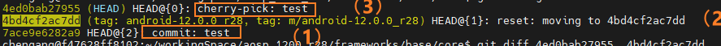

# 目录：


# 结构


参考： https://www.zhihu.com/question/38305012

可见：

- fech获取时，并未合并到本地仓库

  -------->  推论：cherry-pick需要的commiId，可以利用fech获取


# git

git reflog  -----------历史上所有的commit（`即使被删除了、即使被修改了`）

​                                <font color='red'>记录了所有引起HEAD指针变化的原因</font>：真正commit、或reset、或checkout  或  pull  或 merge  或  clone

> **如何读reflog？**
>
> （1）新增一笔提交 7ace9e6282a9
>
> （2）reset: moving to 4bd4cf2ac7dd  （~~自然from 7ace9e6282a~~）
>
> （3）cherry-pick  test 节点（~~自然，形成新节点~~）
>
> 


范围：


参考： https://www.jianshu.com/p/7e4cef3863e7


git commit 技巧：

```java
git commit --amend --no-edit    ----->   不会弹出commit message (reusing the previous one)
```


在 bash中自定义
见《任意ide（As 或 clion 等）,  默认 Terminal 如何使用 bash?》

```cpp
//.myfunction.sh

#!/bin/bash
#git_rebase

function g_pu0 {
	export a=$(git rev-parse --abbrev-ref HEAD) #
	git.exe push --progress "origin" $a:$a   #注意第一个a是本地分支名，第二个是远程分支名: feature/xa_powerterminal:feature/xa_power
}

function g_pul {
	export a=$(git rev-parse --abbrev-ref HEAD)
	git.exe push --force-with-lease --progress "origin" $a:$a
}

function g_re_f{
	#获得某个分支所对应的远程分支
	export a=$(git rev-parse --abbrev-ref --symbolic-full-name @{u})
	git.exe fetch -v --progress "origin"
	git clean -d -fx
	#git fetch --all
	git reset --hard HEAD~5  #仓有问题的话,有垃圾文件,直接 rebase 远端,可能会冲突。先 reset 本地--->强制 
	git reset --hard $a #仓有问题的话,有垃圾文件,直接 rebase 远端,可能会冲突。先 reset 本地--->强制 rebase 
	remotesBranch="remotes/"$a     #shell拼接字符串 
	git rebase $remotesBranch 
}

function g_re{
	#获得某个分支所对应的远程分支
	#git fetch --all
	git.exe fetch -v --progress "origin"
	export a=$(git rev-parse --abbrev-ref --symbolic-full-name @ {u}) git rebase $remotesBranch
	remotesBranch="remotes/"$a
	git rebase $remotesBranch 
}

function g_co{
	git commit -m "修改"
}

function g_he{
    echo "git.exe fetch -v --progress "origin""
    echo "git log-graph"
    echo ": git rev-parse --abbrev-ref--symbolic-full-name @{u}"
    echo "dos2unix unix2dos filename"
    echo "删除 git 没有track的文件:git clean -d -fx"
    echo "git checkout -b feature/master_enterprise2 remotes/origin/master"
    echo "推送： git push -u origin feature/master_local:main -f; 本地分支：远程分支获取：git branch -a"
    echo  "=========commit==============="
    echo  "git commit -m "TraceNo.:REQ20220“"
    echo "git commit --amend --no-edit ----->   不会弹出commit message (reusing the previous one)"
    echo "删除某个commit: git rebase -i 9fd15a8880fc41290d7dc^  修改pick为drop"
    echo " commit: git rebase -i HEAD~4 s"
    echo "任意调整 commit顺序、任意合并: git rebase -i commitID,id之后的所有commit"
}

function g_st {
	git status
}
function g_fe { 
	git fetch
}
function g_co_am {
	git commit --amend
}
```


总结: 

git restore 文件名 

会撤销到缓存区(如果有,add区域)  或者  当前版本库版本(commit区)


git命令回退  某个文件  到指定的版本：

```cpp
git chekcout 版本号 文件
```


如何合并？TODO


git大文件：

```cpp
git Ifs pull  // 下载大文件

git lfs uninstall
```


管理:

硬件十几个人对软件一个人,提十几个单,修改txt 

---------->   应该让硬件出一个人,软件只对接这个一个人。硬件单提一个


## 两个节点之间差异 git  diff

```cpp
git diff 8064cff987043e2272746a46e3240e4ea7336e5b 3e62c71ee5dd6c714fc0bdeaa7faf0a2aa226e91  >  /1111.txt
            前一个commitID                              后一个commitID 
```


两个节点之间差异,  提取所有文件名:

```cpp
git diff 8064cff987043e2272746a46e3240e4ea7336e5b 3e62c71ee5dd6c714fc0bdeaa7faf0a2aa226e91 --name-only >./1111.txt
```

## 技巧：用git  diff  或者 git patch作为代码的持久化存储

如何保留自己的需求修改？

> 法一：保留需求设计 & ppt
>
> 法二：保留 diff文件（<font color='red'>极优</font>） --------->  （1）很容易复原  （2）diff文件很小


## 持久化 & 传递信息  ----->   git patch 


apply patch：

> ```
> git apply --stat 0001-CR-double-RIES-3190.patch
> git apply --check 0001-CR-double-RIES-3190.patch
> git am --signoff 0001-CR-double-RIES-3190.patch
> ```


生成patch：

> ```
> //生成从当前commit往前x个commit的patch文件
>  git format-patch -x
>  //生成从指定commit_id(包含该commit) 往前x个commit的patch文件
> git format-patch commit_id -x
> 
> 
> // 
> git format-patch \\<start-commit\\>..\\<end-commit\\>
> ```


参考：

> [如何使用git 生成patch 和打入patch-腾讯云开发者社区-腾讯云](https://cloud.tencent.com/developer/article/2109416?areaSource=102001.12&traceId=Tbx3qMd-d2hzJGRjpLXVC)          https://cloud.tencent.com/developer/article/2109416

其他：

> https://www.jianshu.com/p/b6d7c13d8e40   git patch相关命令收集


### git apply部分失败

失败，一般只是失败一部分

--------> 在0001-CR-double-RIES-3190.patch文件中**手动删掉**PhoneWindowManager，后面手动同步

### 技巧：可以直接用txt 看.patch文件

很nice

可以手动修改patch   -------->  手动修改后，还可以apply


## 用tag替代commitID  ----->   git tag

git tag查看所有tag

https://blog.csdn.net/newbeixue/article/details/125919492

1、加tag：

2、使用tag替代 commitid ----------> <font color='red'>tag是人语；commitid 是机器语</font>


## 本地有代码修改，如何 rebase 主干(或其他分支):

方法一: 新建一个分支(可行):

```cpp
git fetch (必须把远端的拉下来)
git checkout -b feature/sh_c111111_x214  remotes/origin/master
pick之前分支的修改
```


<font color='red'>方法二 (优选):</font>

git fetch (把远端的拉下来,本质: 拉到本地,但是没有合入到本地, git log 不变---》git fetch 对代码没有任何影响)

git rebase origin/master (当前分支的base,同步到本地的 origin/master)

验证:git log,  代码跟新到新,  而且自己的 commit 在第一个


方法三: 命令的小乌龟界面操作:

拉取+小乌龟界面rebase (找到 head origin,右键 rebase)


## git pull

fetch + merge 或 fetch + rebase

查看远端log:

```
  git fetch
  git log remotes/origin/master
```


## cherry-pick：

```
 git cherry-pick  015e60603883 0caa747eeccae2c
                   start            end
```

##  git checkout

保留合并分支代码：--------- 解决冲突

```
 git checkout --theirs RendererJNI.cpp
```


## git status + path

比如：git status ./


## git push

提交代码：

```java
git push -u --progress "origin" 本地分支:远程分支
本地分支:远程分支 由 git branch -a  查得
    
    -f  强制push
```


注意：

没有本地分支时（安卓开发中多见），提交代码：

```java
git push origin HEAD:refs/for/branch_master
----》以HEAD替代本地分支？
```


## 配置git + 查看已经配置

参考： https://blog.csdn.net/lovedingd/article/details/121288974

主要配置有：

> 1、user.name、user.email
>
> 2、proxy配置


查看配置：

> 1、git config --list
>
> 2、 .gitconfig文件


## 技巧：git管理之 建立本地git

**技巧：  当本地文件夹   没有git时，可以自己创建git 仓库管理**

```
 git init
```


参考：

> ~~https://blog.csdn.net/qq_33254766/article/details/114095922    本地创建一个 Git 仓库~~


--------------------->  技巧：  <font color='red'>想要保存两个git仓的改动diff </font>，可以在公共根路径上创建自己的git仓库


## **win下任意目录文件，都可以纳入git版本管理**

方法： 本地git   +   Git Bash Here(win下)

应用：

> win本地的 应用apk的代码 ----->  好处，改应用代码有时候会改崩了
>
> 写的论文
>
> md文件

git精髓在于：  验证ok的修改  ------>  形成一个commit

（1）前进很踏实

（2）可以快速回退到很久之前的节点

规定：

> 本地写demo，重要节点，也git commit

## .gitignore

作用：

> 忽略：
>
> 指定文件/文件夹不被 git跟踪 --------->  表现：git status 看不到改动

应用场景：

> 场景一： 自然，不想被跟踪部分文件
>
> 场景二：git 嵌套仓
>
> ```
>  // .gitignore
>  /AOSP
> ```
>
> ------> AOSP是底层嵌套的git仓，自然上层要忽略掉

场景一，举例子：

> git status 或者   git add .   不被加入？？？
>
> 只保留 5.27.4-r0/kwin-5.27.4/src  这个路径：
>
> ```
>  /5.27.4-r0/*       （忽略的文件）
>  !/5.27.4-r0/kwin-5.27.4     （保留的文件） ------》 与  /5.27.4-r0/*   成对
>  /5.27.4-r0/kwin-5.27.4/*
>  !5.27.4-r0/kwin-5.27.4/src       ------》 与  /5.27.4-r0/kwin-5.27.4/*   成对
>  git add .gitignore
>  git commit -m ".gitignore"
> ```
>
> ---------------> **验证OK！**


参考： https://blog.csdn.net/qq372848728/article/details/56709919   -------------> 好文，验证ok

https://blog.csdn.net/harryptter/article/details/133295773

https://blog.csdn.net/xuxu_123_/article/details/131710549   【问题分析解决】git添加.gitignore后不生效问题


## 修改commit --amend时，用vim

> git config --global core.editor vim

## git冲突

[git【--ours】及【--theirs】优雅的解决冲突*git checkout --theirs*老张家的独苗的博客-CSDN博客](https://blog.csdn.net/zhangxing52077/article/details/122363886)


## 一些写好的脚本

```
 // .mac_push.sh
 #/bin/zsh
 ~/.bin/repo sync
 ~/.bin/repo forall -c "git status"
 ~/.bin/repo forall -c "git add . "
 ~/.bin/repo forall -c "git commit -s -m 'commit by tools update' "
 ~/.bin/repo forall -c "git push origin HEAD:master"
 git add  -u
 git commit -s -m 'commit by tools update'
 git push origin HEAD:master
```


## 生成SSH key

解决报错：error [SSL: CERTIFICATE_VERIFY_FAILED]


linux 与 GitHub 或者 gerrite通信 协议


参考：  [如何生成SSH key？_ssh key生成-CSDN博客](https://blog.csdn.net/fish_skyyyy/article/details/119213714?utm_medium=distribute.pc_relevant.none-task-blog-2~default~baidujs_baidulandingword~default-1-119213714-blog-134603067.235^v40^pc_relevant_anti_vip&spm=1001.2101.3001.4242.2&utm_relevant_index=4)

-----> 注意：在其他人的服务器和账号下，也可以添加自己的ssh key。然后下载代码


## 报错

### 关于git push   443链接 报错：

```
fatal: unable to access 'https://github.com/KentTJ/-book.git/': Recv failure: Connection was reset

或

fatal: unable to access 'https://github.com/KentTJ/-book.git/': Failed to connect to github.com port 443 
```


参考：

https://blog.csdn.net/qq_42777433/article/details/129026998?spm=1001.2101.3001.6650.1&utm_medium=distribute.pc_relevant.none-task-blog-2%7Edefault%7ECTRLIST%7ERate-1-129026998-blog-123270948.235%5Ev38%5Epc_relevant_default_base3&depth_1-utm_source=distribute.pc_relevant.none-task-blog-2%7Edefault%7ECTRLIST%7ERate-1-129026998-blog-123270948.235%5Ev38%5Epc_relevant_default_base3&utm_relevant_index=2

```java
git config --global http.proxy http://127.0.0.1:7890
git config --global https.proxy http://127.0.0.1:7890
```


### git bash 不支持中文时

```
 $ git status
         modified:   README.md
         modified:   "344\\270\\252\\344\\272\\272\\344\\273\\213\\347\\273\\215/\\345\\220\\264\\346\\227\\245\\346\\225\\217.md"
```

办法：

> git config --global core.quotepath false

参考：https://blog.csdn.net/m0_46104251/article/details/127411854


### 重装系统导致的certificate 找不到

fatal: unable to access 'https://github.com/KentTJ/-book.git/': error setting certificate file: E:/programFiles/Git/mingw64/etc/ssl/certs/ca-bundle.crt

参考： [【完美解决】使用git时候出现error setting certificate verify locations: CAfile:问题_error setting certificate file-CSDN博客](https://blog.csdn.net/weixin_43639180/article/details/126502168)


### 问题：chmod之后，git status显示修改了大量文件（并不是自己修改的文件）

办法： 忽略filemode

> ```java
> git config --add core.filemode false
> ```
>
> --------> 验证有效

[参考](https://blog.csdn.net/pbx6666/article/details/106550706/)


# 参考：

https://blog.csdn.net/renfeideboke/article/details/130930418?spm=1001.2101.3001.6661.1&utm_medium=distribute.pc_relevant_t0.none-task-blog-2%7Edefault%7ECTRLIST%7ERate-1-130930418-blog-120540819.235%5Ev38%5Epc_relevant_anti_t3&depth_1-utm_source=distribute.pc_relevant_t0.none-task-blog-2%7Edefault%7ECTRLIST%7ERate-1-130930418-blog-120540819.235%5Ev38%5Epc_relevant_anti_t3&utm_relevant_index=1      Git创建本地分支并关联远程分支


# ~~repo的安装~~

报错：

```java
$ repo init -u git@e.coding.byd.com:dlc/bos/repo.git
 bash: repo: command not found
```

------------->

安装：

> https://stackoverflow.com/questions/3682083/repo-command-not-found
>
> ```
>  mkdir ~/bin
>  PATH=~/bin:$PATH
>  curl <https://storage.googleapis.com/git-repo-downloads/repo> > ~/bin/repo
>  chmod a+x ~/bin/repo
> ```

报错：

```java
$ repo init -u 
dlc/bos/repo.git File "C:/Users/chen.jinke/bin/repo", line 51 def print(self, *args, **kwargs): ^ SyntaxError: invalid syntax
```

确认：

```
 $ which python /c/myProgramFiles/Python27/python
```

修改默认python：

> (1) 对于linux：
>
> ```
>  sudo ln -s /usr/bin/python3 /usr/bin/python
> ```
>
> （2）对于windows：
>
> > 修改环境变量PATH


# github

## create a new repository on the command line、

```java
echo "# aosp10" >> README.md
git init
git add README.md
git commit -m "first commit"
git branch -M main  // 修改当前分支为main分支
git remote add origin https://github.com/KentTJ/aosp10.git
git push -u origin main
```


## push an existing repository from the command line

```java
git remote add origin https://github.com/KentTJ/aosp10.git
git branch -M main
git push -u origin main
```

## GitHub

1、git push 到gitHub失败：

方法：无需关闭代理
git config --global http.proxy ""

注意：上述方法，网页访问速度没有改善 ----》技巧：用手机看网页


## 规定

> 所有的笔记，在线化
>
> 所有的项目demo，在线化

---------------------->  容易获取，才不会消耗心力！！！！！！！！（容易，但是高频的事情，也会消耗大量心力）