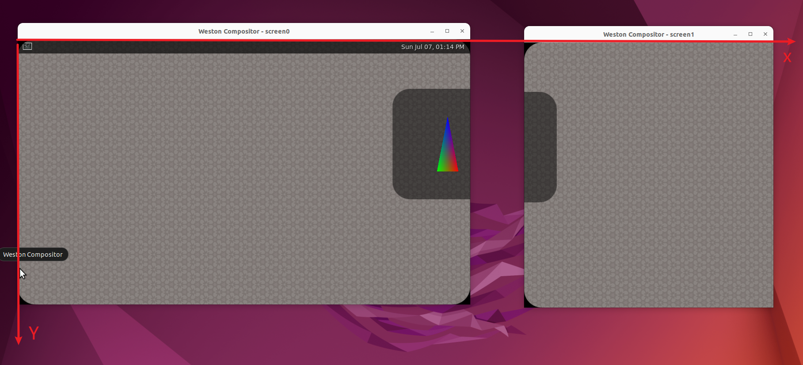

# weston坐标系

结论：

>   1、两个屏幕，共用一个坐标系：
>
>   
>
>   2、一个屏幕 = 一个outPut


```java
// screen1:
[12:55:06.684] gl_renderer_repaint_output, output: 0x58f59137bf80, glViewport:(0, 0, 564, 600) //【】------>  相对于screen1（output1）坐标系！！！！！！
[12:55:06.684] gl_shader_config_init_for_paint_node. go->area:(0, 0, 564, 600)  
[12:55:06.684] gl_shader_config_init_for_paint_node. surface->width: 1024, surface->height: 600, 
[12:55:06.684] gl_shader_config_init_for_paint_node. pnode->view->geometry.pos_offset: (1024.000000, 0.000000) 
[12:55:06.684] gl_shader_config_init_for_paint_node. pnode->output: (1024, 0, 564, 600) 
[12:55:06.684] gl_shader_config_init_for_paint_node. go->area:(0, 0, 564, 600)  
[12:55:06.684] gl_shader_config_init_for_paint_node. surface->width: 250, surface->height: 250, 
[12:55:06.684] gl_shader_config_init_for_paint_node. pnode->view->geometry.pos_offset: (848.000000, 112.000000) //【】---> simple-egl的surface  相对于screen0 左上角（而不是screen1）
[12:55:06.684] gl_shader_config_init_for_paint_node. pnode->output: (1024, 0, 564, 600) 
[12:55:06.684] gl_shader_config_init_for_paint_node. go->area:(0, 0, 564, 600)  
[12:55:06.684] gl_shader_config_init_for_paint_node. surface->width: 32, surface->height: 32, 
[12:55:06.684] gl_shader_config_init_for_paint_node. pnode->view->geometry.pos_offset: (1015.000000, 508.000000) 
[12:55:06.684] gl_shader_config_init_for_paint_node. pnode->output: (1024, 0, 564, 600)                          //【】--> output1 相对于screen0！！！
----------------------------------------------------------------------------------------------------------------------------------------------------------------------------------------
// screen0:
[12:55:06.694] gl_renderer_repaint_output, output: 0x58f59134d460, glViewport:(0, 0, 1024, 600) 
[12:55:06.694] gl_shader_config_init_for_paint_node. go->area:(0, 0, 1024, 600)  
[12:55:06.694] gl_shader_config_init_for_paint_node. surface->width: 1024, surface->height: 600, 
[12:55:06.694] gl_shader_config_init_for_paint_node. pnode->view->geometry.pos_offset: (0.000000, 0.000000) 
[12:55:06.694] gl_shader_config_init_for_paint_node. pnode->output: (0, 0, 1024, 600) 
[12:55:06.694] gl_shader_config_init_for_paint_node. go->area:(0, 0, 1024, 600)  
[12:55:06.694] gl_shader_config_init_for_paint_node. surface->width: 250, surface->height: 250, 
[12:55:06.694] gl_shader_config_init_for_paint_node. pnode->view->geometry.pos_offset: (848.000000, 112.000000) 
[12:55:06.694] gl_shader_config_init_for_paint_node. pnode->output: (0, 0, 1024, 600) 
[12:55:06.695] surface_attach, buffer, (width:250, height:250), type:1 
```

