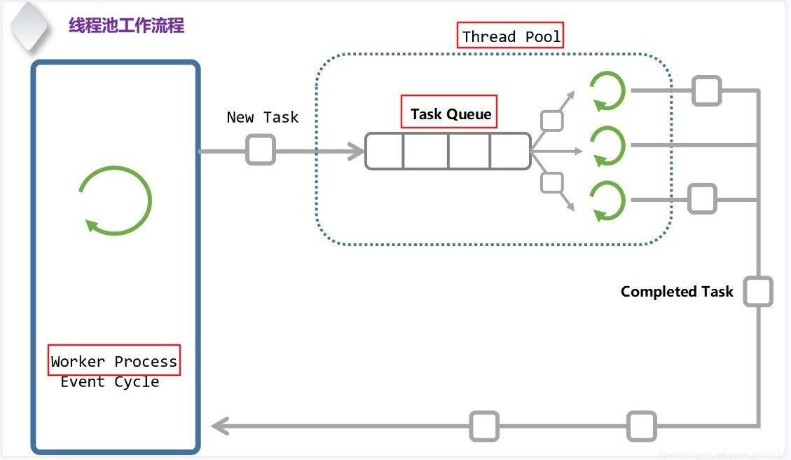

# 角度：

结构

模型

设计模式

https://zhuanlan.zhihu.com/p/568078030   线程池的实现

https://zhuanlan.zhihu.com/p/644170642?utm_id=0     携程ANR 优化实践 - Binder开辟线程数过多导致主线程ANR异常

# 线程池

目标： new Thread

定位： 非功能型\优化型

## 疑问：

> a、从java角度来说，就是一个对象
>
> b、对于linux系统来说，是一个进程，是一个运行
>
> - ---------> 1、如何保证不退出的？内部有没有 死循环？

2、从池子角度：池子如何管理这些 运行的？

从Thread角度：池，就是new Thread的一种方式

3、如果不使用会怎么样？

new Thread： （1）从整体的硬件角度： 减小创建和销毁开销  （自然）

4、Q: 使用池子的具体场景有哪些？

A： 任何需要新new Thread的场景

从模型来看，哪些必然需要使用池子？

线程池的**本质思想**： 复用思想（这里是复用线程）

模型：

结构：

> 线程池  是  进程级别的东西  ----------->   一个进程，创建一个（足够了）

设计模式：

> 生产者消费者模式    或   领导者跟随者模式

```
 线程过多会带来调度开销  --> 具体指的是什么
 创建开销
 防止过分调度
 
 
 线程数过多会导致额外的线程切换开销
 ->不懂
```

小的疑问：

Q: 向Pool里添加Task后，唤醒线程去取Task执行   -------> 那么，唤醒了几个线程？

Q: 同Handler一样，唤醒是核心。唤醒机制是怎样的？

## 模型：



图见： https://zhuanlan.zhihu.com/p/568078030    线程池的实现

从模型图，必然的结论：

> 1、线程池里的线程，都在死循环       代码证明
>
> %accordion%hideContent%accordion%
>
> https://zhuanlan.zhihu.com/p/568078030   // 线程池中的线程（消费者）该干的事儿 static void* thread_worker(void *thrd_pool) {  thread_pool_t *pool = (thread_pool_t*)thrd_pool;  task_queue_t *que;  task_t task;   for (;;) {    pthread_mutex_lock(&(pool->mutex));    que = &pool->task_queue;     while (que->count == 0 && pool->closed == 0) {      // pthread_mutex_unlock(&(pool->mutex))      // 阻塞在 condition      // ===================================      // 解除阻塞      // pthread_mutex_lock(&(pool->mutex));      pthread_cond_wait(&(pool->condition), &(pool->mutex));    }
>
> %/accordion%
>
> 2、

从模型结构，可以看出：

> 整个事件流  反向，就是Handler机制： 多个线程 抛Task  -------->  一个线程 执行
>
> **线程池：** 一个(多个)线程    抛Task  -------->  多个线程 执行

自然， 线程池 和 Handler机制 在  **结构上，是 极大相似的**

--------------------> 代码实现上，必然也极大相似

## 池子具体实现

### c++

https://blog.csdn.net/jisuanji111111/article/details/121811803?spm=1001.2101.3001.6650.5&utm_medium=distribute.pc_relevant.none-task-blog-2~default~BlogCommendFromBaidu~Rate-5-121811803-blog-126914327.235^v39^pc_relevant_anti_vip&depth_1-utm_source=distribute.pc_relevant.none-task-blog-2~default~BlogCommendFromBaidu~Rate-5-121811803-blog-126914327.235^v39^pc_relevant_anti_vip&utm_relevant_index=8           操作系统--线程池（C++）

已经有的库：

> ThreadPool（https://github.com/progschj/ThreadPool）- 是一个轻量级的线程池，只依赖于C++11的标准库，非常易于使用和集成PPL（https://docs.microsoft.com/zh-cn/cpp/parallel/concrt/collection-of-concrt-task-scheduler-samples?view=msvc-160）- 并行模式库（Parallel Patterns Library）是由Microsoft开发的一个高性能并行库，其中包括一个高效的线程池框架QtConcurrent（http://doc.qt.io/qt-5/qtconcurrent-index.html）- Qt链接：https://www.zhihu.com/question/397916107/answer/3092414094 Folly ------> 依赖太重

自己实现，见：

> https://blog.csdn.net/jisuanji111111/article/details/121811803?spm=1001.2101.3001.6650.5&utm_medium=distribute.pc_relevant.none-task-blog-2~default~BlogCommendFromBaidu~Rate-5-121811803-blog-126914327.235^v39^pc_relevant_anti_vip&depth_1-utm_source=distribute.pc_relevant.none-task-blog-2~default~BlogCommendFromBaidu~Rate-5-121811803-blog-126914327.235^v39^pc_relevant_anti_vip&utm_relevant_index=8     操作系统--线程池（C++）

安卓的binder线程池，用的是？

### java

已经有的库：

https://zhuanlan.zhihu.com/p/644065710   Java线程——如何正确使用Java线程池

## 参考：

https://blog.csdn.net/jisuanji111111/article/details/121811803?spm=1001.2101.3001.6650.5&utm_medium=distribute.pc_relevant.none-task-blog-2~default~BlogCommendFromBaidu~Rate-5-121811803-blog-126914327.235^v39^pc_relevant_anti_vip&depth_1-utm_source=distribute.pc_relevant.none-task-blog-2~default~BlogCommendFromBaidu~Rate-5-121811803-blog-126914327.235^v39^pc_relevant_anti_vip&utm_relevant_index=8     操作系统--线程池（C++）

https://zhuanlan.zhihu.com/p/636156144     轻松掌握C++线程池：从底层原理到高级应用

https://zhuanlan.zhihu.com/p/568078030   线程池的实现

https://zhuanlan.zhihu.com/p/644170642?utm_id=0     携程ANR 优化实践 - Binder开辟线程数过多导致主线程ANR异常

https://blog.csdn.net/weixin_45144862/article/details/126914327     C++线程池


## 语言级-----Java并发编程中四种线程池

https://blog.csdn.net/riemann_/article/details/97617432


# binder线程池

一对多问题（多执行）情况：

同时调用太多了问题（不限于binder线程池，甚至不限于线程池）：

# Binder

## 补充：Binder的 同步调用 / 异步调用

-------> 代码角度，区别： 是否有oneway

所有同步调用都存在的问题（不限于Binder）:

> 等待（即阻塞）

所有异步都存在的问题：

> 爆了？       https://blog.csdn.net/shusuanly/article/details/128924394   Binder线程数耗尽引起系统异常分析
>
> 解决办法：  （以Handler 为例子）  1、弄一个队列，排队   2、队列满了就不要了，拒绝
>
> 办法能解决上述问题嘛？

**写demo主动构造异常**  --------->  不要空对空  地分析问题

> ------->  问题demo集

TODO:   binder线程数最大16，能不能增加数量，以解决binder线程池耗尽的影响？

https://blog.csdn.net/software_test010/article/details/125608505     APP性能设计及优化专题——影响性能的不良实现

## Q & A

binder为啥是单向？

> 图：
>
> https://blog.csdn.net/software_test010/article/details/125608505

安全性角度：

> app进程也可以使用mmap映射同一块区域，但是前面我们已经说过为了保证安全性，app进程就不要实现mmap了
>
> 
>
> 具体图，见：https://mp.weixin.qq.com/s?__biz=MzA5MzI3NjE2MA==&mid=2650275124&idx=1&sn=169ff3356aee27ee6b4d9e47bbe45423&chksm=88630c5bbf14854d6592147b7a6adac7de9ab3244a474455b33059cf19bb33a7c36792410d3d&scene=27     Binder机制总结之驱动层分析  -----------> **极好的文章！！！！**

## 一些数据

Binder 通信的数据大小限制：

> 
>
> 图： https://zhuanlan.zhihu.com/p/666600922
>
> -------------------->  TODO： 为啥是这个数据？

https://blog.csdn.net/software_test010/article/details/125608505     APP性能设计及优化专题——影响性能的不良实现

## 从驱动角度 ----> 看Binder

[Binder机制总结之驱动层分析 (qq.com)](https://mp.weixin.qq.com/s?__biz=MzA5MzI3NjE2MA==&mid=2650275124&idx=1&sn=169ff3356aee27ee6b4d9e47bbe45423&chksm=88630c5bbf14854d6592147b7a6adac7de9ab3244a474455b33059cf19bb33a7c36792410d3d&scene=27)           https://mp.weixin.qq.com/s?__biz=MzA5MzI3NjE2MA==&mid=2650275124&idx=1&sn=169ff3356aee27ee6b4d9e47bbe45423&chksm=88630c5bbf14854d6592147b7a6adac7de9ab3244a474455b33059cf19bb33a7c36792410d3d&scene=27

[Android-深入理解Binder（一）_/dev/binder-CSDN博客](https://blog.csdn.net/weixin_43580319/article/details/123994514)           https://blog.csdn.net/weixin_43580319/article/details/123994514

驱动文件  /dev/binder ：

1、~~/dev/binder 是 驱动文件~~ ，在内存中   （~~内存中的虚拟文件系统（Virtual File System，VFS）~~） ---->  自然，~~不涉及硬盘的读写~~

2、驱动部分 ------> 在内核中实现

3、从驱动来看： /dev/binder 本质上是与驱动的 接口 ：  程序 -----> open("/dev/binder") -----> 驱动 ？？？？？？

4、从内核角度：/dev/binder  是一个设备


