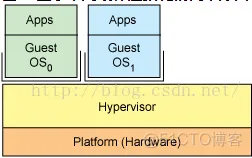
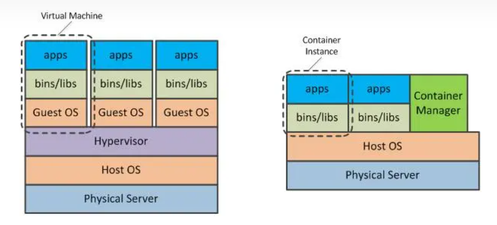

# 目录

# Introduction


# Hypervisor虚拟机概念

https://blog.51cto.com/u_16099316/6615775

Hypervisor是一种虚拟化管理程序，它负责管理虚拟机和物理设备之间的交互

全虚拟技术：

> 
>
> 图： https://blog.51cto.com/u_16099316/6615775
>
> 1、Hypervisor运行在裸硬件之上，充当主机操作系统，则：
>
> （1）Hypervisor管理虚拟服务器运行客户端操作系统，保证客户端系统的**完全隔离**
>
> （2）全虚拟化的性能略差：Hypervisor需要消耗一些资源


-------------> TODO: 容器化技术的图？


半虚拟化技术：

> 在原有的OS之上添加一个很小的模块，利用原有的OS做任务调度、内存管理以及硬件设备交互等
>
> 本质：是利用原有的OS提供了一个模拟的运行环境，并由该系统处理一些事物。在这种模式下每一个虚拟机都是一个常规的进程，通过原有的OS进行调度。

疑问：每一个虚拟机都是一个常规的进程？？？？？

TODO:

两个init.rc（容器方案）、Hypervisor、chroot方式区别？

容器与Hypervisor的区别？

## 理解：

从**硬件资源角度**：操作系统和Hypervisor **都是为了共享硬件资源**：

> 操作系统-------------让多个APP共享硬件资源
>
> Hypervisor -----------  让 多个操作系统 共享硬件资源

**具体策略之内存**----------**还是沙箱模型**：

OS会给每个线程分配特定的内存区域一样（资源沙箱）     ------->   VMM也会给每个OS分配特定的内存区域（资源沙箱）

------>沙箱模型， 推论：

1、~~del: OS会有拥有自己的机器的错觉 ： 沙箱内的一切资源都可以被OS所使用，沙箱以外的任何资源的使用都需要VMM的调解~~

~~del: 所以，从进程角度：感觉也是自己拥有机器的错觉~~

2、**具体策略之硬件外设**----------**虚拟化**：

> 虚拟化 - 准虚拟化 - 物理的(也称作"直通" 或 "原生的")
>
> 
>
> 图来源： https://blog.51cto.com/u_16099316/6615775
>
> 自然，从结构上来说，H**ypervisor是 OS 和  HW（HardWare）之间的插桩点：驱动**
>
> 详细： 虚拟化： 当一个OS访问设备的配置寄存器时硬件会产生一个捕获。VMM的捕获处理程序检查OS的请求，根据模拟设备的状态确定该请求的含义，然后把模拟设备的结果返回给OS使OS继续运行。  --------->  移花接木
>
> ~~参考：https://zhuanlan.zhihu.com/p/185946700~~

虚拟化，其含义：**虚拟化 硬件**！！！

参考：

> https://zhuanlan.zhihu.com/p/185946700

## 具体代码级别的验证：

## Hypervisor是如何垫上一层的？接口是怎样的？如何去适配?

virtio input  是 Hypervisor的

> 图见收藏
>
> 
>
> TODO:  待验证：按照图里的意思，底层的硬件事件被linux 读取，事件传到kwin模块
>
> --------------------->  kwin根据区域，决定是否传给安卓
>
> --------------------->  如果传给安卓，则通过Hypervisor协调： vittio_input传输给安卓的kernel

Q&A:

> Q:   input链路绕路了：为啥要经过kwin？（直接由Hypervisor读取，向两边分发，会快）
>
> A：  因为kwin知道安卓区域范围
>
> 具体代码：Connection::processEvents()函数中，必然
>
> ```java
>  case LIBINPUT_EVENT_TOUCH_DOWN: {
>      #ifndef KWIN_BUILD_TESTING
>          TouchEvent *te = static_cast<TouchEvent *>(event.get());
>          const auto *output = te->device()->output();
>          if (!output) {
>              qCWarning(KWIN_LIBINPUT) << "Touch down received for device with no output assigned";
>              break;
>          }
>          const QPointF globalPos = devicePointToGlobalPosition(te->absolutePos(output->modeSize()), output);
>          
>          // 必然这里会加上区域区分
>          Q_EMIT te->device()->touchDown(te->id(), globalPos, te->time(), te->device());
>          break;
>  }
> ```

TODO:  其他从硬件过来的，或者Android使用硬件能力 --------> 链路是怎样的？

Hypervisor本质是啥？对什么的封装？  linux和安卓kernel差异的封装？


# Android 虚拟化

Android 虚拟化 ------> 指的是Android系统的HAL层没有接硬件，而是转接到 linux（通过virtual-IO、virtual图形等）

TODO: google官网

HAL层本质：通信协议、标准化接口

> 隔离安卓代码与硬件厂商（隔离硬件厂商的差异，让硬件厂商适配）

Android 虚拟化 的好处：

> 1、不需要通过
>
> 2、安卓大版本升级情形： 不需硬件重新适配安卓大版本

参考：[Android虚拟化之一：为什么需要虚拟化 - 知乎 (zhihu.com)](https://zhuanlan.zhihu.com/p/673765044)

[Android 虚拟化框架 (AVF) 概览  | Android 开源项目  | Android Open Source Project (google.cn)](https://source.android.google.cn/docs/core/virtualization?hl=zh-cn)

[架构  | Android 开源项目  | Android Open Source Project (google.cn)](https://source.android.google.cn/docs/automotive/virtualization/architecture?hl=zh-cn)


# 容器与虚拟化区别



> 图来源： https://zhuanlan.zhihu.com/p/27289278


| 特性     | 容器                                                         | 虚拟机                                                       |
| -------- | ------------------------------------------------------------ | ------------------------------------------------------------ |
| 技术原理 | <font color='red'>共享操作系统内核</font>，<br /> 隔离用户空间 | <font color='red'>模拟硬件</font>和操作系统，<br />隔离整个操作系统 |
| 资源占用 | 较少的内存和存储空间                                         | 较多的内存和存储空间                                         |
| 灵活性   | 仅限于与主机操作系统兼容的操作系统                           | 支持多种操作系统                                             |
| 启动时间 | 秒级                                                         | 分钟级                                                       |
| 安全性   | 较低                                                         | 较高                                                         |
| 隔离性   | 中度（隔离用户空间）                                         | 强（独立操作系统）                                           |
| 示例     | Docker、Kubernetes                                           | VMware、VirtualBox                                           |

**从结构上看，**两者之间根本区别在于  <font color='red'>分支分开的地方不一样</font>：

> 一个是在  用户空间分开，成为两个（**<font color='red'>自然，内核和驱动是共用</font>**）
>
> 另一个是  驱动上一层（hypervir）就分开  （**<font color='red'>自然，整个OS都是隔离的，两个内核</font>**）


参考：

> [容器基础知识：容器和虚拟化的区别_容器化和虚拟化区别-CSDN博客](https://blog.csdn.net/surfirst/article/details/136077577?spm=1001.2101.3001.6650.2&utm_medium=distribute.pc_relevant.none-task-blog-2~default~YuanLiJiHua~Position-2-136077577-blog-107787244.235^v43^pc_blog_bottom_relevance_base7&depth_1-utm_source=distribute.pc_relevant.none-task-blog-2~default~YuanLiJiHua~Position-2-136077577-blog-107787244.235^v43^pc_blog_bottom_relevance_base7&utm_relevant_index=4)


<font color='red'>分开的点不一样，对应不同的技术</font>：

> 比如多用户技术（自然，system_server是共用的）
>
> 多输入法技术是system_server中IMMS分开，其他一样（自然，以下都是共用的）

