# 目录


# AS:

## AS  搭建断点java调试环境

见  《HowToReadCode， 如何用源码搭建java断点调试环境》

## 查看类族图谱（**clion一样**）

`认识一个新类：` 需要**快速了解家族图谱**，比如  view的0层家族图谱

`0层向下族谱：`

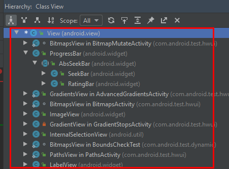

`0层向上族谱：`

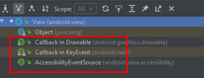

可以copy文字版：

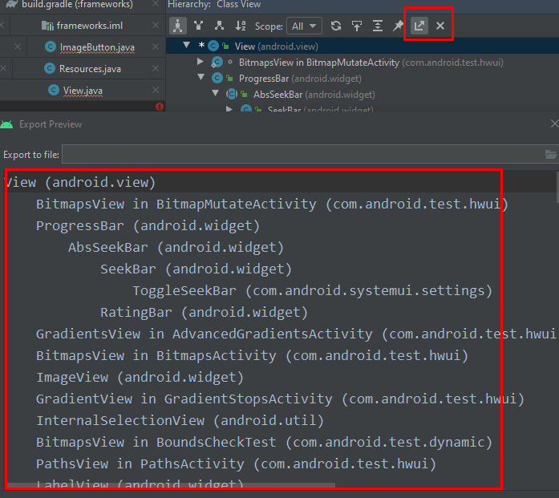

## 查看属性生命周期

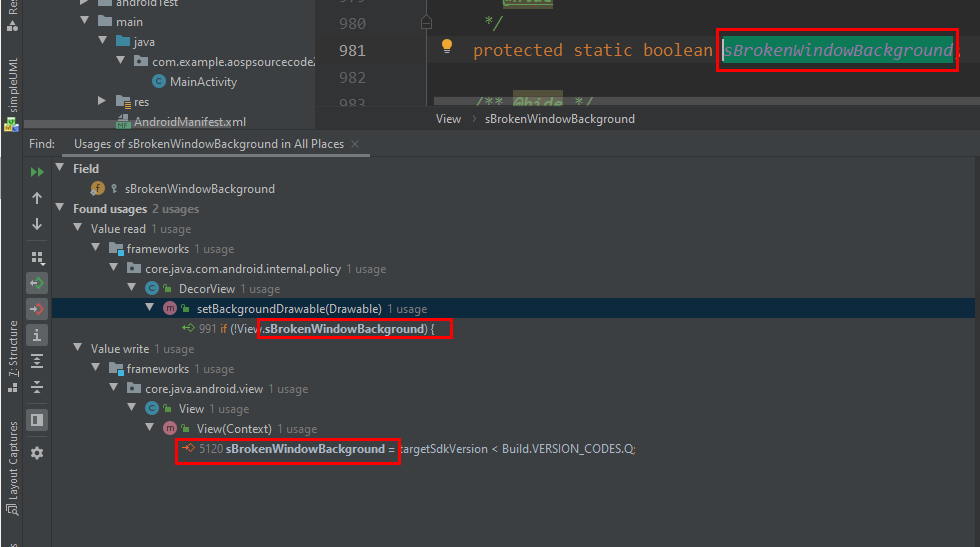

## 查看调用栈

`向上（或向下）调用栈`:

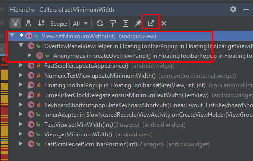

`可以copy文字版`


## 快速了解函数所处哪个内部类里:

小技巧：

> 快速了解函数所处哪个内部类里
>
> 快速了解一段代码在哪个函数里（大函数）

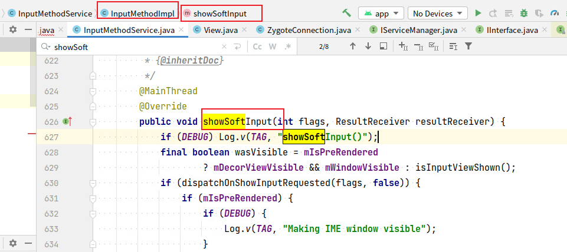


## 快速搜索函数

structure中：点击任意位置都可以搜索（<font color='red'>优</font>）

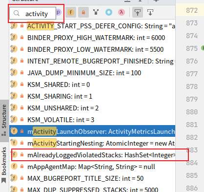


Ctrl +E  最近文件中：可以搜

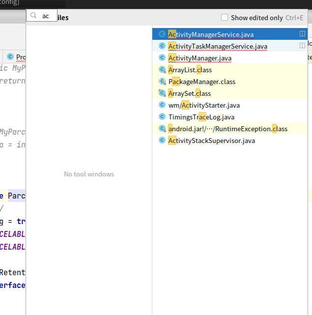


ALT +  F7：  find usage  可以搜


## 代码飘红

飘红 : 

aosp编译出的framework.jar作为lib依赖，给普通工程用。比如Z的工程

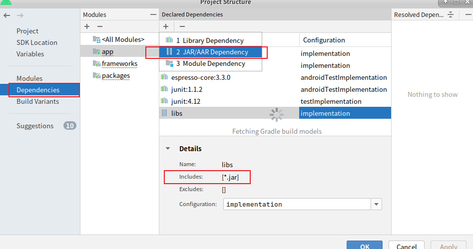


## ide本身就可以完全替代  <font color='red'>界面</font>小乌龟

### 可以查看历史某一次变动：

AS 类似<font color='red'>有界面</font>小乌龟: 切换分支 ----》 commit 信息 ----》 commit 下所有变动文件（以及对应的commit网站）---》某变动下的diff

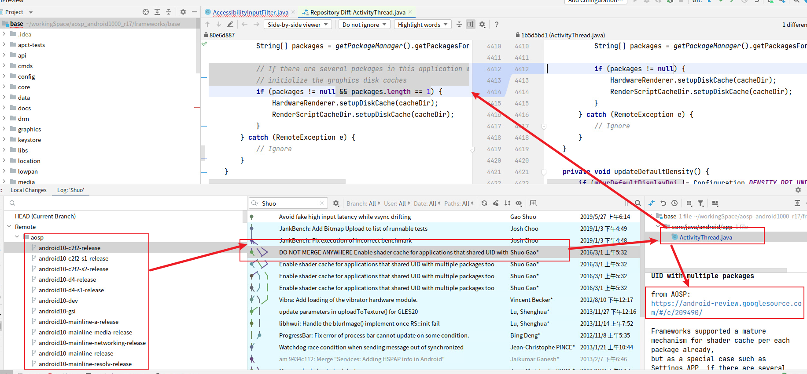


前提：打开的工程是一个git仓 ------》  似乎repo的根目录不行


### ~~类似于小乌龟的GUI-- commit 的操作:~~

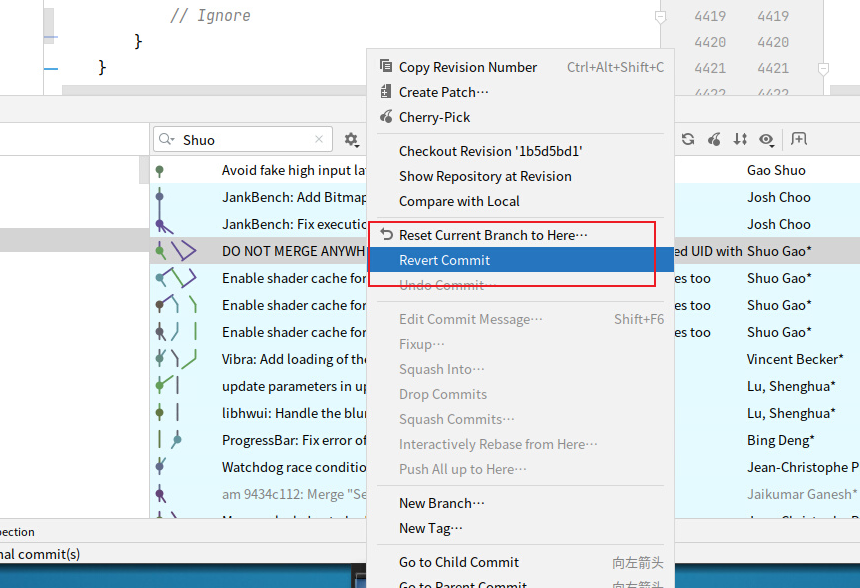


### 利用 ide 替代小乌龟: commit & push

https://birkhoffg.github.io/blog/posts/how-to-committing-code-using-intellij-idea/


## iml 文件

此文件非常重要，必须关注。作用：

1、<font color='red'>跳转优先级配置。</font>有时候优先跳转到jar或者class里，优先配置到source folder

2、在这里增加源码？？？？其他盘里的


**iml文件来源：**

> 1、设置中勾选
>
> 
>
> 2、由gradle编译而来，gradle才是根


## 体会

体会：（不仅限于git）

1、为什么要会用命令呢？-------主

  因为它更本质，从而可以适用于所有场合（win、linux、linux无GUI的）--------->  **一法通万法通，永不过时**（GUI很可能变化）

**为什么更本质?   因为GUI只是对 命令  的封装**

2、为什么还需要一些界面呢？--------景，比如看一个文件的diff时

--------->    优：主+次（某些场景，GUI）


## 任意ide 如何默认 Terminal使用 bash?

任意ide（As 或 clion 等）


Bash 好处：

> 1、 linux下命令  
>
> 2、启动自动运行（自定义一些变量） 

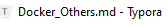


## 内存泄漏的定位：

https://www.jianshu.com/p/19fd60f40e92?from=groupmessage

1、粗略估计

adb shell dumpsys meminfo 包名


2、Android Profiler使用详解


## AS的plugin

### AS高亮

0、最优：使用高亮的插件**[MultiHighlight](https://github.com/huoguangjin/MultiHighlight)**


1、ctrl + F

2、双击选中 --->会给你信息流  （计算机的本质）  --->x信息最终给到了touchBounds

​                                                                                ---》在此之前x信息被getScrollx改写了


设置:

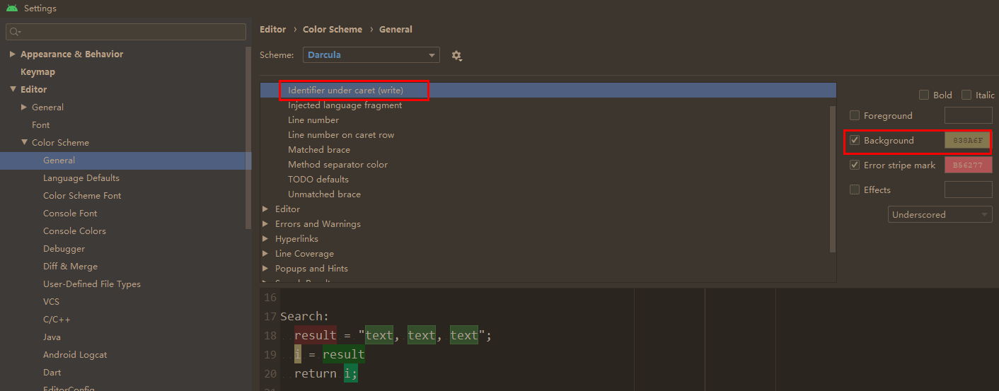


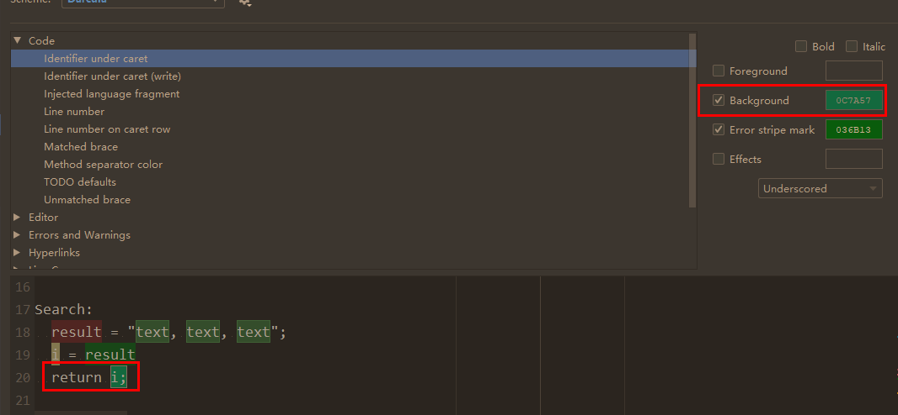


### GitToolBox 工具----**非常有用**

1、查看某一行提交(以某一行为中心链接最新改动人、改动的commit)

2、查看当前行改动的commit下----所有相关改动


https://github.com/zielu/GitToolBox/wiki/Manual

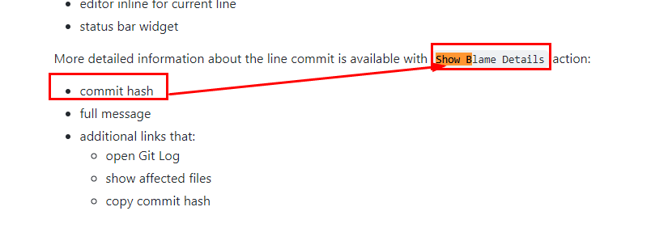

AS里找这个操作的快捷键
ALT + Shift + B  --》`查看commit所有信息`

--------> 所以,   阅读工具对应的英文文档、github英文文档，很有效


图

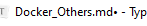


查看该commit 所有改变


### AS 搜索方法使用地方：

------>  修改为： alt  + f


## AS 方法分割线

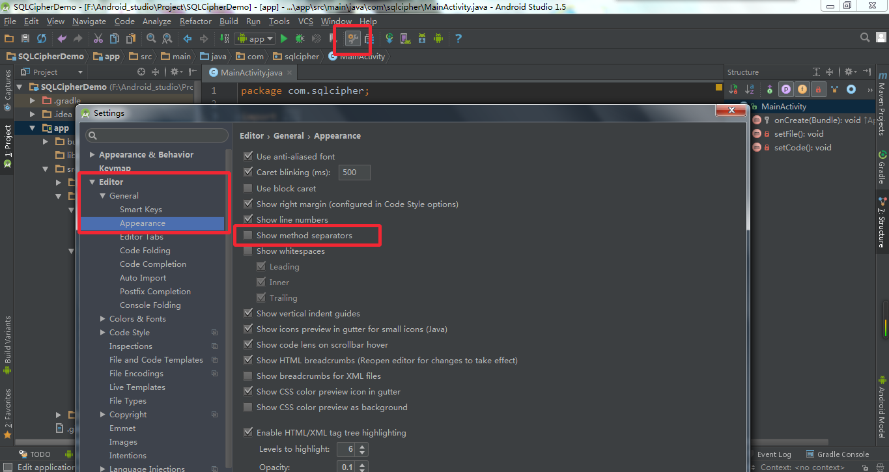


https://www.yii666.com/article/612482.html?action=onAll


## 空白点的设置

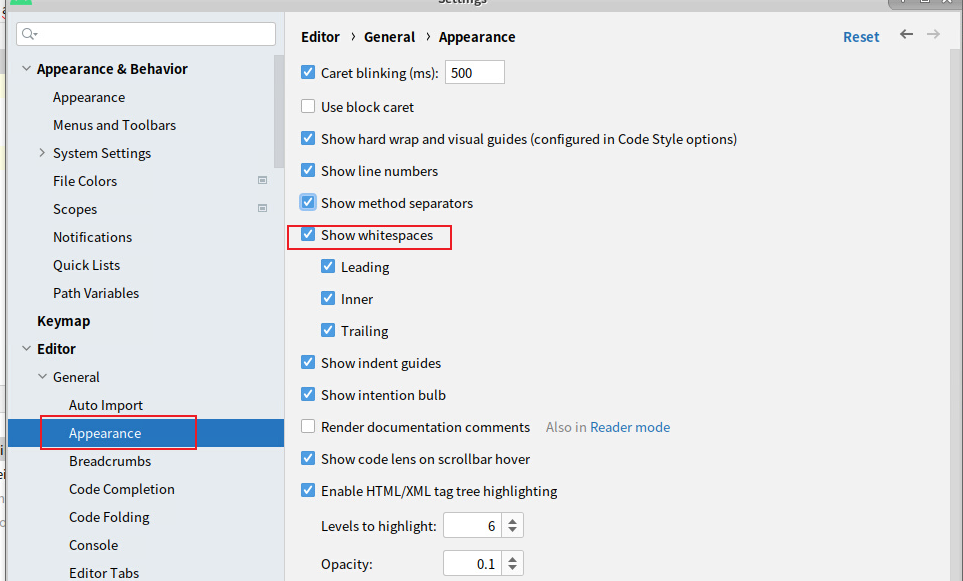


## 关于 win 与 linux AS抢占的问题：

### 如何解决：

由于docker的AS是通过win间接连接手机

同时都开AS，在`使用debug、monitor、layout inspector`等时会有抢占问题：


如何解决抢占：win下AS相对强一些

1、若要使用win的AS：

​    关闭给linux的端口转发即可


   2、若要使用linux的AS：

​     关闭win侧的AS


###  最优使用：

`因目前电脑配置低`：linux AS比较卡顿、layout inspector获取的结果比较差、切换中文比较蛮烦

------------>  所以，AS主要用在win下（等后续增强pc配置）


## 验证过的版本


## 问题

Default Activity Not Found解决方法

**需要一个没有任何界面、只有一个后台Service的程序。但是在安装的工程中出现如下问题：Default Activity Not Found，如图：**

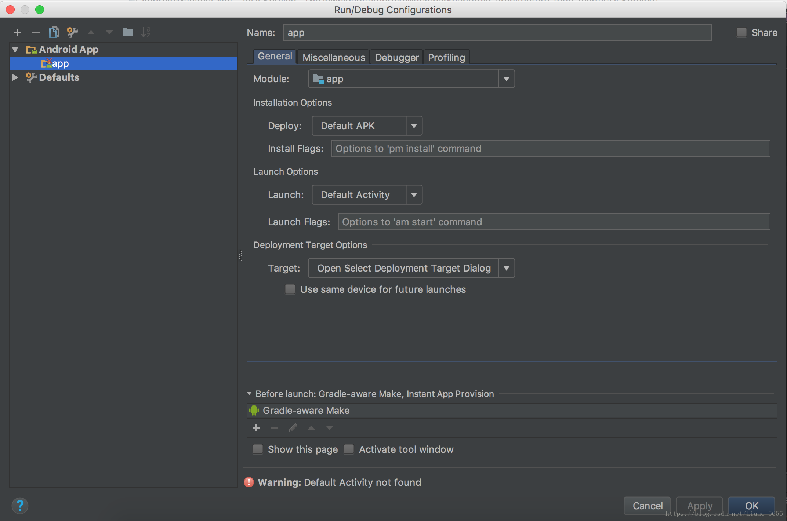

解决方法：

这是因为只有一个Service，没有默认的Activity导致的。

点击上方 Edit Configurations；选择General目录下的Launch Options，选中Nothing


### 签名问题

the apk for your currently selected variant(app-release-unsigned.apk)is not signed.

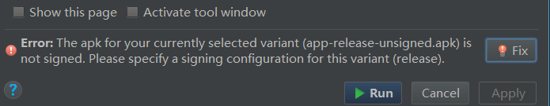

签名问题。一般debug不签名

解决办法如下：

1.点击BuildVariants，然后设置BuildVariant为debug。

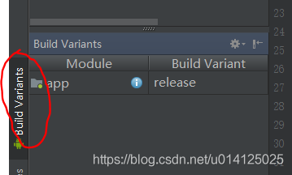


### could not open selected VM debug port

启动monitor时，could not open selected VM debug port(8700) 怎么解决

先关掉as，打开monitor之后，再开AS

https://blog.csdn.net/m0_49255099/article/details/107654950?utm_medium=distribute.pc_relevant.none-task-blog-BlogCommendFromBaidu-2.not_use_machine_learn_pai&depth_1-utm_source=distribute.pc_relevant.none-task-blog-BlogCommendFromBaidu-2.not_use_machine_learn_pai


monitor路径：C:\Users\Administrator\AppData\Local\Android\Sdk\tools
点击monitor.bat

### **代理配置问题：**

**《--------**   dl.google.com:443 failed to respond

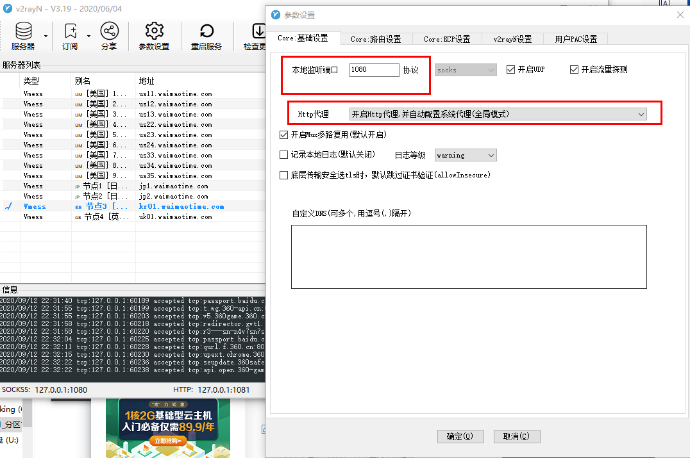


http://www.baidu.com

http://www.google.com

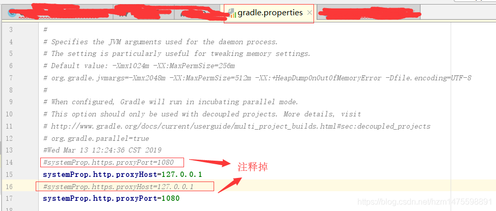

如果有的话：

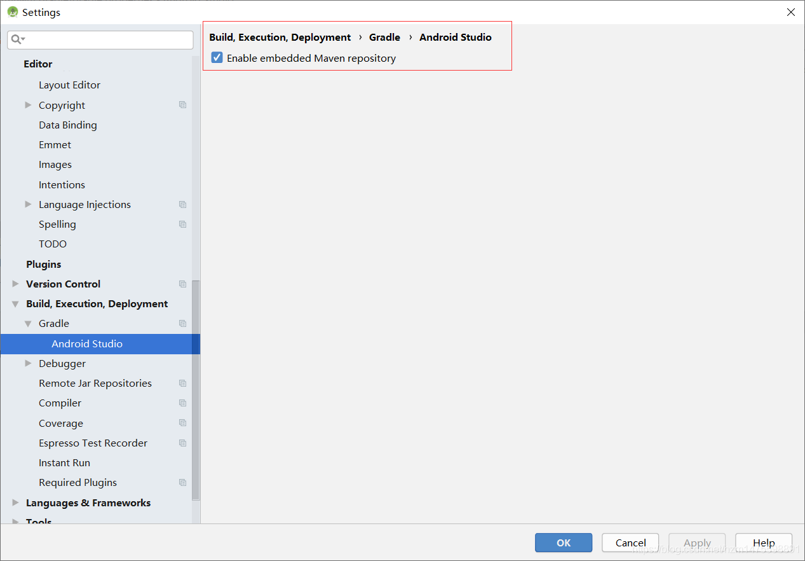


#### 本质：

方法一：

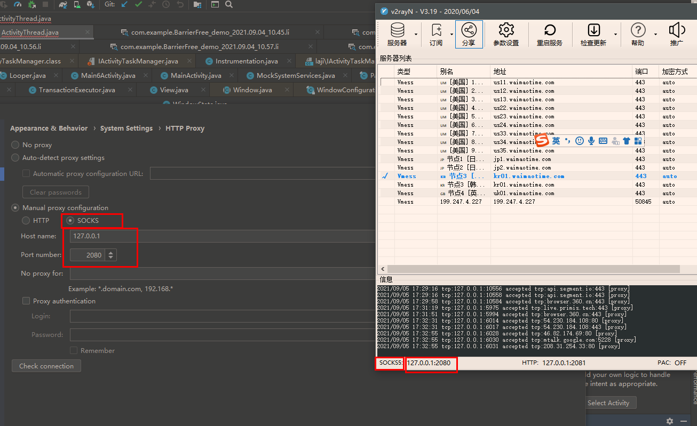


自然，方法二：
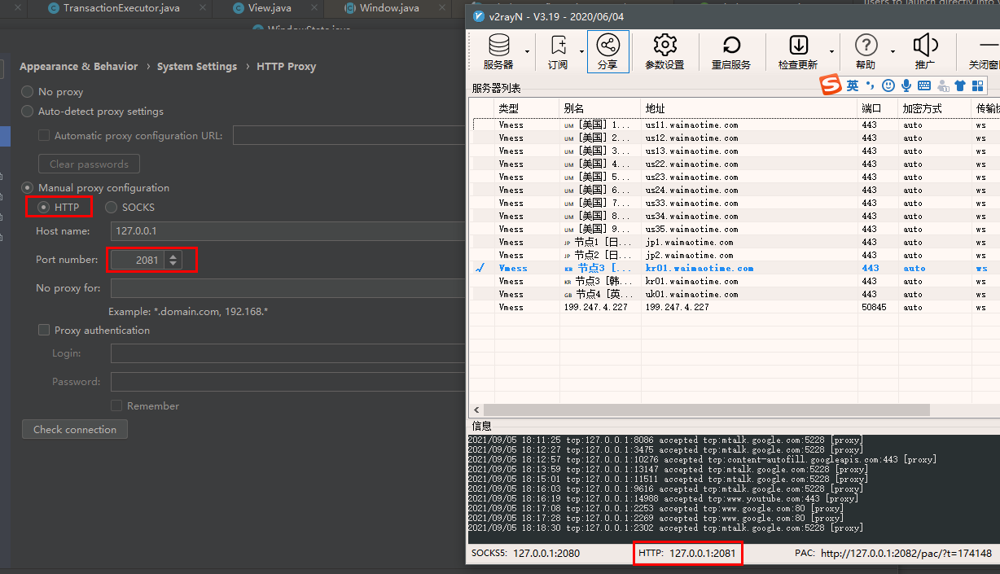

新版本:利用HTTP

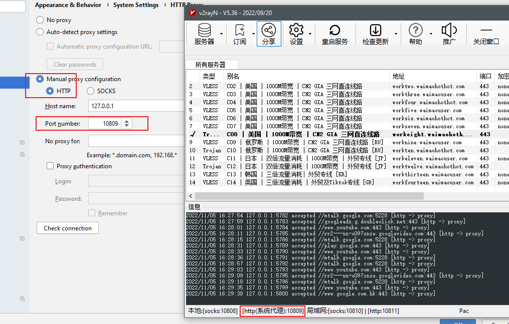

~~注：自然也可以利用socks~~


### AS debug看不到进程


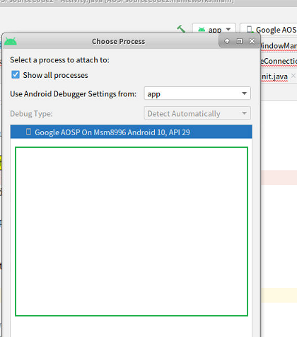


方法：

```shell
adb  kill-server
adb connect host.docker.internal:7788
```


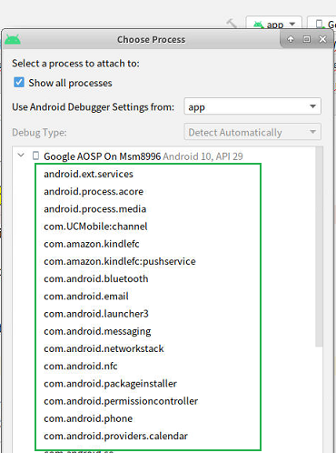


## 编译时报错： Failed to calculate the value of task ‘:unityLibrary:compileDebugJavaWithJavac‘

https://blog.csdn.net/EverNess010/article/details/129924721


## 编译报错PKIX path building failed

Exception in thread "main" javax.net.ssl.SSLHandshakeException: sun.security.validator.ValidatorException: PKIX path building failed: sun.security.provider.certpath.SunCertPathBuilderException: unable to find valid certification path to requested target

-----------------> 网上很多证书问题

**本质还是网络问题**，check 是否能连 google。 不能的话，**需要配置代理：**

> AS ---->  settings ----> Proxy -----> HTTP:
>
> Host name:  10.9.26.12   port:8080

然后check 是否能连 google

https://www.cnblogs.com/xsj1989/p/16822735.html    [settings.gradle配置，解决Plugin [id: 'com.android.application', version: '7.3.0', apply: false\] was not found in any of the following sources](https://www.cnblogs.com/xsj1989/p/16822735.html)


## 编译报错 **Could not find com.android.tools.build:gradle:8.0.2. Searched in the followi**

验证OK的办法：

**参考已经OK的工程，**修改Maven仓库：

```java
// Top-level build file where you can add configuration options common to all sub-projects/modules.

buildscript {
    repositories {
        google()
        mavenCentral()
        gradlePluginPortal()
    }
    ......................
}

allprojects {
    repositories {
        google()
        mavenCentral()
    }
    ......................
}


```

## 编译报错constant expression required-case后参数报错

验证OK的办法：

> ```java
> 在gradle.properties配置文件下添加如下代码即可解决
> android.nonFinalResIds=false
> ```
>
> 参考：https://blog.csdn.net/mjh1667002013/article/details/134763804


## Could not resolve all files for configuration ':classpath'.

```
A problem occurred configuring root project 'openGL-Demo-master'.
> Could not resolve all files for configuration ':classpath'.
   > Could not resolve com.android.tools.build:gradle:8.0.2.
     Required by:
         project :
      > No matching variant of com.android.tools.build:gradle:8.0.2 was found. The consumer was configured to find a library for use during runtime, compatible with Java 8, packaged as a jar, and its dependencies declared externally, as well as attribute 'org.gradle.plugin.api-version' with value '8.0' but:
```

----------------->

办法：

> ```
> AS版本flamingo，新建项目后building就报了这么个错误，解决方法：Ended up changing Gradle JDK to 11.。就是把项目的jdk版本升级到11就可以了。
> 
> File -> Settings -> Build, Execution, Deployment -> Build Tools -> Gradle。
> 
> 
> //  参考：https://blog.csdn.net/ximen250/article/details/8495845
> ```


## Android Studio 很卡 ---->  如何理解？

卡的原因：

> 任务管理器可以看到AS一直cpu很高  ---------> 既然很高，为啥很卡？
>
> 原来这个很高是因为频繁触发GC！！！！！！！GC会打断系统运行

---------> 解决办法： 避免频繁GC（增大内存）

[Android Studio 使用起来很卡，你们是如何解决的？ - 知乎 (zhihu.com)](https://www.zhihu.com/question/32282404)     https://www.zhihu.com/question/32282404

> 一旦你的工程变大，IDE 运行时间稍长，<font color='red'>内存就开始吃紧，频繁触发 GC</font>，自然会卡。
>
> 修改：
>
> ```
>  修改android-studio/bin/studio.vmoptions   studio64.vmoptions  两个文件的以下属性就可以了
>  -Xms2048m
>  
>  -Xmx2048m
>  
>  -XX:MaxPermSize=2048m
>  
>  -XX:ReservedCodeCacheSize=1024m
>  
> ```

所以：

> cpu高水位（pc风扇转得快） ---------  很多时候，根因不是在cpu上，反而是mem上


# Device Monitor启动

https://blog.csdn.net/weixin_55545941/article/details/130883921


## 快捷键

代码展开折叠
Ctrl + +	        展开代码（局部）
Ctrl + -	        折叠代码（局部）  ---》`很有用`
Ctrl + Shift + +	展开所有代码
Ctrl + Shift + -	折叠所有代码


<font color='green'>Ctrl + E  来替代   多行显示 -----》 极优</font>

原因： 1、多行 占用  代码显示空间，很垃圾     2、多行  没有最近使用的一个stack排序，当文件显示超过四五个，没有优先级  -----》  造成很难找
              3、人找文件是按照首字母去找， 多行，非常bug，眼睛要扫完整个文件名才能看下一个（Ctrl + E  从上到下，只需匹配首字母） ----》非常垃圾

**在回退功能上：也尽量用   Ctrl + E  来替代   回退快捷键**
原因：1、Ctrl + E 可以快速回到  最初的地方   2、逼迫自己记忆 是从 哪个房间过来的（无需记忆方法），利于结构的记忆
            3、回退功能，对记忆有伤害：


-<font color='red'>规定：</font>

>  禁止用多行，少用回退，多用Ctrl + E 


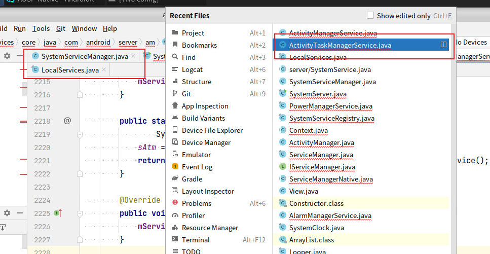


Ctrl + Shift +F    ： find in files   --------->    文本查找（<font color='red'>很优：</font>1、不限于符号，**全局**查找 **文本**  2、有时候文件没有被source，没办法当做符号查）

Shift + Shift  ------>  **全局** 查找 **符号**


ALT + F (个人定制)  ----->  Find Usages:(<font color='red'>很优：</font> ~~当引用的地方非常多时，read、write已经极大缩小范围了~~)

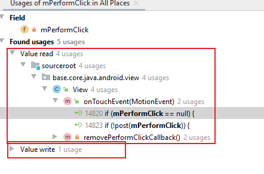

# AS技巧官方教程

TODO:
https://www.youtube.com/hashtag/androiddevsummit

 其中： https://www.youtube.com/watch?v=rjlhSDhFwzM&t=703s


# 格式

%accordion%折叠%accordion%

> 网站上显示能折叠图片
>
> 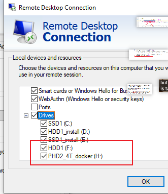


%/accordion%


| qwqw     | qwqwq      | wqwq      | wqw  | wqwq | wqw  |
| -------- | ---------- | --------- | ---- | ---- | ---- |
| asdasdas | sdasdadasd | adasdasda |      |      |      |
| asdsd    | asdasda    | adasda    |      |      |      |

a