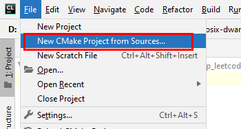
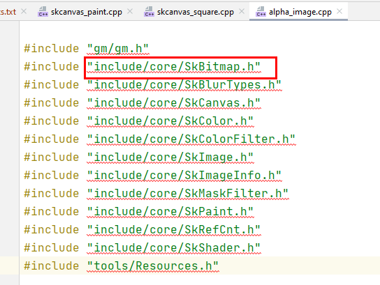
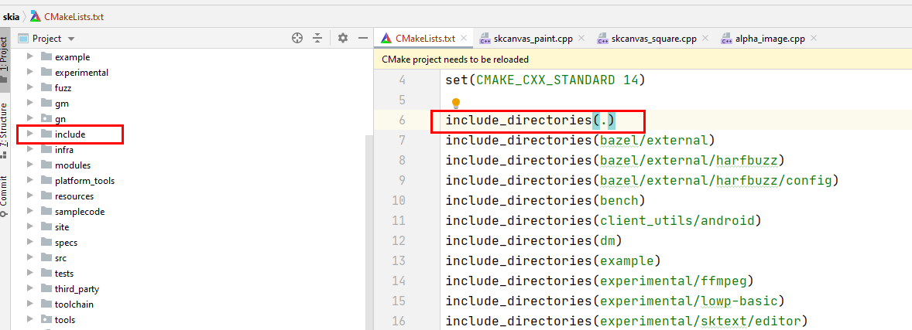
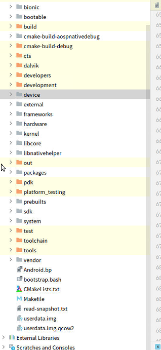
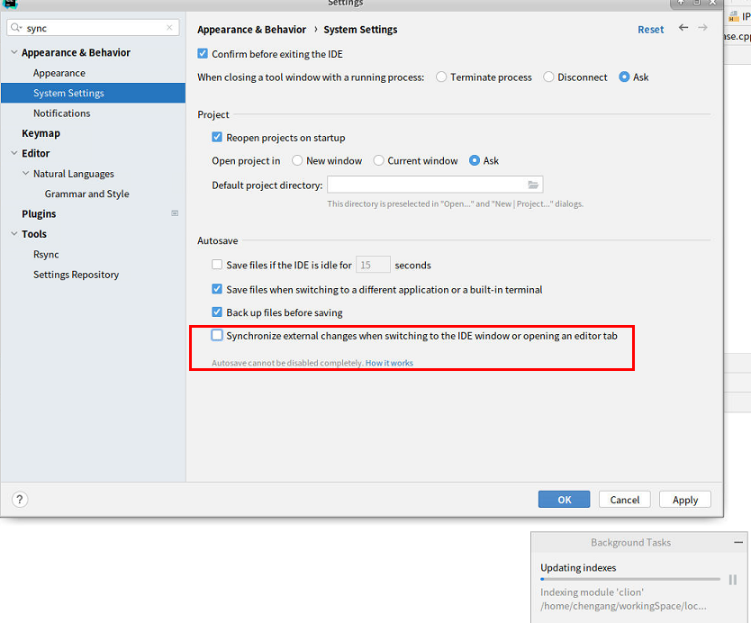
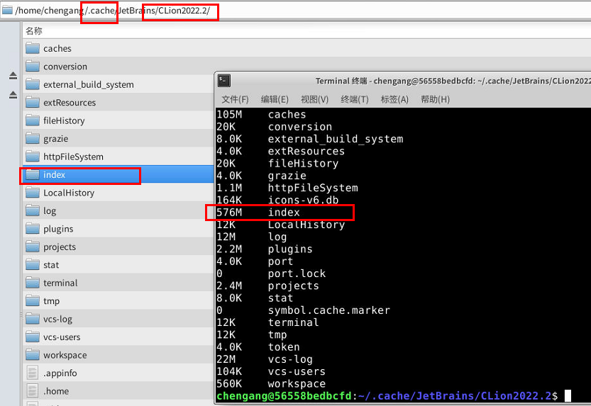

[TOC]


# clion


## ~~clion第一次打开工程, 生成cmakeList.txt~~

~~对于没有cmakeList.txt的工程，选择自动生成cmakeList.txt~~





特别注意：**有些clion版本，没有New CMake Project from Sources**

> https://qa.1r1g.com/sf/ask/4758331231/           从现有源创建项目时如何在 Clion 中生成 CMakeLists.txt？
>
> --------> 验证ok


## clion目录结构

```
.idea   index在这里
cmake-build-aospnativedebug   cmake编译的一些信息

```

## clion  win与linux代码同步

https://cloud.tencent.com/developer/article/1406250   使用Clion优雅的完全远程自动同步和远程调试c++

## clion   cpp跳转问题：

cljon实现跳转几点结论：
1、clion通过.h链接，实现跳转
   --->结论：`保证能跳进所有的.h(看头文件，没有标红),  那么所有工程都OK`

 2、clion通过cmakelist编译链接，实现跳转的

对于gn编译的项目，`clion自动生成cmakelist`,   实现跳转－－> 可能会存在问题
根本原因：两套direction  base导致的
第一套：gn编译，.c里的#include "src/sksl/ir/SkSLProgram.h" 以src上一层作为base
第二套：cmakeList。如果自动生成的CMakeLists.txt没有以上—层为base, 则无法找到SkSLProgram.h, 从而无法跳转
解决方法：`cmakeList.txt中 添加include_directories(上一层路径）`

以Skia源码为例：



---->说明include/core/SkBitmap.h的direction base没有include_directories进来

上一层即根目录



## AOSP Native代码导入CLion，跳转问题

见： HowToReadCode  中《framework Native Clion 跳转环境（linux下）》


## clion加速


### exclude没用的文件目录



### clion关闭自动索引index




### 终极手段：保存.cache?

```
du -sh *
```

index最终存储在.cache中，可以看见，索引很大  ----> 如何不让它更新呢？



https://plugins.jetbrains.com/plugin/12334-gradianto/versions

https://plugins.jetbrains.com/plugin/11938-one-dark-theme

https://www.thinbug.com/q/36628483


验证： 
重启ide：
1、index缓冲区大小是否变  
2、会不会重新index

---》备份缓冲区

## 权限问题：

Error running 'cpp_leetcode': Cannot run program "G:\working_pan\PROJECTS\cpp_leetcode\cmake-build-debug\cpp_leetcode.exe" (in directory "G:\working_pan\PROJECTS\cpp_leetcode\cmake-build-debug"): CreateProcess error=5, 拒绝访问。

1、明明文件在  2、clion以管理员启动的
------》<font color='red'>关闭360</font>！


## 激活码

Server address http://81.68.147.56:8163