# 目录


# 技巧，工具层面：


## 断点调试技巧：

1、可以复制调用栈！！！---->调用流程

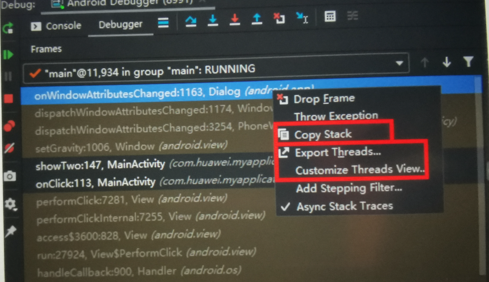

2、 sdk或lib或dependency的jar文件，可以断点！

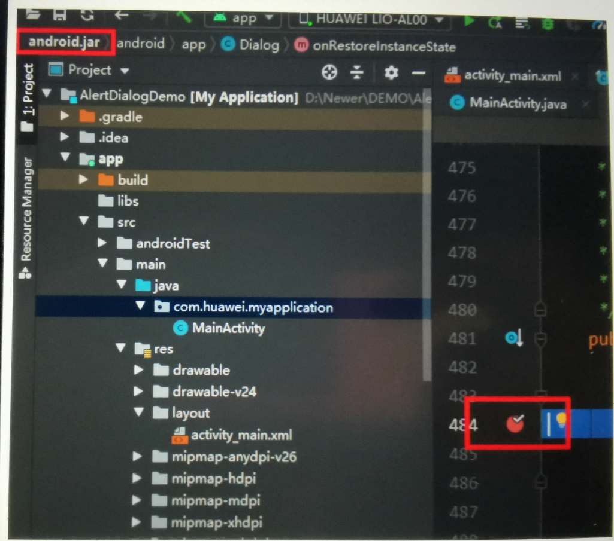

3、基于2，可以做很多事情：

1）huawei改动了Google源码，导致真机与安卓sdk行数不一致 >方法： 复制源码，直接到.class文件里   注意：必须重新编译一次，不能破坏环境！！！！！

2）对应Z代码，如何用AS调试？？？？同样道理， 编译Z的jar，添加到dependency里就OK了（也可以直接copy源码）

编好的jar，也可添加到SDK的source里！！！！！？？？<font color='red'> 更优秀</font>

​               3）<font color='red'> 极其优</font>   利用云帆的方法，<font color='red'>  将其他盘的java文件，通过gradle引入成source</font>，  既然成source就会纳入调试的代码？？？？？？。而且在其他盘改动代码，自动同步过来！！！！

​               4）源码，copy到sdk的source目录下？？？（或者copy到工程目录下？？？）

4、如何配合log？？？各适合哪些场景？？？？

5、回退：回到上一个函数状态（当然已经改变的值是不会恢复的）

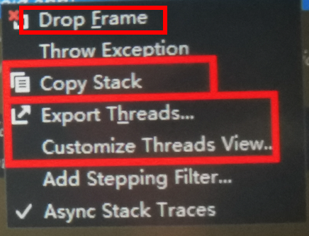

6、条件断点

对于循环和有if的语句超级实用！！！

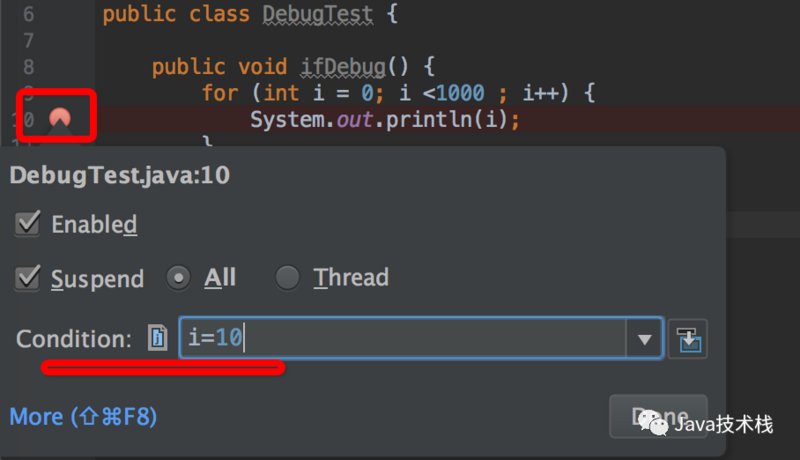

### 暂停等待attach

方法一：

手点击启动应用，但代码中加wait

```cpp
Debug.waitForDebugger() ===》暂停等待attach
-------> 代码背后原理： 会让手机进程保持阻塞状态,直到连上调试器后,才会继续执行后续的代码
```

场景举例:

> ​      AS debug，无法对onCreate方法进行调试è点开，就执行完了


仍然存在的问题：

因为attach时必须绑定app进程名（包名），所以必须在Activity new之后，在APP应用侧代码容易添加waitForDebugger （如果想看activity起来之前加断点呢呢？？）

方法一：framework里添加Debug.waitForDebugger();---->编译framework
方法二；framework里添加log
方法三：在app起来后，销毁重建activty------>横竖屏切换

进入acitivy，1，wait 2 横竖屏切换。这个有个很大优点:可以解决activity之前的


**方法四：（极优）**

以debug模式启动应用，命令adb shell am start –D –n 包名/类名（包名和类名可以在反编译出的AndroidManifest.xml中找到，不详细介绍）
注： <font color='red'> -D 是debug  </font>

```
adb shell am start -D  -n com.example.BarrierFree_demo/.MainActivity
```

------->可以做很多事情：


补充：

> 1、这个命令的等待点，实际上是launchActivity，此时应用已经起来了---> 所以，launchActivity之前的流程断点不上？
>
> 2、没有-D，就是普通起一个MainActivity


方法三：

> 以debug模式启动应用，AS中Debug图标启动，是可以暂停的
>

### 多线程

多进程之间切换调试

1、在代码中加断点(~~此时可能不知道是哪个线程会走这个代码~~)

2、打开app，启动主线程


多个线程设置debugger


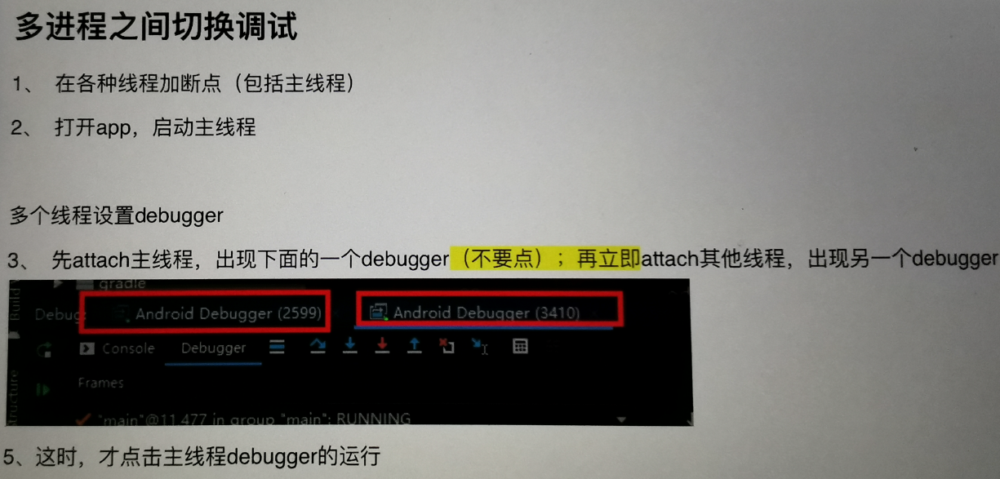


`Intellij IDEA` 的`debug`断点调试是有一个模式的选择的，就像下面这张图，平时我们都使用的是默认的 `ALL`（在`Eclipse`中默认是线程模式） ，这种模式我们只能将一个线程断下来，但其他线程却已经执行过了；而将其改为 `Thread` 后，就可以多个线程都断下来，并且可以很方便的切换线程的执行流程，这就是多线程调试。

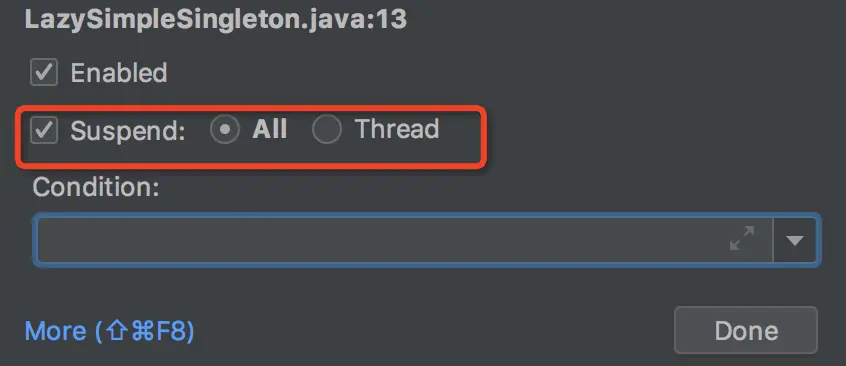

在`debug`控制台能够很方便的查看线程的执行状态，也可以很方便的选择某个线程去执行：


### 改写值之----Evaluate（或watchs）

-----><font color='red'>极优！！！获取运行时信息 + 强制改变运行态的代码</font>

Watchs中不仅可以观看值，也可以执行代码修改值，可以执行任意代码！！！！！！！！！

同样的，Evaluate（更推荐！！！！！ 优点：只会执行一次）

https://blog.csdn.net/Peng_Hong_fu/article/details/79994860

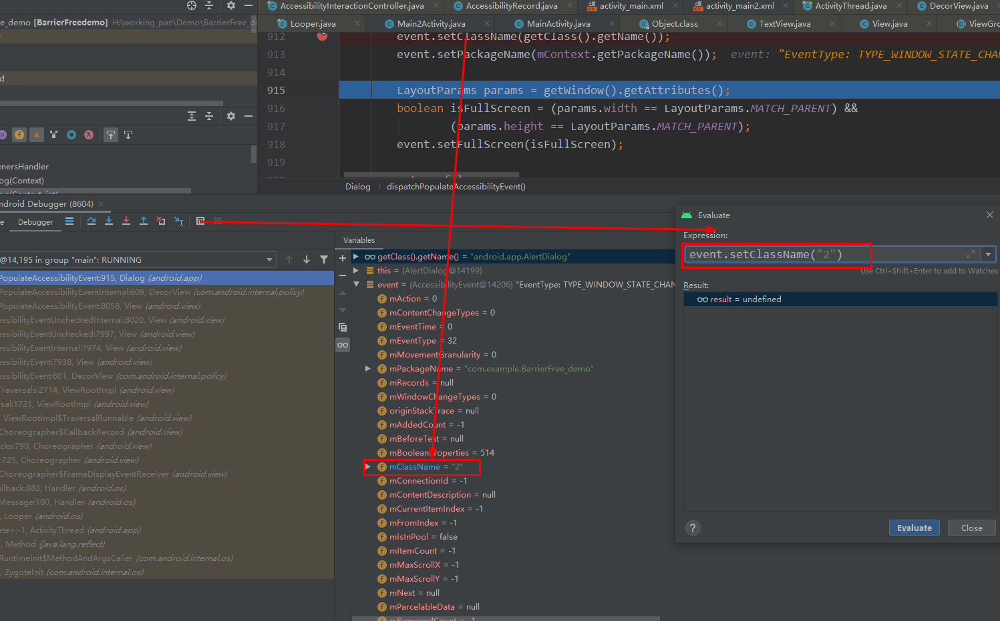

这个技巧非常有用，可以强制改变运行态的代码，场景：

（1）用来阅读代码，要理解某个量的影响---->制造冲突：修改某个量，观察变化，从而理解代码

（2）用来写代码：当代码量比较小的时候，完全可以用Evaluate添加或者修改几行代码！！！！！！！<font color='red'>极优！！！！不用编译，也不用导包重启</font>

（3）用来解问题很适合，查看某些量，某些信息，尤其可以看到这个量周围量的信息！！！！！


watchs改变值：**优点：更加图形化，不用写代码**


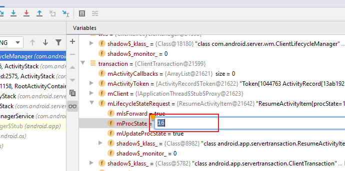

### 改写值之----Evaluate and log

见《断点日志》


### 改写值之 反射

利用断调试   动态 反射修改final数据域 ---》 <font color='red'>极优</font>

参考： https://www.cnblogs.com/fudashi/p/6624379.html  

**<font color='red'>注意： 修改后，就不依赖于 断点调试环境了，永远修改了！！！！！！！！</font>**   -----》  自然，除非重启手机

TODO:   能用反射，必然可以发挥的空间很大!!

#### 应用一：修改debug开关  -------->  修改后，脱离断点调试

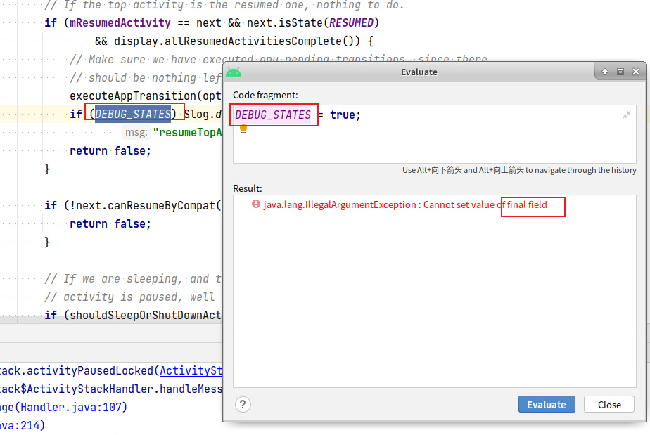

修改final数据域: 

```
 // 构造一个Person类，里面有个final字段NAME
        Person p = new Person();
        Field field = p.getClass().getDeclaredField("NAME");
        field.setAccessible(true);
        field.set(p,"Hello");
```

 

修改static final数据域，比如：

```java
Class clz = ActivityTaskManagerDebugConfig.class;
Field field = clz.getDeclaredField("DEBUG_STATES");
field.setAccessible(true);
field.set(new ActivityTaskManagerDebugConfig(),true);
```

效果：

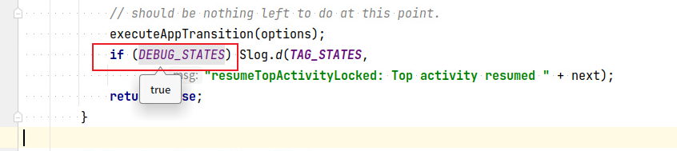


实际上：<font color='red'>DEBUG_STATES以及log都被编译器优化掉了</font>（在编译后的jar）

> ```java
> static final Boolean  DEBUG_STATES = false;
> 
>  if (DEBUG_STATES) {  // 【1】因为永远是false，所以被编译器优化掉了
>      .............
>  }
> 
> ```
>
> 结论：
>
> 1、加DEBUG日志，相当于没加
>
> 2、即使final 动态修改也没用，被编译器优化掉了


#### 调用方法

例2：以无参方法为例子：

```java
// 在view.java中 调用 Activity.java方法：
Class clz = this.getContext().getClass(); Method method = clz.getMethod("dismissKeyboardShortcutsHelper"); method.toString();
method.invoke(this.getContext());

//结果：
public final void android.app.Activity.dismissKeyboardShortcutsHelper()
```


例3：以两参方法为例子：


```java
// 在view.java中 调用 Activity.java方法performResume：
Class clz = this.getContext().getClass(); Method method = clz.getDeclaredMethod("performResume",boolean.class,String.class); method.toString();
method.invoke(this.getContext());

//结果：
-----》 Method threw 'java.lang.NoSuchMethodException' exception
```


```java
Class clz = this.getContext().getClass(); Method[] method = clz.getDeclaredMethods();
Arrays.toString(method);

//本类方法
[static com.example.myhandlerdemo.MainActivity$MyHandler com.example.myhandlerdemo.MainActivity.access$000(com.example.myhandlerdemo.MainActivity), protected void com.example.myhandlerdemo.MainActivity.onCreate(android.os.Bundle), public void com.example.myhandlerdemo.MainActivity.testJump2anotherApp()]
```


```
//view.java
Class clz = this.getContext().getClass(); Method[] method = clz.getMethods();
Arrays.toString(method);
```

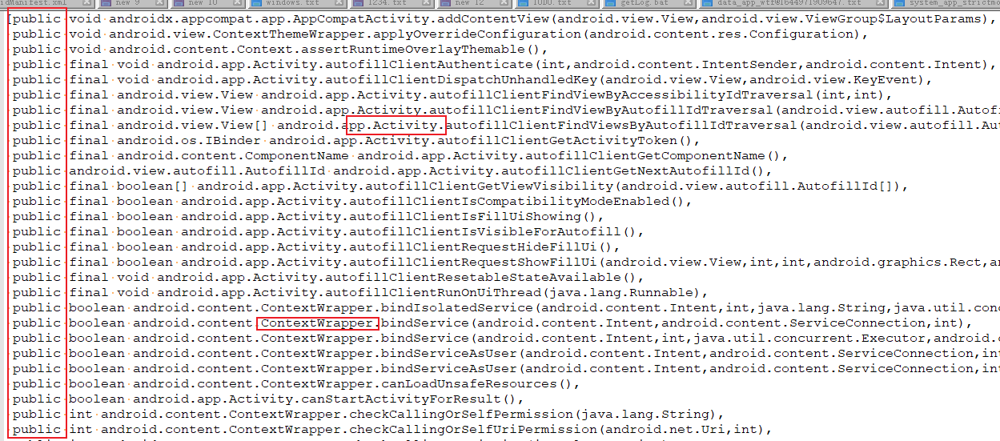


纵向横向：

> getMethods()：~~能够获取类的所有public方法，包括自身定义的以及从父[类继承](https://so.csdn.net/so/search?q=类继承&spm=1001.2101.3001.7020)的~~。 ----->  即限制在public里（纵向）
> getDeclaredMethods()：~~能够获取类本身的所有方法，包括[private](https://so.csdn.net/so/search?q=private&spm=1001.2101.3001.7020)方法，实现的接口方法，但是不能获取从父类继承的非public方法~~   ------> 即限制在本类里（横向）

如何调用父类的 private方法呢？

> 只能用父类来调用，即  子.getSuperclass()
>
> 参考： https://blog.csdn.net/u013425438/article/details/92637055


所以：

```java
// 在view.java中 调用 Activity.java方法performResume：
Class clz = this.getContext().getClass(); Method method = clz.getDeclaredMethod("performResume",boolean.class,String.class); 
method.toString();
method.invoke(this.getContext());

应该为：
Class clz = this.getContext().getClass().getSuperclass().getSuperclass().getSuperclass().getSuperclass().getSuperclass();
```


#### 技巧：

一个复杂的代码/脚本，验证一点，添加一点

全量的东西是好的，万能的：比如 getMethods()先查看，有哪些方法

每一行提前验证，结果验证：

```
Class clz = this.getContext().getClass().getSuperclass().getSuperclass().getSuperclass().getSuperclass().getSuperclass();
clz.toString();  //验证

Method[] methods = clz.getMethods();
Arrays.toString(methods); //全量，为后一步提供验证

Method method = clz.getDeclaredMethod("performResume",boolean.class,String.class); method.toString(); //验证

//调用
method.invoke(this.getContext(), false, "RESUME_ACTIVITY");
method.invoke((Activity)this.getContext(), false, "RESUME_ACTIVITY");
```


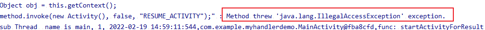

---------> <font color='red'>因为非公有方法，调用需要</font>

method.setAccessible(true);


可以运行的最后脚本：

```java
Class clz = this.getContext().getClass().getSuperclass().getSuperclass().getSuperclass().getSuperclass().getSuperclass();

clz.toString();
Method method = clz.getDeclaredMethod("performResume",boolean.class,String.class);
method.setAccessible(true);
method.invoke(this.getContext(), false, "RESUME_ACTIVITY");
```


进一步优化，OK：

```java
//优化点，用while找到对应的类
Class<?> clz = this.getContext().getClass();
Class<?> superclass = clz.getSuperclass();
while (superclass != null) {
	if(superclass.getSimpleName().equals("Activity")){
		break;
	}
	superclass = superclass.getSuperclass();
}
clz = superclass;


clz.toString();
Method method = clz.getDeclaredMethod("performResume",boolean.class,String.class);
method.setAccessible(true);
method.invoke(this.getContext(), false, "RESUME_ACTIVITY");
```

参考：https://blog.csdn.net/huangxinyu_it/article/details/73499490


####   .java反射

https://blog.csdn.net/weixin_56442629/article/details/115430249


#### 补充：   实例化Class类对象的三种方式

```
package HelloClass;
 
class Hello {
}
 
public class GetClassDemo {
	public static void main(String[] args) throws ClassNotFoundException {
		Class <?> c1 = null;
		Class <?> c2 = null;
		Class <?> c3 = null;
		
		//1.
		c1 = Class.forName("HelloClass.Hello");
		//2.
		c2 = new Hello().getClass();
		//3.
		c3 = Hello.class;
```


### 断点日志： 动态地  改写值、添加log （调用栈）

既然可以断点调试了，为啥还要log（调用栈）？------>   断点log，不要勾选Suspend！！！

> 原因在于：
>
> 1、断点调试太慢，<font color='red'>会将思路打断，消耗人的意志力</font>  ------>  <font color='red'> 快速有快速的好处，整体 结构更强</font>
>
> 2、有些流程，就不适合降速，比如有时间要求的

-<font color='red'>极优</font>： 

1、断点日志 与 普通日志 没有任何区别（除了不用编译）

2、不会阻塞线程。很多流程不能阻塞

​        注意，不要勾选Suspend，不会阻塞线程

3、在attach过程中，还可以修改、添加log

4、一直attach，不会导致ANR

5、部分第三方jar，aar里面外面更是无法手动添加log代码---》 该方法OK


注意：最终结果，一定以string， 布尔型等的形式表达出来


常见的log：

```java
//当前线程名
"Thread: " + Thread.currentThread().getName() + ", " + Thread.currentThread().getId() + ", " + new java.text.SimpleDateFormat("yyyy-MM-dd HH:mm:ss:SSS").format(System.currentTimeMillis());


// 当前系统时间
new java.text.SimpleDateFormat("yyyy-MM-dd HH:mm:ss:SSS").format(System.currentTimeMillis())

//当前具体实例
"," + this;
    
//当前函数名
"func: " + Thread.currentThread().getStackTrace()[2].getMethodName();

//调用栈
勾选 Stack trace
```


综合脚本：

```java
String s = "Thread: " + Thread.currentThread().getName() + ", " + Thread.currentThread().getId() + ", " + new java.text.SimpleDateFormat("yyyy-MM-dd HH:mm:ss:SSS").format(System.currentTimeMillis())+ "," + this.getSimpleName() + ", func: " + Thread.currentThread().getStackTrace()[2].getMethodName();
```


注意：
可以多行代码，比如：

```java
// 在view.java中 调用 Activity.java方法：
Class clz = this.getContext().getClass(); Method method = clz.getMethod("dismissKeyboardShortcutsHelper"); method.toString();
method.invoke(this.getContext());
-------> 只有最后一行结果，会被打印出来
```


**调用栈 优点：**

相当于目录+大纲：

<font color='cornflowerblue'>1、方便快速跳转   </font>

2、不会  走到细节分支

<font color='red'>3、观察触发点，触发点是锚点，建立记忆逻辑</font>


#### 断点日志，<font color='red'>最优实践</font>

不在debug里输出 ------> 缺点：（1）没有时间戳    （2）只能打印一个string

真正意义上在debug过程中使用

（1）log能做的事情，这里都能做

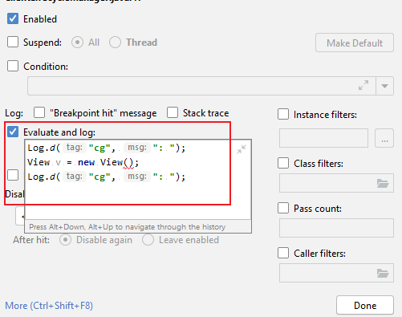

#### Evaluate and log之  写代码

TODO:

 一个很可能的做法是，在这个框里写自己的需求代码。而不需要重新编译  ----->  <font color='red'>极优</font>


### 异常断点

https://blog.csdn.net/weixin_35735663/article/details/114159806

捕获android运行的时候抛出的异常 ------>  给车祸的第一现场拍照

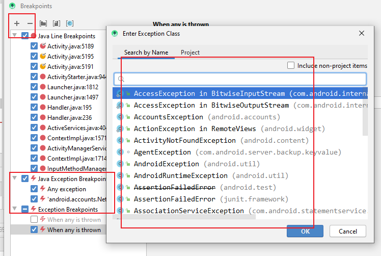


TODO: 啥区别


例子：

> 虽然看不到微信代码，但是可以看到它抛了异常
>
> 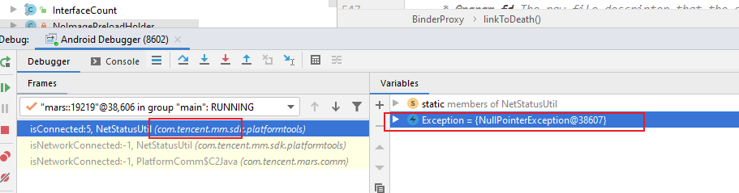


### 方法断点

TODO: 好像没有什么价值

参考 https://blog.csdn.net/weixin_35735663/article/details/114159806

不需要关心这个方法里面的变量是怎么变化的时候？

### 字段断点和方法断点


### 断点调试时，关闭ANR

断点调试，很耗费时间，安卓触摸事件等，有ANR机制，让进程挂了。

-----> 技巧：关闭ANR机制

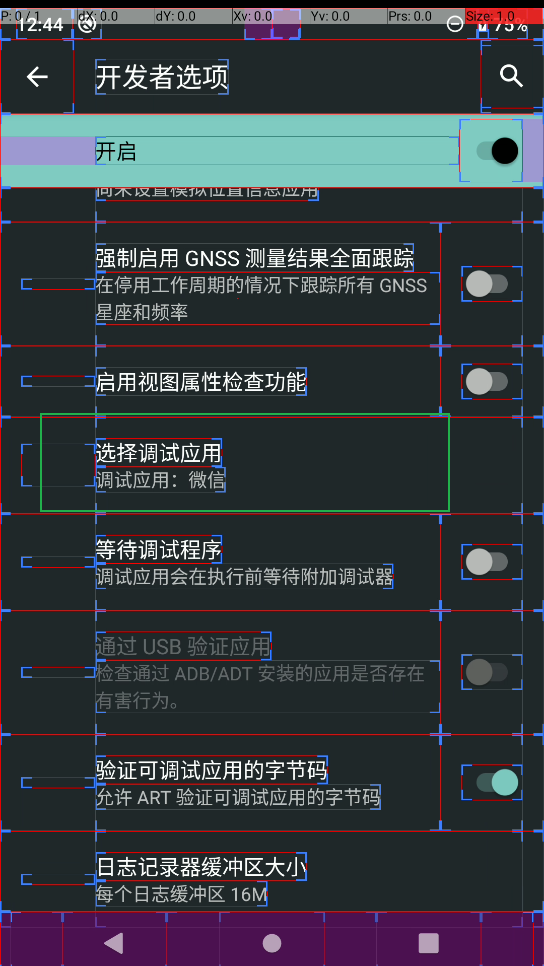

https://www.coder.work/article/140491
https://qa.1r1g.com/sf/ask/3854914871/


TODO: 

命令行如何关闭ANR?  （有些阉割系统，设置里根本没有这个选项）

因为可以看到ANR代码机制，所以，理论上，一定可以调试时破坏这个机制


### 过滤之 condition

过滤的重要性（一种化简）：

大量的log，必须过滤，1、否则没法看  2、断点次数会卡


condition断点： 


### 过滤之watch

watch把自己要观察的多级内层的一个值，外提

-------》  以便于观察。断点 + 按F9,  当watch是自己想要的，停下--------->  过滤作用 


### 杀进程

#### 利用断点调试杀进程

先attach，然后关闭attach

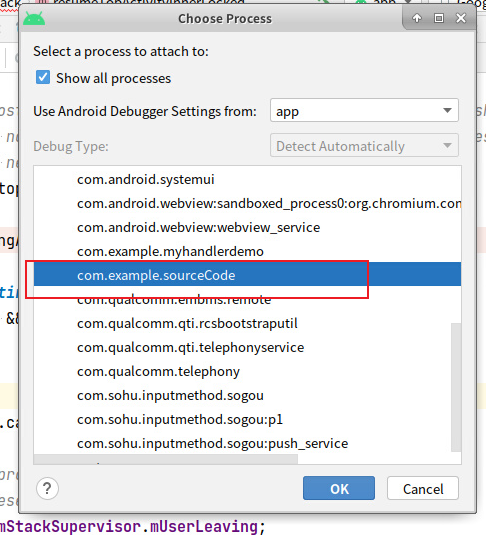

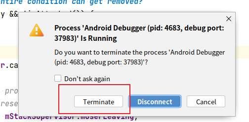

#### 利用命令行杀进程

使用情况：经常需要杀进程

见《手机命令》

### 改app代码，而非framework源码

很多时候，想要观察framework源码

？？？？？？？？？？？？？


### debug的遗憾

只能修改值（内存里的值），无法给函数打桩 (无法直接return 或者  返回固定值)------------> 而C语言是可以的

---->  TODO


补充：

> idea是可以做到force   return，并返回你设置的值.......<font color='red'>很优</font>，见 ：  https://blog.jetbrains.com/idea/2015/09/intellij-idea-15-eap-improves-debugger-and-git-support/                  https://help.eclipse.org/latest/index.jsp?topic=%2Forg.eclipse.jdt.doc.user%2Freference%2Fviews%2Fshared%2Fref-forcereturn.htm         https://blog.csdn.net/u010675669/article/details/124225873
>
> 但是，idea的remote  debug（即As）是不行的

### 注意事项：

为了防止调试过程中应用被系统AMS干掉，先把开发者选项中的【显示所有应用程序无响应】开关打开，不打开的情况下断点调试过程中应用进程很容易挂掉。

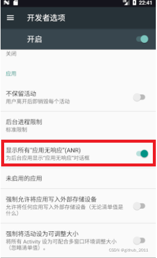


## IDEA DEBUG技巧整理

https://blog.csdn.net/weixin_43981673/article/details/106298812


TODO：视频教程
https://www.bilibili.com/video/BV1g4411k7UJ?p=15


技巧，搜索所有AS问题都可以搜索IDEA，更广泛！！！！


## AS断点调试   Build.gradle的详细配置

%accordion%Build.gradle%accordion%


```java
apply plugin: 'com.android.application'//说明module的类型，com.android.application为程序，com.android.library为库
android {
    compileSdkVersion 22//编译的SDK版本
    buildToolsVersion "22.0.1"//编译的Tools版本
    defaultConfig {//默认配置
        applicationId "com.nd.famlink"//应用程序的包名
        minSdkVersion 8//支持的最低版本
        targetSdkVersion 19//支持的目标版本
        versionCode 52//版本号
        versionName "3.0.1"//版本名
		manifestPlaceholders = [ UMENG_CHANNEL_VALUE:"hsq" ]//声明友盟渠道名是可变的
    }
    sourceSets {//目录指向配置
        main {
            manifest.srcFile 'AndroidManifest.xml'//指定AndroidManifest文件
            java.srcDirs = ['src']//指定source目录
            resources.srcDirs = ['src']//指定source目录
            aidl.srcDirs = ['src']//指定source目录
            renderscript.srcDirs = ['src']//指定source目录
            res.srcDirs = ['res']//指定资源目录
            assets.srcDirs = ['assets']//指定assets目录
            jniLibs.srcDirs = ['libs']//指定lib库目录
        }
        debug.setRoot('build-types/debug')//指定debug模式的路径
        release.setRoot('build-types/release')//指定release模式的路径
    }
    signingConfigs {//签名配置
        release {//发布版签名配置
            storeFile file("fk.keystore")//密钥文件路径
            storePassword "123"//密钥文件密码
            keyAlias "fk"//key别名
            keyPassword "123"//key密码
        }
        debug {//debug版签名配置
            storeFile file("fk.keystore")
            storePassword "123"
            keyAlias "fk"
            keyPassword "123"
        }
    }
    buildTypes {//build类型
        release {//发布
            minifyEnabled true//混淆开启
            proguardFiles getDefaultProguardFile('proguard-android.txt'), 'proguard-project.txt'//指定混淆规则文件
            signingConfig signingConfigs.release//设置签名信息
        }
        debug {//调试
            signingConfig signingConfigs.release
        }
    }
    packagingOptions {
        exclude 'META-INF/ASL2.0'
        exclude 'META-INF/LICENSE'
        exclude 'META-INF/NOTICE'
        exclude 'META-INF/MANIFEST.MF'
    }
 
    lintOptions {
        abortOnError false//lint时候终止错误上报,防止编译的时候莫名的失败
    }
	
	//打包-渠道
    productFlavors {
        hsq{}
        hsq_dx{}
        hsq_wx{}
        baidu{}
        yingyongbao{}
        ppzhushou{}
        anzhi{}
        zhushou360{}
        huawei{}
        lenovomm{}
        wandoujia{}
        mumayi{}
        meizu{}
        youyi{}
        sougou{}
    }
	
	//打包-防渠道代码重复处理
    productFlavors.all { flavor ->
        flavor.manifestPlaceholders = [ UMENG_CHANNEL_VALUE:name ]
    }
}
 
dependencies {//依赖
    compile fileTree(dir: 'libs', exclude: ['android-support*.jar'], include: ['*.jar'])   //编译lib目录下的.jar文件
    compile project(':Easylink')//编译附加的项目
    compile project(':ImageLibrary')
    compile project(':ImageResLibrary')
    compile project(':Ofdmtransport')
    compile project(':PullToRefreshLibrary')
    compile project(':RecorderLibrary')
    compile project(':WebSocket')
    compile project(':WidgetLibrary')
    compile 'com.nostra13.universalimageloader:universal-image-loader:1.9.3'//编译来自Jcenter的第三方开源库
}
 
 
```


%/accordion%


## 用源码搭建java断点调试环境----法一

法一：copy aosp源码到工程目录

https://blog.csdn.net/Gsony6501/article/details/110139734

https://blog.csdn.net/qq_38998213/article/details/81907253

优点：本地代码，不受网速影响

缺点：服务器代码copy到 本地工程目录

### 新建一个空的工程

保证可同步sync，可编译，可安装

### 根目录下新建与app同级的module  

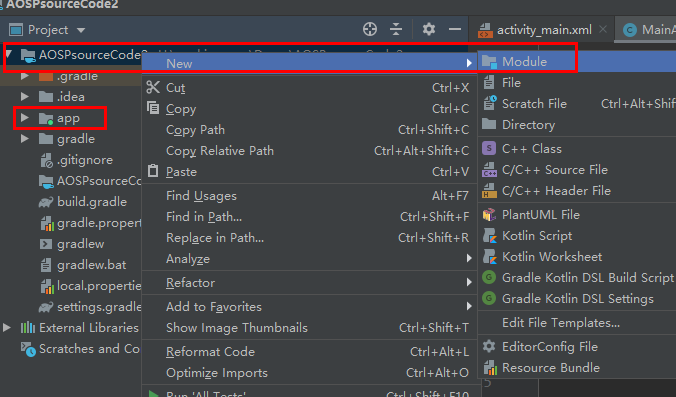

选择：


并取名frameworks ---》后面代码导入该目录下

----》加入module  ，**再次编译app，保证环境可编译，可安装**

注意生成的module 级两个文件：frameworks.iml 与 build.gradle


### 删掉src、libs

删掉frameworks下自动生成的文件夹：src、libs   ，并copy代码到该目录下比如base目录下

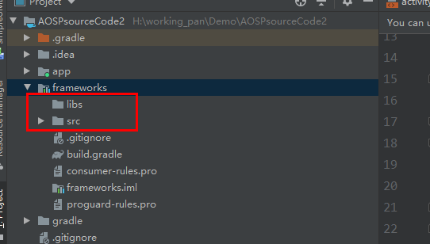


### 为base下代码设置为source

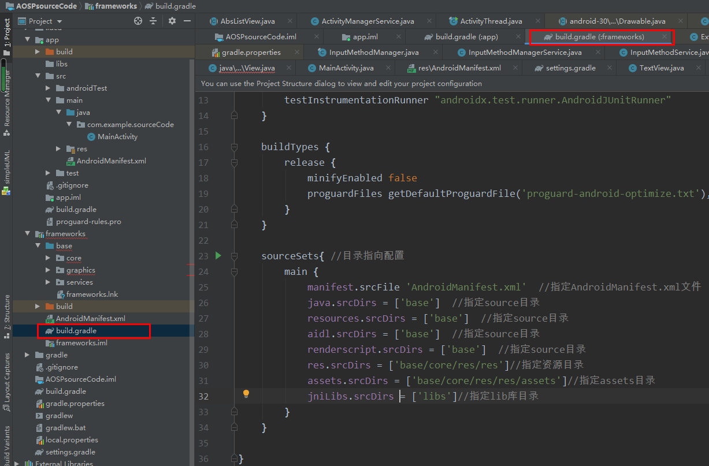

```
//

sourceSets{ //目录指向配置
    main {
        manifest.srcFile 'AndroidManifest.xml'  //指定AndroidManifest.xml文件
        java.srcDirs = ['base']  //指定source目录
        resources.srcDirs = ['base']  //指定source目录
        aidl.srcDirs = ['base']  //指定source目录
        renderscript.srcDirs = ['base']  //指定source目录
        res.srcDirs = ['base/core/res/res']//指定资源目录
        assets.srcDirs = ['base/core/res/res/assets']//指定assets目录
        jniLibs.srcDirs = ['libs']//指定lib库目录
    }
}
```


### 同步，保证环境

会出现

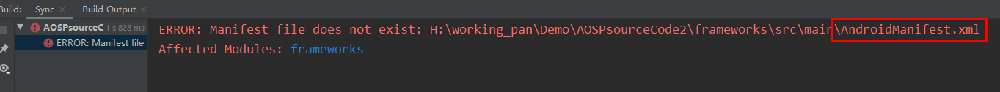

需要增加与base同级的AndroidManifest.xml ：

```java
<?xml version="1.0" encoding="utf-8"?>
<manifest xmlns:android="http://schemas.android.com/apk/res/android"
    package="com.example.sourceCode"/>
    
```

再同步，直到成功 ---》保证环境

### 配置跳转优先级  .iml文件：

配置跳转优先级（点击鼠标左键时）：这里当然是把jdk和sdk的依赖放到最后--->   可以优先依赖到sourceFolder

frameworks.iml 文件：

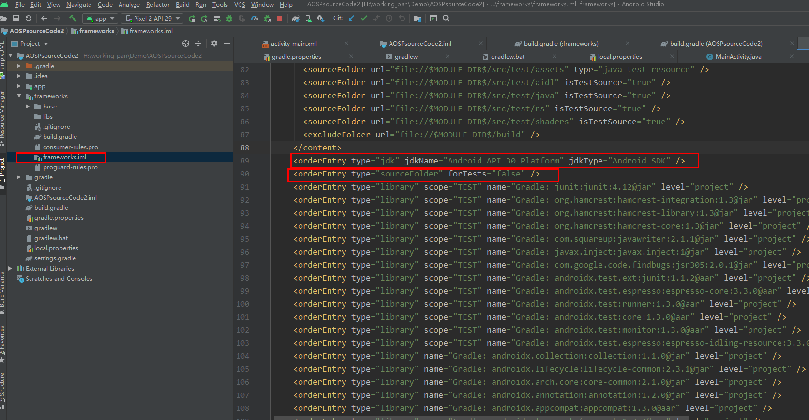

这样就完成了一个可断点调试的环境


补充：对于`linux下 AS`，该文件处于：


补充：如果idea没有自动生成，打开iml自动产生

参考：~~https://www.cnblogs.com/wanglongjiang/p/17315700.html~~


### 最重要第二点：

避免attach的时候，优先attach到sdk里的代码。删除app.iml  中sdk依赖：

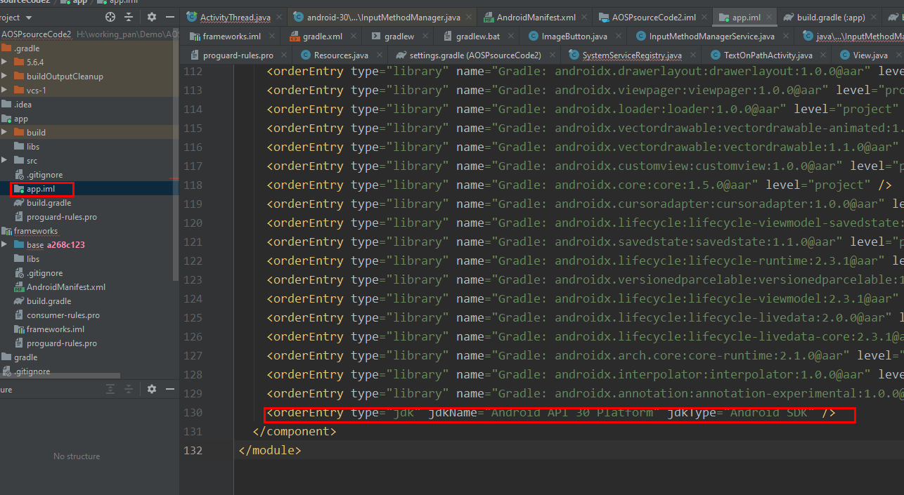

注意：只是临时删除。编译时还要加回来，不然编译不过

### 不允许添加两个module

规定：不允许添加两个依赖。。。。只添加一个root（子目录framework、packages）

因为 两个依赖之间，无法跳转（**飘红之 依赖间无法跳转**）


%accordion%例子：%accordion%

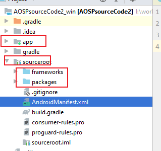


```java
android {
	.............

    sourceSets{ //目录指向配置
        main {
            manifest.srcFile 'AndroidManifest.xml'  //指定AndroidManifest.xml文件
            java.srcDirs = ['frameworks','packages']  //指定source目录
            resources.srcDirs = ['frameworks','packages']  //指定source目录
            aidl.srcDirs = ['frameworks','packages']  //指定source目录
            renderscript.srcDirs = ['frameworks','packages']  //指定source目录
            res.srcDirs = ['frameworks/base/core/res/res']//指定资源目录
            assets.srcDirs = ['frameworks/base/core/res/res/assets']//指定assets目录
            jniLibs.srcDirs = ['libs']//指定lib库目录
        }
    }

}
```


%/accordion%

### 关于aidl的调试（万能调试）：

#### 方法一：万能的classes.jar

**（优的方法，万能且可以包含所有类！！！！）**

framework.jar原始没有打包加密的jar路径：

\out\target\common\obj\JAVA_LIBRARIES\framework_intermediates\classes.jar

基于此，可以做很多事情：
1、依赖跳转 --》飘红问题

2、依赖编译  --》超越sdk编译

3、依赖断点调试 ---》aidl等调试


方法：1、classes.jar改名framework.jar，添加到依赖里
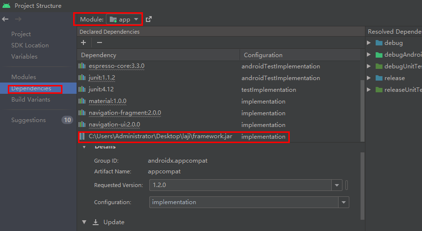

2、sync后，gradle里有：

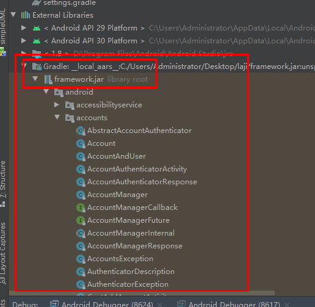


3、class文件可以加断点调试（只是行号对不上，因为这是class文件）

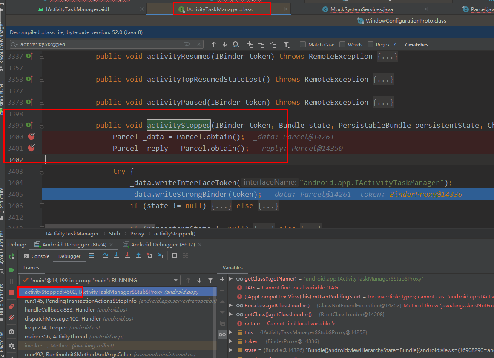

注：IActivityTaskManager$Stub$Proxy 指的是IActivityTaskManager类里的Stub类里的Proxy类


#### 方法二：

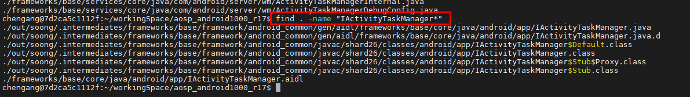

找到aidl编译出的源码java文件，IActivityTaskManager.java

在app的依赖framework里添加一个路径laji:

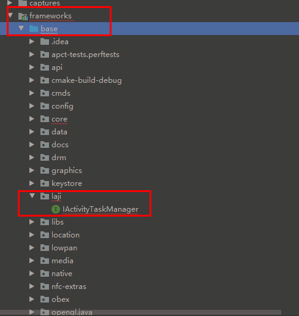

特别注意一点：要检查package android.app;没有被IDE修改为laji  ----》否则无法断点上

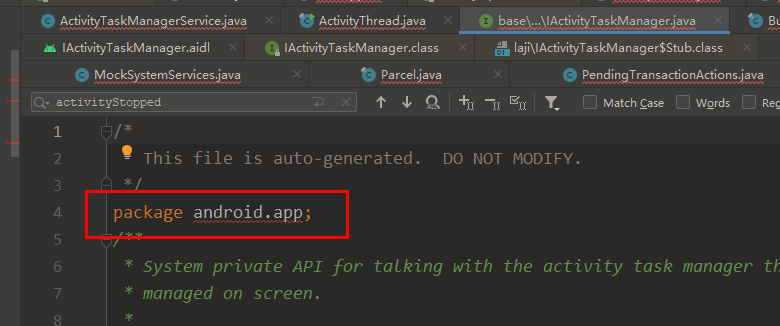


方式三：

aidl的理解


### ~~移除module~~

%accordion%不能直接删%accordion%

> 
>
> 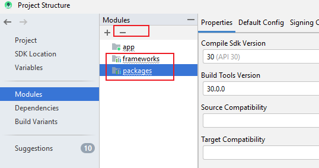


%/accordion%


### 技巧：

#### 同时调试   应用+ framework代码：

demo和源码放到同一工程，作为不同module，可以同时调试   应用+ framework代码

#### iml本质

根据gradle中sourceSets生成的依赖关系集合（包括sourceFolder等）

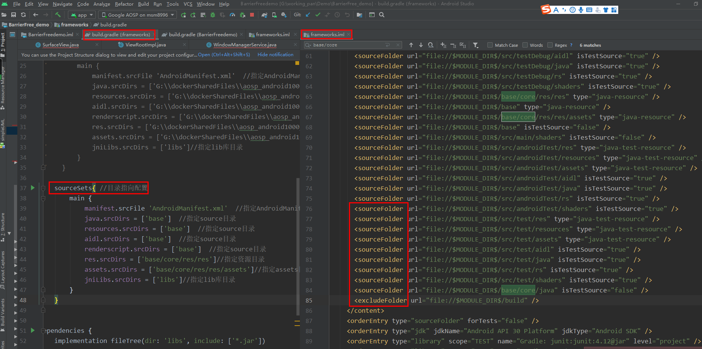

#### 同包的两个类不能引用导致飘红

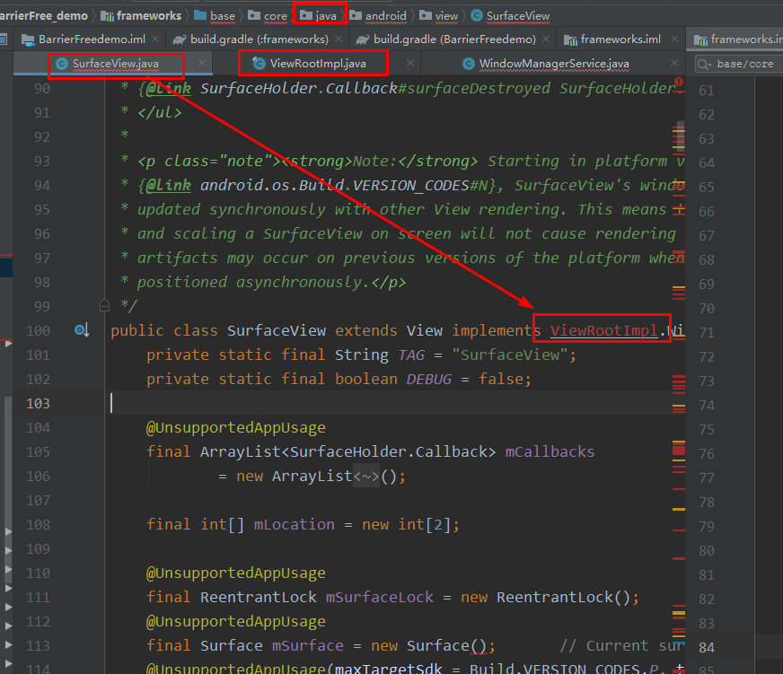

同包却无法引用-------》
1、方法1：右键，将包名上一级即java作为source --->缺点：source里不能嵌套source，需要将base取消

2、方法2：修改iml文件，可以source嵌套source！

添加：

```java
<sourceFolder url="file://$MODULE_DIR$/base/core/java" isTestSource="false" />
```

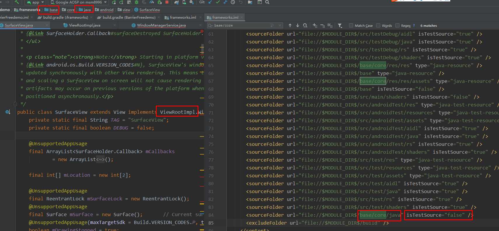

技巧：方法2快速添加技巧:

右键java，exclude

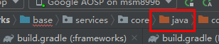

iml文件会新增：
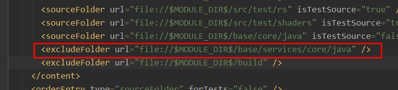

修改为source-folder

3、方法3：

**方法2的界面化操作**：  先取消framework的，添加java为source，最后还原framework


%accordion%图：%accordion%


%/accordion%


### **方法一最大的痛点**:代码同步 ---> 已解决

本地代码与服务器代码的 修改同步


如何解决？

> 方法一：copyToRemote.py
>
> 方法二：FreeFileSync软件同步文件夹  
>
> 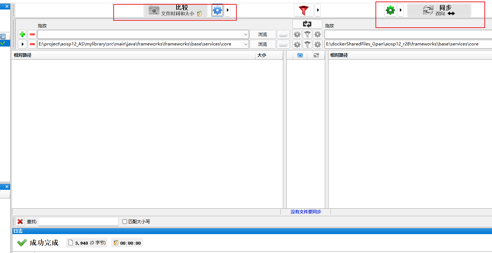
>
> 方法三：利用FreeFileSync命令行解决代码同步问题 以及第一次copy问题，见 《FreeFileSync》


## 用源码搭建java断点调试环境----法二，`不同盘有问题`

法二：修改app/build.gradle  ----->  在android的域中添加sourcesets项,  指定JAVA的源码目录(java.srcDirs为服务器的java源码目录)

优点：1、服务器代码不用copy到 本地工程目录   2、可以引入多个，甚至不同盘之间

缺点：对网速要求高

```java
#app/build.gradle 

android {
      compileSdkVersion 28
      ..........
     
          sourceSets {
        main {
            java {
                // 在此处添加你需要的代码路径(注意是java目录)
                srcDirs = [
                        'E:\\dockerSharedFiles_Gpan\\aosp12_r28\\frameworks',
                ]
//
//                //在此处排除目录、文件 ----> 只是不进行打包,不代表不能跳转
//                excludes = [
//                        'zincStudy/*.java',
//                        'SoundPicker\\.*',
//                ]
                //为啥还有这个？
//                includes = ["com/zinc/gradlestudy/MainActivity.java"]


                // 在此处添加你需要的资源路径
                //resources.srcDirs = ['W:\\WCL_WorkSpase\\EMUI10.0_GP\\packages\\apps\\Settings\\app\\src\\main\\res']

                // 清单文件路径
                //manifest.srcFile = 'W:\\app\\src\\main\\ AndroidManifest.xml'
            }
        }
    }
}
```


优点：保存了源码最原始的目录。。。。srcDirs为指定的

问题1：很大缺点：似乎把整个盘都index了，很慢！！！          ------->  TODO: 以前似乎不是这样？？？？

----------》 根本原因：工程和代码不同盘符造成的！

:解决方法：

把工程项目放到源码服务器内，保存同一个盘符


问题2：

服务器代码，可以跳转，但是显示的颜色没有区分，<font color='red'>应该是服务器代码速度不及本地？</font>。正常情况：


问题2解决办法：TODO


参考： 《源码导入IDE说明java_cpp跳转.pdf》


## ~~用源码搭建java断点调试环境----法三，有问题~~

settings.gradle中添加：

```java
include ':Custom'
project(":Custom").projectDir = new File("I:\\dockerSharedFiles\\aosp_1200_r28_sourceRoot\\frameworks\\base\\core")
include ':Custom2'
project(":Custom2").projectDir = new File("I:\\dockerSharedFiles\\aosp_1200_r28_sourceRoot\\frameworks\\base\\services")
```


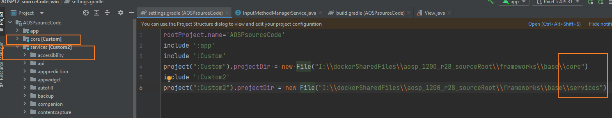

优点：一行修改搞定

问题1： 很大缺点：一个projectDir会变成一个module ------->  左边目录，无法保持aosp源码目录，没有显示frameworks\\base目录（尤其只需要一部分代码时）

​                <font color='red'> 两个module之间不能跳转！</font>

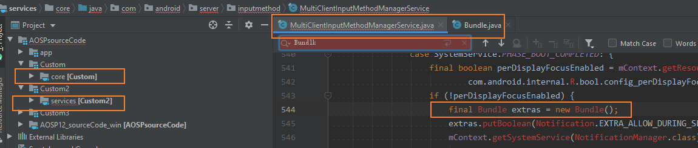

问题1解决办法：

把各个module的最近根目录添加

----------> 注意：这个时候，文件不会加载到内存里（极优）。所以，按需添加标记source目录（大部分Java目录）

问题2：同方法二。服务器代码，大多时候，不区分颜色


利用iml来改进：**按需放开的原则：**

app/build.gradle   -----> 添加了  frameworks  作为source （**注意，这个时候，把根目录加进去，不要分多个！！！！！！！**！利用iml去分！！！）

iml  ----->    excludeFolder排除整个 frameworks  （即相当于整个工程啥也没引进来，然后按需放开）

```java
    <content url="file://$MODULE_DIR$/../../../../../dockerSharedFiles_Gpan">
      <sourceFolder url="file://$MODULE_DIR$/../../../../../dockerSharedFiles_Gpan/aosp12_r28/frameworks/base/core" isTestSource="false" />
      <sourceFolder url="file://$MODULE_DIR$/../../../../../dockerSharedFiles_Gpan/aosp12_r28/frameworks/base/services" isTestSource="false" />
      <sourceFolder url="file://$MODULE_DIR$/../../../../../dockerSharedFiles_Gpan/aosp12_r28/frameworks" isTestSource="false" />
        
        
       //先排除总的
      <excludeFolder url="file://$MODULE_DIR$/../../../../../dockerSharedFiles_Gpan/aosp12_r28/frameworks" />
    </content>
```


进一步改进：

编程遍历所有含“Java”目录都放开为source ------> 永久保存对应.iml 复用


总结：优点：

无需copy代码，无需同步修改


## framework java 断点调试 环境（jdb）

主要参考链接：
https://developer.aliyun.com/article/24084

https://blog.csdn.net/SCHOLAR_II/article/details/81562459?utm_medium=distribute.pc_relevant.none-task-blog-2~default~baidujs_title~default-4.control&spm=1001.2101.3001.4242

java jdb 命令行调试程序

https://blog.csdn.net/arkblue/article/details/39718947

### 总结：

1、环境：

adb shell am start -D -n com.example.BarrierFree_demo/.MainActivity && @ping -n 3 127.1>nul 2>nul && adb shell 
------> <font color='red'>极优</font>：以debug模式打开，<font color='red'>给足够的时间attach</font>。不限于jdb，任何调试环境都可以这样！GDB


adb shell ps | findstr  client

adb forward tcp:9000 jdwp:27681

jdb -connect com.sun.jdi.SocketAttach:port=9000,hostname=localhost

2、jdb：

 stop at com.example.BarrierFree_demo.MainActivity:85


### 环境

adb shell ps查看进程的信息：

```java
system 835 793 208564 29768 ffffffff afe0c57c S system_server
radio 873 793 112816 21252 ffffffff afe0d674 S com.android.phone
app_8 876 793 98044 17336 ffffffff afe0d674 S android.process.media
app_7 879 793 123780 28452 ffffffff afe0d674 S android.process.acore
app_0 926 793 104916 18372 ffffffff afe0d674 S com.google.process.gapps
app_11 956 793 96008 16392 ffffffff afe0d674 S com.android.alarmclock
app_16 989 793 105304 16772 ffffffff afe0d674 S com.android.mms
app_23 999 793 96324 15552 ffffffff afe0d674 S org.broncho.powermonitor
app_19 1010 793 98492 16044 ffffffff afe0d674 S com.android.setupwizard
app_7 1022 793 106708 19204 ffffffff afe0d674 S com.android.inputmethod.pinyin
```

建立网络数据转发关系，pid 873

```java
adb forward tcp:9000 jdwp:873
    
# 查看是否成功
adb forward --list 
```

设置jdb源代码路径，这里设置了android系统内的JAVA路径，如果调试自己的应用程序 ，可以加在后面

```java
set ANDROID_SRC="G:\dockerSharedFiles\aosp_android1000_r17\aosp_android1000_r17"
set ANDROID_SRC_PATH=$ANDROID_SRC/frameworks/base/opengl/java:$ANDROID_SRC/frameworks/base/awt/java:$ANDROID_SRC/frameworks/base/core/java:$ANDROID_SRC/frameworks/base/location/java:$ANDROID_SRC/frameworks/base/sax/java:$ANDROID_SRC/frameworks/base/graphics/java:$ANDROID_SRC/frameworks/base/telephony/java:$ANDROID_SRC/frameworks/base/services/java:$ANDROID_SRC/frameworks/base/media/java:$ANDROID_SRC/frameworks/base/wifi/java:$ANDROID_SRC/frameworks/base/im/java:$ANDROID_SRC/dalvik/libcore/suncompat/src/main/java:$ANDROID_SRC/dalvik/libcore/nio_char/src/main/java:$ANDROID_SRC/dalvik/libcore/nio_char/src/main/java/java:$ANDROID_SRC/dalvik/libcore/security-kernel/src/main/java:$ANDROID_SRC/dalvik/libcore/security-kernel/src/main/java/java:$ANDROID_SRC/dalvik/libcore/security/src/main/java:$ANDROID_SRC/dalvik/libcore/security/src/main/java/java:$ANDROID_SRC/dalvik/libcore/archive/src/main/java:$ANDROID_SRC/dalvik/libcore/archive/src/main/java/java:$ANDROID_SRC/dalvik/libcore/awt-kernel/src/main/java:$ANDROID_SRC/dalvik/libcore/awt-kernel/src/main/java/java:$ANDROID_SRC/dalvik/libcore/luni/src/main/java:$ANDROID_SRC/dalvik/libcore/luni/src/main/java/java:$ANDROID_SRC/dalvik/libcore/math/src/main/java:$ANDROID_SRC/dalvik/libcore/math/src/main/java/java:$ANDROID_SRC/dalvik/libcore/x-net/src/main/java:$ANDROID_SRC/dalvik/libcore/openssl/src/main/java:$ANDROID_SRC/dalvik/libcore/dalvik/src/main/java:$ANDROID_SRC/dalvik/libcore/auth/src/main/java:$ANDROID_SRC/dalvik/libcore/concurrent/src/main/java:$ANDROID_SRC/dalvik/libcore/concurrent/src/main/java/java:$ANDROID_SRC/dalvik/libcore/sql/src/main/java:$ANDROID_SRC/dalvik/libcore/sql/src/main/java/java:$ANDROID_SRC/dalvik/libcore/prefs/src/main/java:$ANDROID_SRC/dalvik/libcore/prefs/src/main/java/java:$ANDROID_SRC/dalvik/libcore/xml/src/main/java:$ANDROID_SRC/dalvik/libcore/text/src/main/java:$ANDROID_SRC/dalvik/libcore/text/src/main/java/java:$ANDROID_SRC/dalvik/libcore/luni-kernel/src/main/java:$ANDROID_SRC/dalvik/libcore/luni-kernel/src/main/java/java:$ANDROID_SRC/dalvik/libcore/regex/src/main/java:$ANDROID_SRC/dalvik/libcore/regex/src/main/java/java:$ANDROID_SRC/dalvik/libcore/nio/src/main/java:$ANDROID_SRC/dalvik/libcore/nio/src/main/java/java:$ANDROID_SRC/dalvik/libcore/json/src/main/java:$ANDROID_SRC/dalvik/libcore/crypto/src/main/java:$ANDROID_SRC/dalvik/libcore/icu/src/main/java:$ANDROID_SRC/dalvik/libcore/annotation/src/main/java:$ANDROID_SRC/dalvik/libcore/annotation/src/main/java/java:$ANDROID_SRC/dalvik/libcore/junit/src/main/java:$ANDROID_SRC/dalvik/libcore/logging/src/main/java:$ANDROID_SRC/dalvik/libcore/logging/src/main/java/java:$ANDROID_SRC/dalvik/libcore-disabled/instrument/src/main/java:$ANDROID_SRC/dalvik/libcore-disabled/instrument/src/main/java/java:$ANDROID_SRC/dalvik/libcore-disabled/sound/src/main/java

```


启动jdb

```java
jdb -sourcepath $ANDROID_SRC_PATH -attach localhost:9000
```

这里的端口号9000，是由前面的tcp:9000决定

#### 附：可能的报错

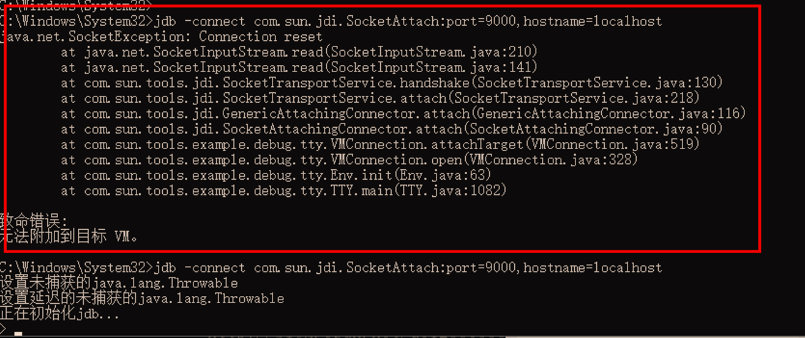


原因：Android Studio占用了jdb, 关闭Android Studio 重试

需要关闭AS。。。同时再次执行：adb forward tcp:9000 jdwp:17652


## framework Native 断点调试 环境（GDB）

见《GDB》 章节

## framework Native Clion 跳转环境（linux下）

### 基本原理

**跳转的基本原理：--------1、cmake链接文件正常**。 注意：跳转不依赖符号表，  调试 依赖符号表

注：cmake链接文件正常实际上

即：没有飘红

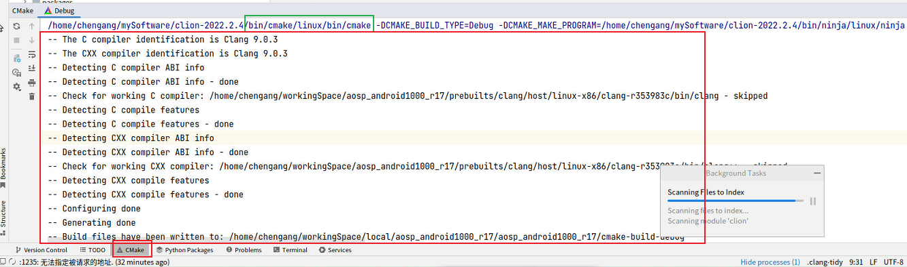

2、index索引完


### 具体步驟：

1、编译生成CMakeLists.txt：
build目录下有文档`build/soong/docs/clion.md`

```shell
// 打开开关，编译时生成CMakeLists.txt
export SOONG_GEN_CMAKEFILES=1
export SOONG_GEN_CMAKEFILES_DEBUG=1

// 全编译
make -j32
// 或者编译单独模块
make frameworks/native/service/libs/ui

// CMakeLists.txt会生成在
out/development/ide/clion/frameworks/native/libs/ui/libui-arm64-android/CMakeLists.txt
```

2、导入

新建总的CMakeLists.txt放到 **源代码根目录上**

%accordion%具体CMakeLists.txt %accordion%

```shell
cmake_minimum_required(VERSION 3.6)
project(AOSP-Native)

#// CMAKE_HOME_DIRECTORY是系统给定的值
set(ANDROID_ROOT "${CMAKE_HOME_DIRECTORY}")

set(CMAKE_DIRECTORY_FOR_CLION "${ANDROID_ROOT}/out/development/ide/clion")


#// 导入各个子cmakeList。工程很多，用到了再导入:

add_subdirectory(${CMAKE_DIRECTORY_FOR_CLION}/art/dalvikvm/dalvikvm-arm-android)
add_subdirectory(${CMAKE_DIRECTORY_FOR_CLION}/art/libdexfile/libdexfile-arm-android)
add_subdirectory(${CMAKE_DIRECTORY_FOR_CLION}/art/runtime/libart-arm-android)
add_subdirectory(${CMAKE_DIRECTORY_FOR_CLION}/external/compiler-rt/lib/sanitizer_common/libsan-arm-android)
add_subdirectory(${CMAKE_DIRECTORY_FOR_CLION}/frameworks/av/media/libaaudio/src/libaaudio-arm-android)
add_subdirectory(${CMAKE_DIRECTORY_FOR_CLION}/frameworks/av/soundtrigger/libsoundtrigger-arm-android)
add_subdirectory(${CMAKE_DIRECTORY_FOR_CLION}/frameworks/base/core/jni/libandroid_runtime-arm-android)
add_subdirectory(${CMAKE_DIRECTORY_FOR_CLION}/frameworks/native/cmds/installd/installd-arm-android)
add_subdirectory(${CMAKE_DIRECTORY_FOR_CLION}/frameworks/native/cmds/servicemanager/servicemanager-arm-android)
add_subdirectory(${CMAKE_DIRECTORY_FOR_CLION}/frameworks/native/libs/binder/libbinder-arm-android)
add_subdirectory(${CMAKE_DIRECTORY_FOR_CLION}/libcore/libjavacore-arm-android)
add_subdirectory(${CMAKE_DIRECTORY_FOR_CLION}/libcore/libopenjdk-arm-android)
add_subdirectory(${CMAKE_DIRECTORY_FOR_CLION}/libnativehelper/libnativehelper-arm-android)
add_subdirectory(${CMAKE_DIRECTORY_FOR_CLION}/libnativehelper/libnativehelper_compat_libc++-arm-android)

#// 内核的CMakeLists是自己写的，只导入了头文件，跳转还有问题

#//系统工具
add_subdirectory(${CMAKE_DIRECTORY_FOR_CLION}/system/core/base/libbase-arm-android)
add_subdirectory(${CMAKE_DIRECTORY_FOR_CLION}/system/core/init/libinit-arm-android)
add_subdirectory(${CMAKE_DIRECTORY_FOR_CLION}/system/core/libziparchive/libziparchive-arm-android)
add_subdirectory(${CMAKE_DIRECTORY_FOR_CLION}/system/core/liblog/liblog-arm-android)
add_subdirectory(${CMAKE_DIRECTORY_FOR_CLION}/system/core/libcutils/libcutils-arm-android)
add_subdirectory(${CMAKE_DIRECTORY_FOR_CLION}/system/core/libutils/libutils-arm-android)
add_subdirectory(${CMAKE_DIRECTORY_FOR_CLION}/system/core/libprocessgroup/libprocessgroup-arm-android)
add_subdirectory(${CMAKE_DIRECTORY_FOR_CLION}/system/core/logcat/logcatd-arm-android)
add_subdirectory(${CMAKE_DIRECTORY_FOR_CLION}/system/core/logcat/logcat-arm-android)
add_subdirectory(${CMAKE_DIRECTORY_FOR_CLION}/system/core/logd/logd-arm-android)
add_subdirectory(${CMAKE_DIRECTORY_FOR_CLION}/system/core/logd/liblogd-arm-android)
add_subdirectory(${CMAKE_DIRECTORY_FOR_CLION}/system/core/lmkd/liblmkd_utils-arm-android)
add_subdirectory(${CMAKE_DIRECTORY_FOR_CLION}/system/core/lmkd/lmkd-arm-android)

```

%/accordion%


3、导入

打开CLion
选择「New CMake Project from Sources」
指定包含 CMakeLists.txt 

4、 <font color='red'> **clion编译器配置：** </font>
**技巧：选择aosp cmakeList指定的clang**  。 **用Ubuntu的gcc和clang，编译基本上有问题**

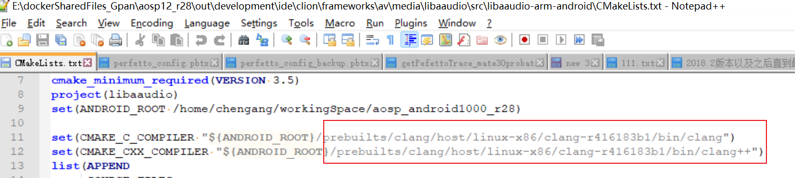


----------------->  配置:

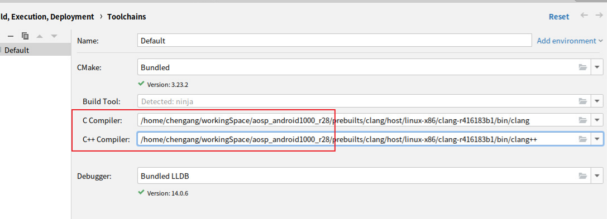


编译结果：


### 一些问题：

有时候自动生成出来的cmakeList是有问题的，需要手动修改(**注意：必须用clion修改，**这样clion会重新load project)

比如：导致.h没有进入，导致关联不上.h


### 参考：

 https://blog.csdn.net/iamdy/article/details/106658583

build/soong/docs/clion.md  官方文档


art/tools/generate_cmake_lists.py  ------》 自动生成cmakelist的脚本  TODO


## 搜索能力：

1、代码方面：

2、Google方面

### ~~搜索技巧之搜索同类~~

```java
  // Parcel.java
    private static native long nativeCreate();
	..........
    private static native boolean nativeHasFileDescriptors(long nativePtr);
```

比如想要在AOSP native代码中搜索nativeCreate，会很多，但是可以搜索比较`独特的`nativeHasFileDescriptors

搜索的<font color='red'>核心在于，独特，唯一</font>


### aosp本地代码 **全量搜索**

在全量搜索的情况下，由于本地ide导入的代码量大，搜索很慢

----->  **全量搜索**，用Android Code Search搜索，<font color='red'>速度快，且全</font>

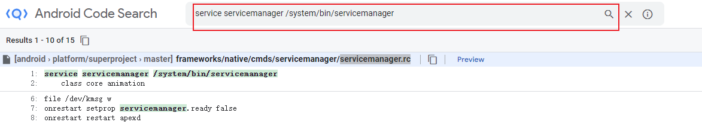


之后，找到本地对应代码路径

**在线 + 本地**

### 对知识点的搜索途径

Google、baidu、new Bing、bibili

-<font color='red'>技巧：</font>

> 搜索关键词1----->  结果，在结果1中找关键词2
>
> 以关键词2为base，搜索
>
> ..............

--------------> 1、可以扩大搜索范围。 2、应对智障的推荐

**例子：**

> 关键词1 ROOT应用  的搜索结果：
>
> 
>
> 找到关键词2：
>
> 
>
> 搜索commocap.c，得到 https://blog.csdn.net/SHH_1064994894/article/details/131966009   Android13 Root实现和原理分析


## 断点环境问题

1、找不到system_process

2、system_process debug过程中，没有断到任何断点上

-------------> 先在APP进程上断点上，然后再尝试system_process


3、attach 上 system_process之后，直接重启


## debug环境规定：

1、ANR显示crash对话、show后台ANR


2、关闭动画？

方法一：设置中关闭

方法二：<font color='red'>代码里关闭动画：</font>

```

```

3、select an APP可以不ANR的


4、次要环境：显示点击的位置


# LOG

## system log

作用：
记录手机android上层app以及framework相关活动的log，比如你写的app打印的log，就在这里面


```
adb shell logcat -v
```


### ProtoLog动态log

Android ProtoLog动态开启相关wm logging源码分析补充

https://blog.csdn.net/liaosongmao1/article/details/130597983?utm_medium=distribute.pc_relevant.none-task-blog-2~default~baidujs_baidulandingword~default-0-130597983-blog-110820407.235^v38^pc_relevant_default_base3&spm=1001.2101.3001.4242.1&utm_relevant_index=3   


## EventLog

作用：

> 非常简洁明了地展现当前<font color='red'>Activity各种状态</font>  -----》 状态性日志，而不是流程性
>
> ~~ActivityManager、powerManager等相关的log~~


```java
  adb shell logcat -b events 
  adb shell logcat -b events | findstr "am_ wm_"  // 同时过滤AMS与Wms
```

--------->    注意：~~普通的[adb](https://so.csdn.net/so/search?q=adb&spm=1001.2101.3001.7020) shell logcat 日志里没有 event log~~


涉及的源码类：

> EventLog.java, EventLogTags.java


### 参考

http://gityuan.com/2016/05/15/event-log/  Android EventLog含义  ----> 详细

https://blog.csdn.net/junjle/article/details/87184120?utm_medium=distribute.pc_relevant.none-task-blog-2~default~baidujs_baidulandingword~default-1-87184120-blog-117734286.235^v38^pc_relevant_default_base3&spm=1001.2101.3001.4242.2&utm_relevant_index=4   


## kernel Log  驱动相关的log


ctrl+alt+shift+i


## log环境规定

规定：

1、<font color='red'>永远不允许用AS抓log</font>   （日志过多，AS端日志会冲掉）


用  adb logcat -c   &&  adb logcat  -v time  > logcat.txt

2、log buffer选择最大 -----> 否则，有可能丢日志


## 加log技巧

1、log也要**注意判断null，**否则直接crash，浪费编译时间

​       加log，可能导致attach system_process挂了

​        ------>   **规定**：

> ​      （1）每次加完，验证一下  
>
> ​      （2）**加log要谨慎，判空要做好**

2、log和调用栈一起使用


3、**避免一行超长，notePad看不方便：**

```java
// 换行
Log.d(TAG, "child.mAttachInfo.mTmpInvalRect "  + child.mAttachInfo.mTmpInvalRect + "\\n" +
        "child.getId(): "+ child.getId() + "\\n" +
        "child.getAccessibilityViewId(): "+ child.getAccessibilityViewId() + "\\n" +
        "child.getWindowId(): "+ child.getWindowId());

```


4、技巧之： **针对（关键指标，要非常显眼）、差异化**对待：

（1）比如关注某个接口的时间差 ----------> 如果打印频繁，不好一直做差

​                                                            即用Error 打印出来**差值**（**<font color='red'>Error自带红色</font>**）

（2）**我们只对时间差高的关心**，~~更进一步 差异化~~：

```java
 if （差值 > 70ms ）{
    log.e()
} else {
	log.d()
}
```


## view log维测技巧：

TODO：

特点：多而杂乱


方法一：**<font color='red'>以偏概全</font>** ---------------打印含有文字的控件，然后基本知道所有控件的布局（对应关系）

​                             ------------->  **抓住一点，不及其余**                           


方法二：

> **直观画图**：-----> 也是有文字的才画
>
> 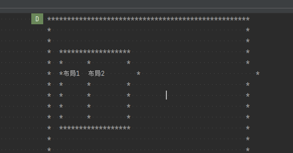

%accordion%直观画图%accordion%


```java
        // 将矩形的数组合并到大数组中
        private char[][]  mergeArrays(char[][] screen, char[][] rectangle) {
            int row =  rectangle.length;
            int col = rectangle[0].length;
            for (int i = 0; i < row; i++) {
                for (int j = 0; j < col; j++) {
                        if (rectangle[i][j] != ' ') {
                            screen[i][j] = rectangle[i][j];
                        }
                }
            }
            return screen;
        }

        // 打印屏幕数组
        private String  printScreen(char[][] screen) {
            StringBuilder sb = new StringBuilder();

            for (int i = 0; i < screen.length; i++) {
                for (int j = 0; j < screen[0].length; j++) {
//                    System.out.print(screen[i][j]);
                    sb.append(screen[i][j]);
                }
//                System.out.println();
                sb.append("\n");
            }
            Log.d(TAG, sb.toString());
            return sb.toString();
        }

        // 生成一个矩形数组
        public char[][] generateRectangle(int x1, int y1, int x2, int y2, String  text) {
            // 计算矩形的宽度和高度
            int width = x2 + 1;  // 宽度为 x2
            int height = y2 + 1;  // 高度为 y2

            // 创建二维数组表示矩形，初始为全空格
            char[][] rectangle = new char[height][width];

            // 初始化数组
            for (int i = 0; i < height; i++) {
                for (int j = 0; j < width; j++) {
                    rectangle[i][j] = ' ';
                }
            }

            // 用*表示矩形的边界
            for (int i = y1; i < height; i++) {
                for (int j = x1; j < width; j++) {
                    if (i == y1 || i == height - 1 || j == x1 || j == width - 1) {
                        rectangle[i][j] = '*';  // 边界
                    } else {
                        rectangle[i][j] = ' ';  // 内部空格
                    }
                }
            }

            // 在矩形中央显示文本，如果文本长度超过矩形宽度，只显示前几个字符
            int textStart = Math.max(0, (width - text.length()) / 2);
            int textEnd = Math.min(width, textStart + text.length());
            for (int j = textStart; j < textEnd; j++) {
                rectangle[height / 2][j] = text.charAt(j - textStart);
            }

            // 返回生成的矩形数组
            return rectangle;
        }

    public void test3() {
        // 合并矩形的数组并返回
        char[][] screen = generateRectangle(0,0,50,80, "");

        // 给定矩形的左上角和右下角坐标
        char[][] rectangle = generateRectangle(3,3, 10, 10, "布局1");
        // 合并矩形的数组到大数组
        mergeArrays(screen, rectangle);

        // 给定矩形的左上角和右下角坐标
        char[][] rectangle2 = generateRectangle(3,3, 20, 10, "布局2");
        // 合并矩形的数组到大数组
        mergeArrays(screen, rectangle2);

        // 打印大数组
        printScreen(screen);
    }
```

%/accordion%


## AS 日志 过滤

https://blog.csdn.net/qq_38909786/article/details/134416770  日志 过滤

过滤包名加两个字段 package:org.sipdroid.sipua message:=alarm message:600


## 日志问题----------丢日志

AS 或者 logcat发现有丢日志，**根因：** 

> 日志缓冲区过小

方法一：

> 缓冲区，直接在配置中，改大：------------------>  防止日志丢失
>
> P13_5G:/system # cat build.prop  | grep logd persist.logd.size=8M
>
> adb pull /system/build.prop  ---> 修改

**特别注意**： 不能修改 build.prop  的权限（方法：pull & push，不要直接vi修改）

方法二： 参考： https://blog.csdn.net/zhangxu1024/article/details/121374807       

> 报错：
>
> ```java
> logcat: Unexpected EOF!
> 
> This means that either the device shut down, logd crashed, or this instance of logcat was unable to read log
> messages as quickly as they were being produced.
> 
> If you have enabled significant logging, look into using the -G option to increase log buffer sizes.
> ```
>
> 最终生效：
>
> ```java
> D:\\\\work\\\\test\\\\log>adb shell logcat -g
> main: ring buffer is 256 KiB (3 MiB consumed), max entry is 5120 B, max payload is 4068 B
> system: ring buffer is 256 KiB (251 KiB consumed), max entry is 5120 B, max payload is 4068 B
> crash: ring buffer is 256 KiB (15 KiB consumed), max entry is 5120 B, max payload is 4068 B
> kernel: ring buffer is 256 KiB (245 KiB consumed), max entry is 5120 B, max payload is 4068 B
> ```
>
> 修改：
>
> ```
> adb shell logcat -G 5M
> ```


--------------------> **很多时候，方法一不生效！！！！！！！！！！！！**


--------------------->  TODO: 找到持久化的文件，写成脚本。每次导入jar时执行


方法三：**万能方法**（**验证ok**）：

> 在**logd处**限制  -----------> 只允许打印E 及以上的日志（**其他日志不打印，自然不会过频**）
>
> ```
>   setprop persist.log.tag E
> ```

参考：

> [Android logcat log输出控制_persist.log.tag-CSDN博客](https://blog.csdn.net/Tecinno4/article/details/107955881)


TODO： log框架：

> APP  通过UDP---------> logd服务  通过TCP-----------> logcat终端
>
> 打印，指的是logd打印；logcat只是取日志


# 在源码中adb（dump、截图、ui、操作、、、）

打通了源码中执行adb  ----->  <font color='red'>极其优，可以做的事情非常非常多</font>

精髓：

> -<font color='red'>可以精确的保存当时案发现场</font>


两种方式：

```java
// 法一：
Runtime.getRuntime().exec("screencap -p /data/local/tmp/1111.png");


// 法二：
TODO：com
```

-<font color='red'>特别注意的点：</font>

> 命令不能用重定向，比如  dumpsys display > /data/local/tmp/display.txt

## 权限问题的解决

1、即使在系统进程里，代码里也**申请不了su权限**，linux侧安卓做了严格校验。。。TODO
2、关闭selinux权限后，~~代码里可以申请sh权限：~~   ------》 <font color='red'>规定：统一不管，用system权限。</font>文件夹也用system
      ~~Runtime.getRuntime().exec("sh")~~   ---->  adb shell setenforce 0
3、------> 其实可以不用申请。直接运行cmd命令。比如截图：Runtime.getRuntime().exec("screencap -p /data/local/tmp/1111.png");
4、操作相关的文件夹权限也要放开：
   （1）所有者以及用户不能是root。system和shell似乎都可以？
chmod 777 /data/local/tmp
chown -R system /data/local/tmp
chgrp  -R system /data/local/tmp


补充：见com的《写文件权限》

注：
断点调试下，可以在window下cmd执行。也可以利用Runtime执行cmd
但是注意：当断点系统进程时，am pm等被卡住了，不一定能执行出结果；window下cmd也如此

## 应用之源码中截图，保存png

精确保存当时的图片。<font color='red'>注意点：</font> 抛到子线程操作，不要影响主要流程

TODO：《com》

方法一：adb截图

方法二：surfacecontrol


## 应用之源码中dump信息


%accordion%具体代码%accordion%


```java
Log.d(TAG, "start dump:" + getSystemTime());
myDump("dumpsys SurfaceFlinger","/data/local/tmp/sf.txt");
myDump("dumpsys window windows","/data/local/tmp/window.txt");
myDump("screencap -p /data/local/tmp/app.png",null);
myDump("uiautomator dump --compressed -d 0  /data/local/tmp/uidump.xml",null);  	


 private static void myDump(String cmd, String outPath) {
        new Thread(new Runnable() {
            @Override
            public void run() {
                java.io.FileOutputStream fileOutputStream = null;
                java.io.InputStream fileInputStream = null;
                try {
                    // 执行CMD命令
                    Slog.d(TAG,"cmd start: " + getSystemTime() + " " + cmd);
                    java.lang.Process process = Runtime.getRuntime().exec(cmd);
                    Slog.d(TAG,"cmd exec done" + getSystemTime());

                    if (outPath != null) {
                        fileOutputStream = new java.io.FileOutputStream(outPath);

                        // 获取命令的输出流, line用来观察中间数据！！！
//                        BufferedReader reader = new BufferedReader(new InputStreamReader(process.getInputStream()));
//                        String line;
//                        while ((line = reader.readLine()) != null ) {
//                            line = line + System.getProperty("line.separator");//换行符
//                            byte[] bytes = line.getBytes(StandardCharsets.UTF_8);
//                            fileOutputStream.write(bytes);
//                        }
//                        Slog.d(TAG,"fileOutputStream.write down:" + getSystemTime());

                        fileInputStream = process.getInputStream();
                        byte[] buffer = new byte[2048];  //这里需要足够大，否则数据会丢失
                        while ((fileInputStream.read(buffer)) != -1) {
                            fileOutputStream.write(buffer);
                        }

                        // 等待命令执行完成:提早关闭，会拿不到数据
                        int waitValue = process.waitFor();// -----> 有时候会卡, 怎么办？
                        Slog.d(TAG,"waitValue:" + waitValue + getSystemTime());

                        fileOutputStream.flush();
                        fileOutputStream.close();
                        fileInputStream.close();
                    } else {
                        int waitValue = process.waitFor();
                        Slog.d(TAG,"waitValue:" + waitValue + getSystemTime());
                    }
                } catch (IOException | InterruptedException e) {
                    try {
                        fileOutputStream.close();
                        fileInputStream.close();
                    } catch (Exception e1) {
                        e.printStackTrace();
                        Slog.d(TAG, "chen, out3: e:" + e1);
                        Slog.d(TAG, "chen, out3: e:" + e1.getStackTrace());
                    }
                    e.printStackTrace();
                    Slog.d(TAG, "chen, out3: e:" + e);
                    Slog.d(TAG, "chen, out3: e:" + e.getStackTrace());
                }
                Slog.d(TAG,"cmd end");

            }
        }).start();
    }


    static java.text.SimpleDateFormat mdateFormat = new java.text.SimpleDateFormat("yyyy-MM-dd HH:mm:ss.SSS");
    private static String getSystemTime() {
        long currentTimeInMillis = System.currentTimeMillis();
        return " " + mdateFormat.format(currentTimeInMillis);
    }
```


%/accordion%


<font color='red'>系统时间currentTimeMillis作为整个trace、log、dump的唯一统一者</font>


%accordion%**具体每个dump中修改**：%accordion%

wms：


%/accordion%


Runtime.getRuntime().exec注意：

> 加上路径后，**会执行成功，但是没有输出文件**  -----> 没有报错，  <font color='red'>很难定位</font>
>
> ```java
> java.lang.Process process2 = Runtime.getRuntime().exec("dumpsys display > /data/local/tmp/display.txt");
> ```

很神奇的一个点：

> 
>
> ```java
> String cmd = "uiautomator dump --compressed -d 0  /data/local/tmp/uidump.xml";
> java.lang.Process process = Runtime.getRuntime().exec(cmd);
> ```
>
> **在断点下，执行后，没有任何输出**。在代码里，可以


## 一些注意点

（1）<font color='red'>log不阻塞情况下</font>，log时间戳 =  系统时间（真正dump时间）

---------->  结论：log时间点，暂时可以替代  抛出dump的时间点

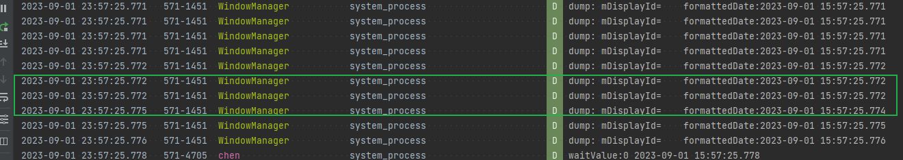

时间戳的加法：

```java
Log.d(TAG, "screencap -p end" + getSystemTime());
```

时间戳的最终呈现：

> （1）log形式 、
>
> **直接加在dump.txt中**   ------>  会更加精细
>
> （2）
>
> ```java
>     @Override
>     void dump(PrintWriter pw, String prefix, boolean dumpAll) {
>         //cg add
>         if (!(toString().contains("myapplication") || toString().contains("InputMethod"))) {
>             Log.d(TAG, toString() + "dump in" + getSystemTime());
>             return;
>         }
>         pw.print(prefix + "formattedDate=" + getSystemTime());   // 写进dump里
> ```
>
> 

（2）要非常<font color='red'>清楚耗时段在哪里</font>：

**规定: 大耗时必须有日志<font color='red'>夹出时间段</font>**

> 1、抛出dump 时刻   与  dump真正执行时刻 ----> **大耗时，加日志**
>
> 2、~~新起线程，<font color='red'>不阻塞，</font>1ms时间差，不用前后都加日志~~
>
> 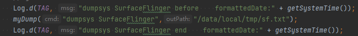
>
> 3、 **dump windows 耗时 6ms**   ----> 一般情况下可以忽略
>
> 


（3）抛出dump 时刻   与  dump真正执行时刻 ，<font color='red'>是有差距的</font>，**大概40ms**

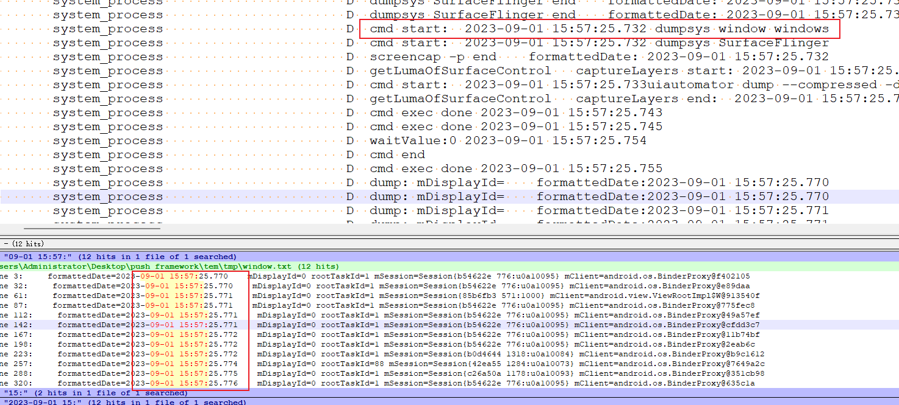

 ------>  如何解决这个问题？

方法一：

> -<font color='red'>将调用点往前挪动，直至log  时间点 与 dump时间点比较接近！！</font> 
>
> 技巧： 当前函数，向上两个函数都要加log


方法二：精确做法：见下


## 精确时间点dump-------更好的选择：

```java
// dumpsys window windows 对应代码
java.io.FileOutputStream fileOutputStream= new java.io.FileOutputStream("/data/local/tmp/111.txt");
com.android.internal.util.FastPrintWriter pw = new com.android.internal.util.FastPrintWriter(fileOutputStream);
//new java.io.PrintWriter(fileOutputStream);
WindowManagerService.this.dumpWindowsLocked(pw, true, null);
```

---------------->  验证ok

优点：

> <font color='red'>时间很精确</font>（**shell dump做不到**）  调用点，和执行开始点是一个。
>
> 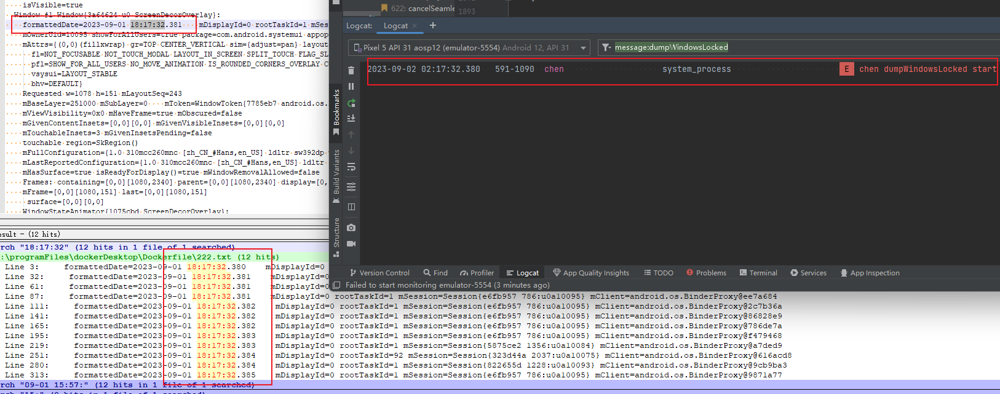

缺点：

> **限于在系统源码中任意调用（****shell dump可以任意位置，甚至APP侧！**）
>
> TODO： 要不要反射？ 要不要启动新线程？
>
> <font color='red'>总耗时不可控： 比如商业应用整个display 的 window过多 需要50ms。但demo只需要5ms</font>    
>
> -------->  这是最大的问题： **造成调用点的精确，无意义**


最终封装， **系统进程任意可用**：

```java
// wms.LocalService:(WindowManagerInternal也要改)


        public void dumpWindowsLocked(String outFile) {
                new Thread(new Runnable() {
                    @Override
                    public void run() {
                        try {
                            java.io.FileOutputStream fileOutputStream= new java.io.FileOutputStream(outFile);
                            com.android.internal.util.FastPrintWriter pw = new com.android.internal.util.FastPrintWriter(fileOutputStream);
                            WindowManagerService.this.dumpWindowsLocked(pw, true, null);

                            pw.flush();
                            pw.close();
                            fileOutputStream.close();
                        } catch (Exception e){
                            Log.d(TAG, "dumpWindowsLocked: Exception" + Arrays.toString(e.getStackTrace()));
                        }
                    }
                }).start();
        }


//精确使用：
Slog.e("chen", "chen dumpWindowsLocked start");
LocalServices.getService(WindowManagerInternal.class).dumpWindowsLocked("/data/local/tmp/windows_All.txt");
```


### 精确dump时间优化

1、<font color='red'>过滤，减少dump的window个数，我们关注的，一般也就一两个</font>，因为io非常耗时  

------>  **规定：减少至1~2个，这样便一刻完成**

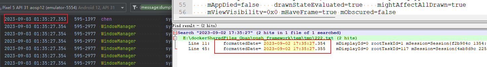

```java
    static java.text.SimpleDateFormat mdateFormat = new java.text.SimpleDateFormat("yyyy-MM-dd HH:mm:ss.SSS");
    private static String getSystemTime() {
        long currentTimeInMillis = System.currentTimeMillis();
        return " " + mdateFormat.format(currentTimeInMillis);
    }


// WindowState.java
    @Override
    void dump(PrintWriter pw, String prefix, boolean dumpAll) {
        //cg add
        if (!(toString().contains("myapplicat") || toString().contains("InputMet"))) { // 过滤
            Log.d(TAG, toString() + "dump in" + getSystemTime());
            return;
        }
```


2、稍稍提前5ms


TODO：

1、推广至AMS：


### 总之，所有改动点

#### dump window

```java
// WindowState.java   过滤 + dump时间写入 
static java.text.SimpleDateFormat mdateFormat = new java.text.SimpleDateFormat("yyyy-MM-dd HH:mm:ss.SSS");
    private static String getSystemTime() {
        long currentTimeInMillis = System.currentTimeMillis();
        return " " + mdateFormat.format(currentTimeInMillis);
    }

    @Override
    void dump(PrintWriter pw, String prefix, boolean dumpAll) {
        //cg add
        String name = toString();
        if (!(name.contains("myapplication") || name.contains("InputMethod"))) {
            Log.d(TAG, name + "dump in" + getSystemTime());
            return;
        }
        pw.print(prefix + "formattedDate=" + getSystemTime());
```


```java
// wms.LocalService添加:(WindowManagerInternal也要改)


        public void dumpWindowsLocked(String outFile) {
                new Thread(new Runnable() {
                    @Override
                    public void run() {
                        try {
                            java.io.FileOutputStream fileOutputStream= new java.io.FileOutputStream(outFile);
                            com.android.internal.util.FastPrintWriter pw = new com.android.internal.util.FastPrintWriter(fileOutputStream);
                            WindowManagerService.this.dumpWindowsLocked(pw, true, null); // true区分 dump window与dump window Windows

                            pw.flush();
                            pw.close();
                            fileOutputStream.close();
                        } catch (Exception e){
                            Log.d(TAG, "dumpWindowsLocked: Exception" + Arrays.toString(e.getStackTrace()));
                        }
                    }
                }).start();
        }


//系统进程任意点，精确使用：
Slog.e("chen", "chen dumpWindowsLocked start");
LocalServices.getService(WindowManagerInternal.class).dumpWindowsLocked("/data/local/tmp/windows_All.txt");
```


#### dump activity


### 技巧：

模仿源码是怎么调用的！找到上游调用

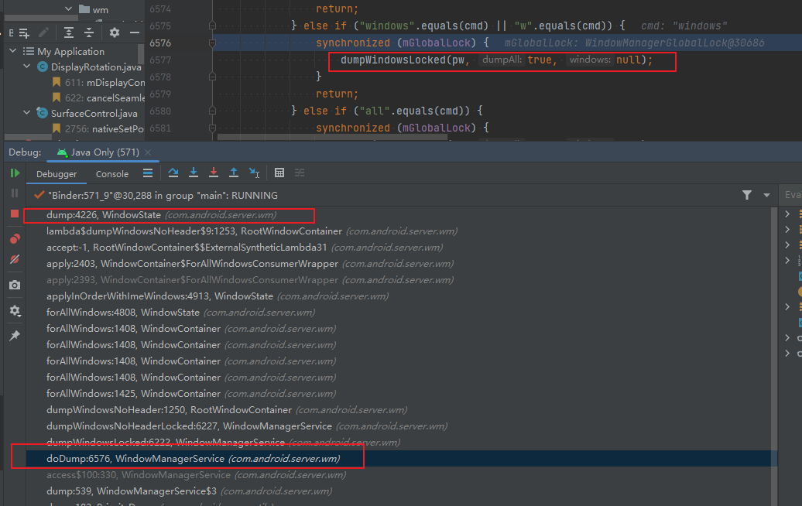

## 技巧

可以在debug下先验证代码是否可以运行


对于要<font color='red'>经常</font>复制到陌生环境的代码，不要import：

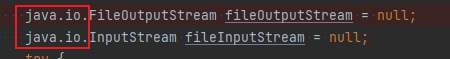

## TODO：其他方式

https://zhaoyf.cn/2021/01/21/selinux-shell-cmd/


https://blog.csdn.net/liaosongmao1/article/details/130502382   安卓车机系统adb shell cmd 源码原理分析


TODO：连续执行多个cmd命令呢？


## 遇到的问题：

“java.io.IOException: Cannot run program "/system/xbin/su": error=13, Permission denied

-------->selinux权限、文件权限


没有文件输出：

> 找命令执行的脚本---> 对应代码


dump时刻与调用点时刻的差距：


## 参考：

https://blog.csdn.net/qq_37858386/article/details/125002811      2022-05-27 Android Android getRuntime()、exec 执行命令（linux 下的bin文件等）并解得到返回值、执行ping命令


# 过滤之dump、log、断点debug

**循环之恶：**

> log循环造成log疯狂打印  ----->  跟踪耗费精力
>
> dump 循环多个window，造成io时间过长，难以抓第一现场
>
> 断点debug ：造成一直停顿----->  跟踪耗费精力

对付循环的技巧：

> **过滤**  -------->  注意力 配置合理化

---<font color='red'>规定：</font>

​     （1）频繁打印的log。。。。。。**一定要加if 过滤**

​     （2）dump内容，**加if过滤**  只打印自己关注的window

​     （3）debug，条件断点 **if 过滤**


**if过滤技巧：** toString +  模糊匹配

```java
// 模糊匹配com.example.myapplication   和   InputMethod输入法两个应用
if (!(toString().contains("myappli") || toString().contains("InputMet"))) {  
    Log.d(TAG, toString() + "dump in" + getSystemTime());
    return;
}
```


# 认识工具、发展工具

这是一个思想：

-<font color='red'>见到任何工具，规定：</font>

1、了解背后的原理, 拆开来看   ----->  定位工具bug、扩展功能

>    比如：
>
>   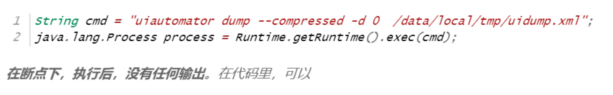

2、了解背后的思想 ------------->  才可以拓展自己的


## TODO

安卓的很多工具都在这里：

比如截图、

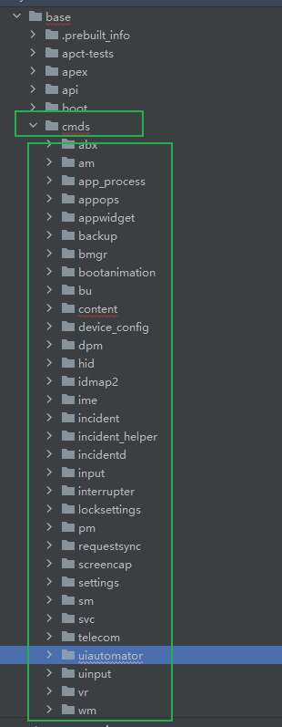


TODO：

如何破坏各种权限？


# log、debug适用的场景

1、对于复杂问题，log是最终手段，疯狂加log

2、debug适合一次调用

​       适合看变量的值

​       看调用栈（一次调用）


循环调用的函数（for遍历的、多次调用的）-------> 适合用log来看

生命周期这种（循环分发的）-------> log


TODO:

log与debug结合？


log的分层模型设计  <--------- 如何打印log？？？一级log、二级log

log如何处理多线程？


log与trace的结合

​      

# dump

## 具体含义见各章节


# 如何定位bug？ 思路层面

## 定位bug总体原则

原则1：最好的情况，能找到一个没有bug的环境（<font color='red'>如何能找到，已经成功了一大半</font>）：

​     比如： 其他设备、其他仓代码、其他应用、其他人的环境 

原则2：在定位问题之前，**先初步界定  问题的范围（目的在于：正向定位太细太耗时间，缩小范围可以大大缩短时间）**：

​           比如显示问题，是Activity级别的，window级别的，还是view级别的

原则3：**第一要义是改值坐实**，最后的最后才分体深层次原因    --------> 目的：还是**缩小范围，不浪费正向定位的精力**

​           比如：弹框没谈出来，涉及到很多状态。可以**直接debug动态修改**标志数值，来验证哪一个影响了。最后才追溯 标志值的来源，为什么是这个值，以及判定的代码逻辑（一般很长，没必要读）

原则:4：**正向定位时**，先从主干、核心节点入手。看流程是否完整。

​              比如显示问题，首要的是：activiy生命周期是否完整

原则5：**解耦 +  化简**。我们永远不可能理解复杂的东西。

​            化简之<font color='red'>排除干扰</font>------------闪屏问题：**关闭动画**  

​                                       ------------ 抓log，先清一把； debug时，先把之前应用杀掉，从头再来**（保证环境一致）**

原则6： **尽量做化简，无论是不是问题的根因**、无论是否有影响：

​               先列举所有可能影响因素  

​             为啥我想不到要关闭动画？

原则7：断点和log，作为定位的第一步，是灾难性质的

​             因为纵向，陷入细节，太费精力


## 显示问题定位

上面总体原则


<font color='red'>显示问题，关键点：</font>

1、layer的层级位置：     TaskDisplayArea.adjustRootTaskLayer()

2、surface可见性决定的地方：  surfaceControl.hide  或者  cpp surfaceFlinger的入口， SurfaceComposerClient.setFlag

​       TODO: 按道理，所有的窗口级别的hide，都会走到这里

3、看一下生命周期是否紊乱


## 闪屏问题定位：

1、化简之排除干扰 ---------> 关闭动画：

法一：开发者选项里，关闭动画

法二： 反射方法，破坏系统动画功能 ---------->  <font color='red'>这是一种万能方法</font>

```java
# 在WMS流程中
```

2、winscope，~~见winscope章节~~


## 缺少应用代码的情况下的定位

1、反编译

TODO: 反编译技能

2、framework ap层本身就可以断点

3、纯APP进程的APP层代码，可否无源码调试？


|      |      |      |
| ---- | ---- | ---- |
|      |      |      |
|      |      |      |
|      |      |      |

